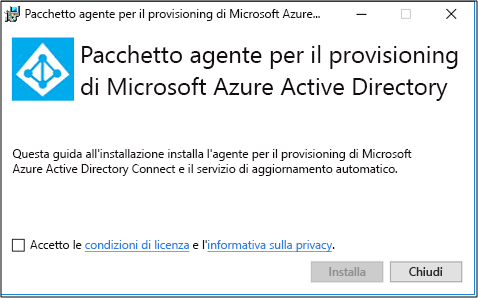
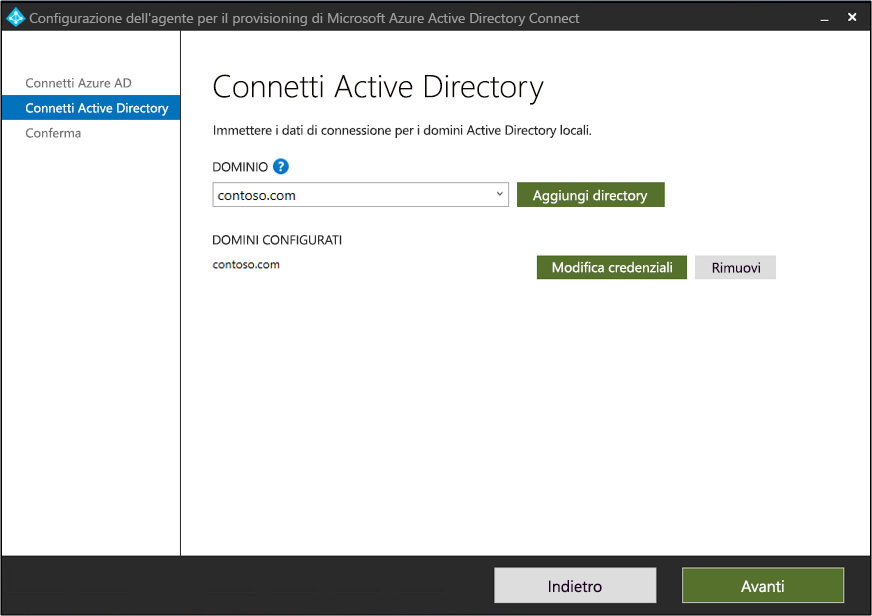
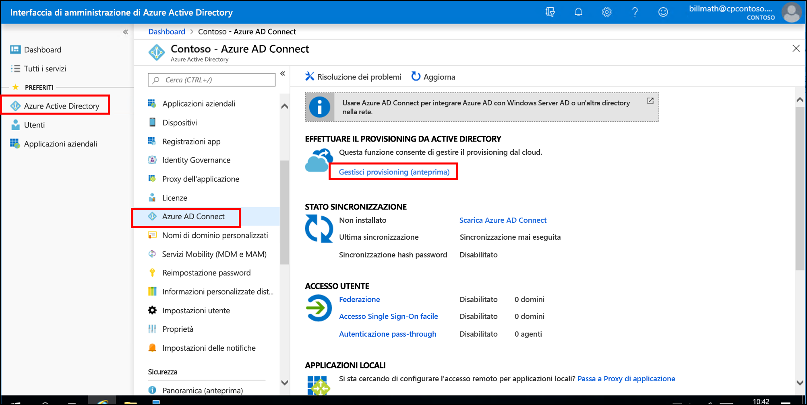
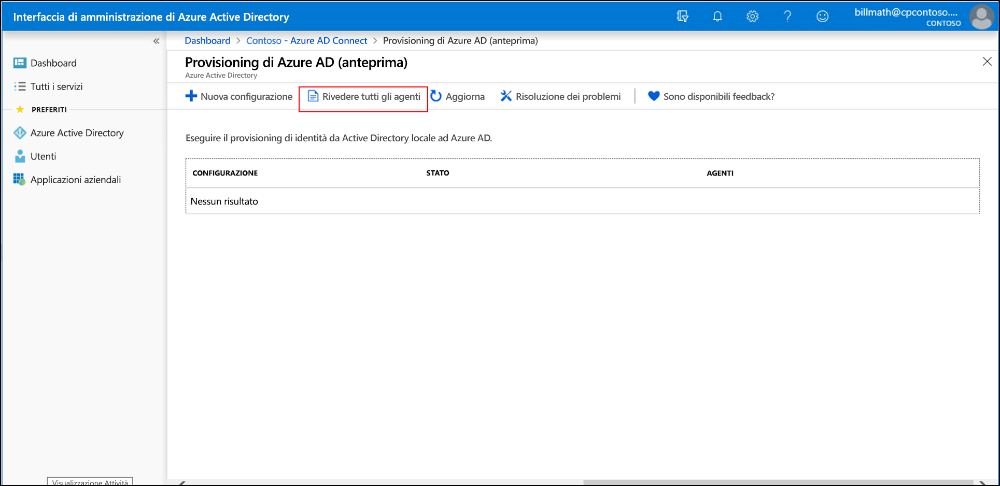
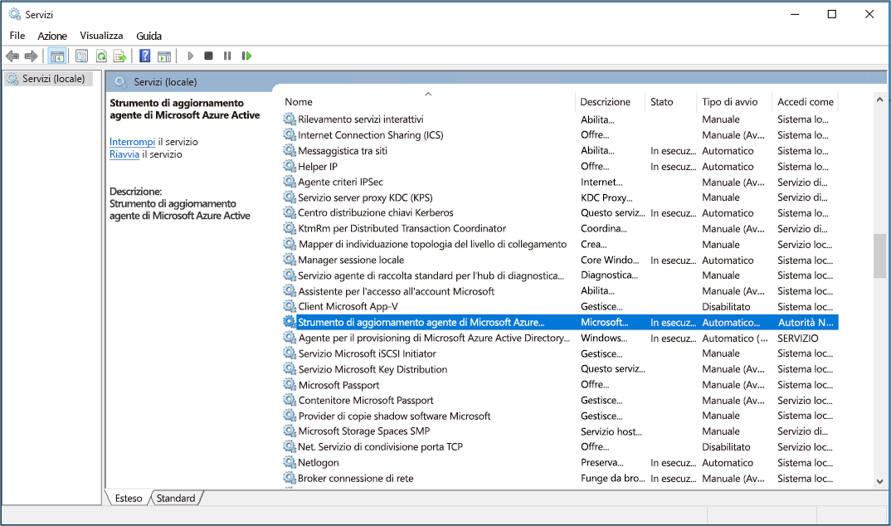

# Installare Azure AD Connect agente di provisioning cloud
In questo documento viene illustrato il processo di installazione per l'agente di provisioning di Azure AD Connect e come configurarlo inizialmente nel portale di Azure.

>[!IMPORTANT]
>Nelle istruzioni di installazione seguenti si presuppone che siano stati soddisfatti tutti i [prerequisiti](how-to-prerequisites.md) .

L'installazione e la configurazione di Azure AD Connect provisioning vengono eseguite nei passaggi seguenti:
    
- [Installare l'agente](#install-the-agent)
- [Verificare l'installazione dell'agente](#verify-agent-installation)

## Installare l'agente

1. Accedere al server che si userà con le autorizzazioni di amministratore dell'organizzazione.
2. Passare alla portale di Azure, selezionare Azure Active Directory a sinistra.
3. Fare clic su **Gestisci provisioning (anteprima)** e selezionare **Controlla tutti gli agenti**.
3. Scaricare l'agente di provisioning Azure AD Connect dalla portale di Azure.
 
3. Eseguire il provisioning Azure AD Connect (AADConnectProvisioningAgent. Installer)
3. Nella schermata iniziale **accettare** le condizioni di licenza e fare clic su **Installa**. 
 

4. Al termine dell'operazione verrà avviata la configurazione guidata.  Accedere con l'account amministratore globale Azure AD.
5. Nella schermata **connetti Active Directory** fare clic su **Aggiungi directory** , quindi accedere con l'account amministratore Active Directory.  Questa operazione aggiungerà la directory locale.  Fare clic su **Next** (Avanti). 
 

6. Nella schermata **Configurazione completata** fare clic su **conferma**.  Questa operazione registrerà e riavvierà l'agente. 
 

7. Al termine dell'operazione, si noterà che **la verifica è stata completata.**  È possibile fare clic su **Esci**. 
 
8. Se viene ancora visualizzata la schermata iniziale iniziale, fare clic su **Chiudi**.

## Verificare l'installazione dell'agente
La verifica dell'agente viene eseguita nel portale di Azure e nel server locale in cui è in esecuzione l'agente.

### Verifica dell'agente portale di Azure
Per verificare che l'agente sia visualizzato da Azure, attenersi alla procedura seguente:

1. Accedere al portale di Azure.
2. A sinistra selezionare **Azure Active Directory**, fare clic su **Azure ad Connect** e al centro selezionare **Gestisci provisioning (anteprima)** . 
 

3.  Nella schermata **Azure ad provisioning (anteprima)** fare clic su **Controlla tutti gli agenti**.
provisioning di  
 
4. Nella **schermata agenti di provisioning locali** vengono visualizzati gli agenti installati.  Verificare che l'agente in questione sia presente ed è contrassegnato come **attivo**.
 

### Verificare la porta
Per verificare che Azure sia in ascolto sulla porta 443 e che l'agente sia in grado di comunicare con esso, è possibile usare quanto segue:

https://aadap-portcheck.connectorporttest.msappproxy.net/ 

Questo test verificherà che gli agenti siano in grado di comunicare con Azure tramite la porta 443.  Aprire un browser e passare all'URL precedente dal server in cui è installato l'agente.

### Sul server locale
Per verificare che l'agente sia in esecuzione, attenersi alla seguente procedura:

1.  Accedere al server con un account amministratore
2.  Aprire i **Servizi** passando a Start/Run/Services. msc.
3.  In **Servizi** assicurarsi che **Microsoft Azure ad Connect agent Updater** e **Microsoft Azure ad Connect provisioning Agent** siano presenti e che lo stato sia **in esecuzione**.

>[!IMPORTANT]
>L'agente è stato installato, ma deve essere configurato e abilitato prima di avviare la sincronizzazione degli utenti.  Per configurare un nuovo agente, vedere [Azure ad Connect la configurazione del nuovo agente di provisioning](how-to-configure.md).

## Passaggi successivi 

- [Che cos'è il provisioning?](what-is-provisioning.md)
- [Che cos'è Azure AD Connect provisioning cloud?](what-is-cloud-provisioning.md)
 
