# Creare un progetto pilota per il provisioning cloud di una foresta di AD sincronizzata esistente 

Questa esercitazione illustra come creare un progetto pilota di provisioning cloud per una foresta di Active Directory di test già sincronizzata tramite il servizio di sincronizzazione di Azure Active Directory (Azure AD) Connect.

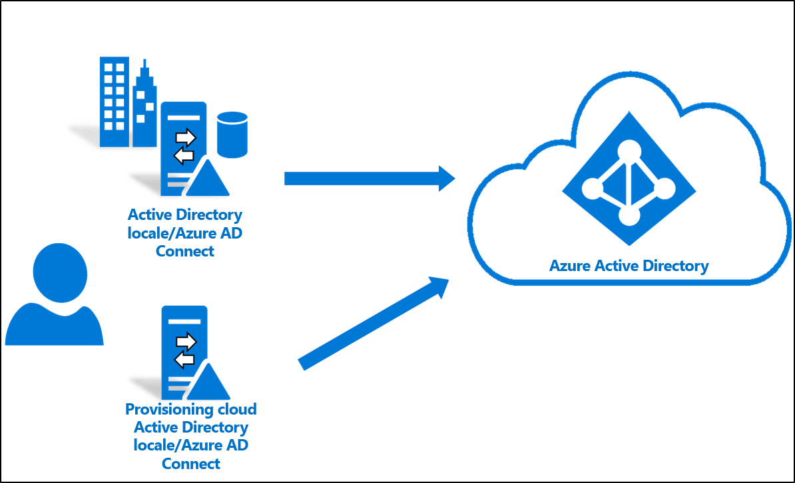

## Considerazioni
Prima di provare questa esercitazione, considerare quanto segue:
1. Assicurarsi di avere familiarità con le nozioni di base del provisioning cloud. 
2. Verificare che sia in esecuzione la versione 1.4.32.0 o successiva del servizio di sincronizzazione di Azure AD Connect e di aver configurato le regole di sincronizzazione come documentato. Quando si crea il progetto pilota, si rimuoverà un'unità organizzativa o un gruppo di test dall'ambito di sincronizzazione di Azure AD Connect. Gli oggetti spostati dall'ambito verranno eliminati da Azure AD. Nel caso degli oggetti utente, l'eliminazione da Azure AD sarà temporanea e sarà possibile ripristinarli. Nel caso degli oggetti gruppo, l'eliminazione da Azure AD sarà permanente e non sarà possibile ripristinarli. Nel servizio di sincronizzazione di Azure AD Connect è stato introdotto un tipo di collegamento che impedisce l'eliminazione nel caso di scenari pilota. 
3. Verificare che gli oggetti nell'ambito del progetto pilota abbiano il valore ms-ds-consistencyGUID popolato, in modo che corrispondano a livello hardware con il provisioning cloud. 

   > [!NOTE]
   > Il servizio di sincronizzazione di Azure AD Connect non popola *ms-ds-consistencyGUID* per impostazione predefinita. Seguire i passaggi descritti in [questo post di blog](https://blogs.technet.microsoft.com/markrenoden/2017/10/13/choosing-a-sourceanchor-for-groups-in-multi-forest-sync-with-aad-connect/) per popolare *ms-ds-consistencyGUID* per gli oggetti gruppo.

4. Si tratta di uno scenario avanzato. Assicurarsi di seguire esattamente i passaggi descritti in questa esercitazione.

## Prerequisites
Per completare questa esercitazione sono necessari i requisiti seguenti
- Un ambiente di test con il servizio di sincronizzazione di Azure AD Connect versione 1.4.32.0 o successiva
- Un'unità organizzativa o un gruppo incluso nell'ambito di sincronizzazione e che è possibile usare nel progetto pilota. È consigliabile iniziare con un piccolo set di oggetti.
- Un server che esegue Windows Server 2012 R2 o versione successiva che ospiterà l'agente di provisioning.  Non può essere lo stesso server di Azure AD Connect.
- L'ancoraggio di origine per il servizio di sincronizzazione di AAD Connect deve essere *objectGuid* o *ms-ds-consistencyGUID*

## Aggiornare Azure AD Connect

Come minimo, è necessario avere [Azure AD Connect](https://www.microsoft.com/download/details.aspx?id=47594) 1.4.32.0. Per aggiornare il servizio di sincronizzazione di Azure AD Connect, completare i passaggi elencati in [Azure AD Connect: Eseguire l'aggiornamento alla versione più recente](../hybrid/how-to-upgrade-previous-version.md).  

## Arrestare l'utilità di pianificazione
Il servizio di sincronizzazione di Azure AD Connect sincronizza le modifiche rilevate nella directory locale usando un'utilità di pianificazione. Per modificare e aggiungere regole personalizzate, è consigliabile disabilitare l'utilità di pianificazione in modo che nel frattempo non vengano eseguite sincronizzazioni.  Eseguire la procedura descritta di seguito:

1.  Nel server che esegue il servizio di sincronizzazione di Azure AD Connect aprire PowerShell con privilegi di amministratore.
2.  Eseguire `Stop-ADSyncSyncCycle`.  Premere INVIO.
3.  Eseguire `Set-ADSyncScheduler -SyncCycleEnabled $false`.

>[!NOTE] 
>Se si esegue l'utilità di pianificazione personalizzata per il servizio di sincronizzazione di AAD Connect, disabilitarla. 

## Creare una regola utente in ingresso personalizzata

 1. Avviare l'editor di sincronizzazione dal menu dell'applicazione sul desktop, come illustrato di seguito: 
 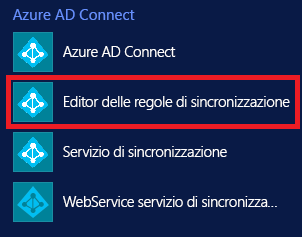 
 
 2. Selezionare **In ingresso** nell'elenco a discesa Direzione e fare clic su **Aggiungi nuova regola**.
 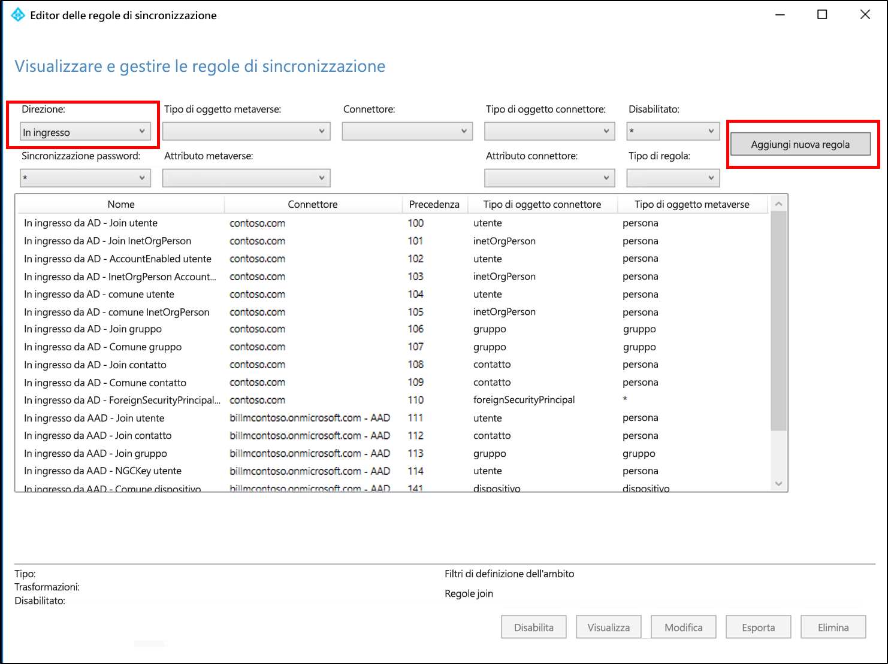 
 
 3. Nella pagina **Descrizione** immettere quanto segue e fare clic su **Avanti**:

    **Nome:** assegnare un nome significativo alla regola 
    **Descrizione:** aggiungere una descrizione significativa  
    
    **Connected System** (Sistema connesso): scegliere il connettore AD per cui si sta scrivendo la regola di sincronizzazione personalizzata 
    **Connected System Object Type** (Tipo di oggetto sistema connesso): Utente 
    **Metaverse Object Type** (Tipo di oggetto metaverse): Persona 
    **Link Type** (Tipo di collegamento): Join 
    **Precedence** (Precedenza): specificare un valore univoco nel sistema 
    **Tag**: lasciare vuoto questo campo 
    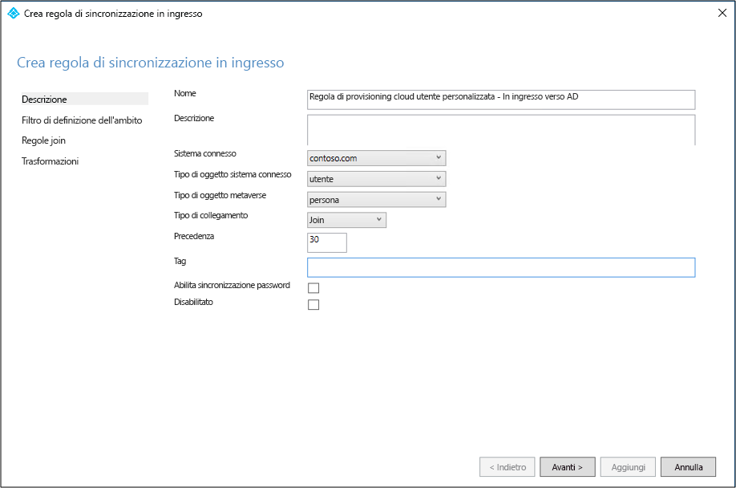 
 
 4. Nella pagina **Scoping filter** (Filtro di ambito) immettere l'unità organizzativa o il gruppo di sicurezza in base a cui creare il progetto pilota.  Per filtrare in base a unità organizzativa, aggiungere la parte OU del nome distinto. Questa regola verrà applicata a tutti gli utenti inclusi in tale unità organizzativa.  Quindi, se il nome distinto termina con "OU=CPUsers,DC=contoso,DC=com, aggiungere questo filtro.  Quindi fare clic su **Next**. 

    |Regola|Attributo|Operatore|valore|
    |-----|----|----|-----|
    |Scoping OU|DN|ENDSWITH|Nome distinto dell'unità organizzativa.|
    |Scoping group||ISMEMBEROF|Nome distinto del gruppo di sicurezza.|

     
 
 5. Nella pagina **Join Rules** (Regole di unione) fare clic su **Avanti**.
 6. Nella pagina **Transformations** (Trasformazioni) aggiungere una trasformazione costante: impostare su True l'attributo cloudNoFlow. Scegliere **Aggiungi**.
 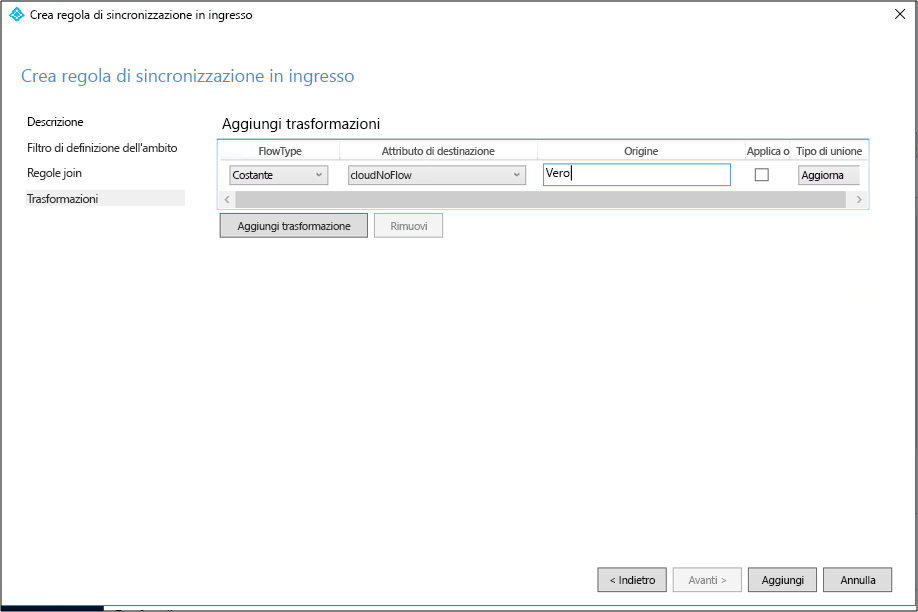 

È necessario seguire la stessa procedura per tutti i tipi di oggetto (utente, gruppo e contatto). Ripetere i passaggi per ogni connettore AD e per ogni foresta AD. 

## Creare una regola utente in uscita personalizzata

 1. Selezionare **In uscita** nell'elenco a discesa Direzione e fare clic su **Aggiungi regola**.
  
 
 2. Nella pagina **Descrizione** immettere quanto segue e fare clic su **Avanti**:

    **Nome:** assegnare un nome significativo alla regola 
    **Descrizione:** aggiungere una descrizione significativa  
    **Connected System** (Sistema connesso): scegliere il connettore AAD per cui si sta scrivendo la regola di sincronizzazione personalizzata 
    **Connected System Object Type** (Tipo di oggetto sistema connesso): Utente 
    **Metaverse Object Type** (Tipo di oggetto metaverse): Persona 
    **Link Type** (Tipo di collegamento): JoinNoFlow 
    **Precedence** (Precedenza): specificare un valore univoco nel sistema 
    **Tag**: lasciare vuoto questo campo 
    
    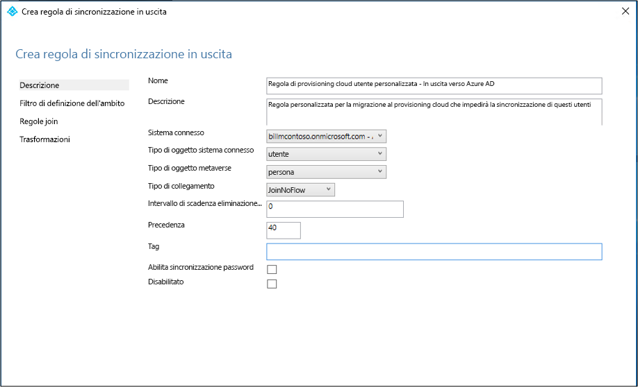 
 
 3. Nella pagina **Scoping filter** (Filtro di ambito) scegliere **cloudNoFlow** uguale **True**. Quindi fare clic su **Next**.
 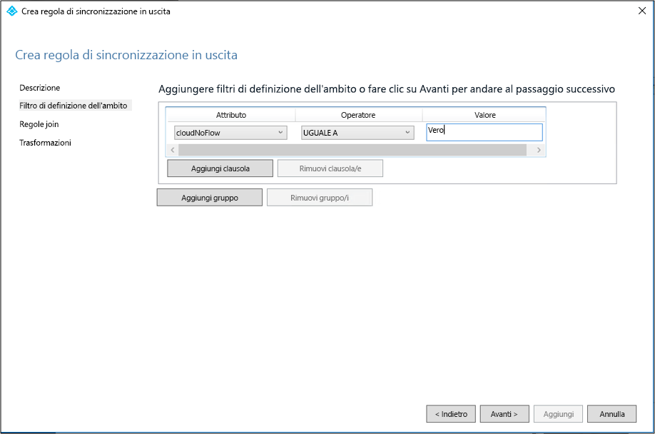 
 
 4. Nella pagina **Join Rules** (Regole di unione) fare clic su **Avanti**.
 5. Nella pagina **Transformations** (Trasformazioni) fare clic su **Add** (Aggiungi).

È necessario seguire la stessa procedura per tutti i tipi di oggetto (utente, gruppo e contatto).

## Installare l'agente di provisioning cloud di Azure AD Connect
1. Accedere al server che si userà con le autorizzazioni di amministratore dell'organizzazione.  Se si usa l'esercitazione [Ambiente di AD e Azure di base](tutorial-basic-ad-azure.md), sarà CP1.
2. Scaricare l'agente di provisioning cloud di Azure AD Connect [qui](https://go.microsoft.com/fwlink/?linkid=2109037).
3. Eseguire il provisioning cloud di Azure AD Connect (AADConnectProvisioningAgent.Installer)
3. Nella schermata iniziale **accettare** le condizioni di licenza e fare clic su **Installa**. 
 

4. Al termine dell'operazione verrà avviata la configurazione guidata.  Accedere con l'account amministratore globale di Azure AD.
5. Nella schermata **Connect Active Directory** (Connetti Active Directory) fare clic su **Aggiungi directory** quindi accedere con l'account amministratore di Active Directory.  Questa operazione aggiungerà la directory locale.  Fare clic su **Avanti**. 
 

6. Nella schermata **Configurazione completata** fare clic su **Conferma**.  Questa operazione registrerà e riavvierà l'agente. 
 

7. Al termine dell'operazione verrà visualizzato l'avviso indicante che **la verifica è stata completata correttamente**.  È possibile fare clic su **Esci**. 
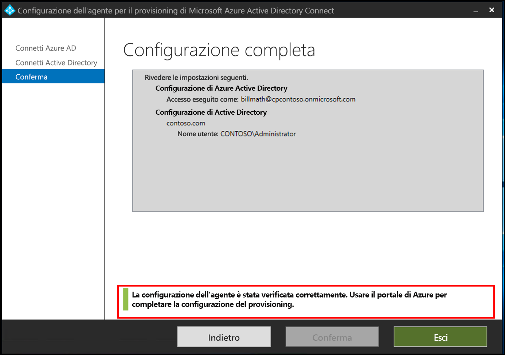 
8. Se è ancora visualizzata la schermata iniziale, fare clic su **Chiudi**.

## Verificare l'installazione dell'agente
La verifica dell'agente si esegue nel portale di Azure e nel server locale che esegue l'agente.

### Verifica dell'agente nel portale di Azure
Per verificare se l'agente viene visto da Azure, seguire questa procedura:

1. Accedere al portale di Azure.
2. A sinistra selezionare **Azure Active Directory**, fare clic su **Azure AD Connect** e al centro selezionare **Gestione del provisioning (anteprima)** . 
 

3.  Nella schermata **Provisioning di Azure AD (anteprima)** fare clic su **Verifica tutti gli agenti**.
 
 
4. Nella **schermata degli agenti di provisioning locali** verranno visualizzati gli agenti installati.  Verificare che l'agente in questione sia presente e contrassegnato come **Disabilitato**.  L'agente è disabilitato per impostazione predefinita  

### Nel server locale
Per verificare se l'agente è in esecuzione, seguire questa procedura:

1.  Accedere al server con un account amministratore
2.  Aprire **Servizi** passando all'opzione oppure tramite Start/Esegui/Services.msc.
3.  In **Servizi** assicurarsi che siano presenti i servizi **Microsoft Azure AD Connect Agent Updater** e **Microsoft Azure AD Connect Provisioning Agent** e che il relativo stato sia **In esecuzione**.

## Configurare il provisioning cloud di Azure AD Connect
Per configurare il provisioning, seguire questa procedura:

 1. Accedere al portale di Azure AD.
 2. Fare clic su **Azure Active Directory**
 3. Fare clic su **Azure AD Connect**
 4. Selezionare **Gestione del provisioning (anteprima)** 
  
 5.  Fare clic su **Nuova configurazione**
  
 6.  Nella schermata di configurazione, immettere un valore per **Messaggio di posta elettronica di notifica**, spostare il selettore su **Abilita** e fare clic su **Salva**.
 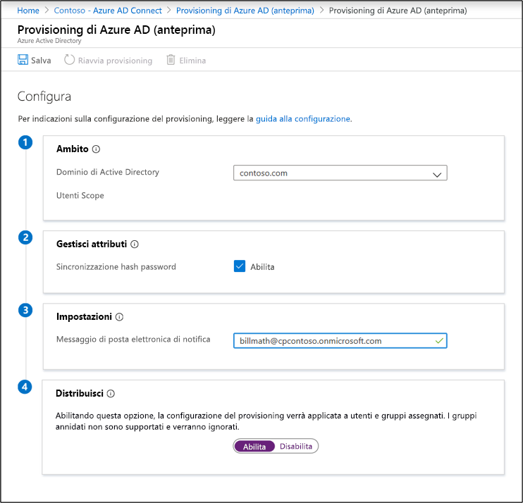 
 7. In **Configura** selezionare **Tutti gli utenti** per cambiare l'ambito della regola di configurazione.
  
 8. A destra cambiare l'ambito per includere la specifica unità organizzativa creata, "OU=CPUsers,DC=contoso,DC=com".
 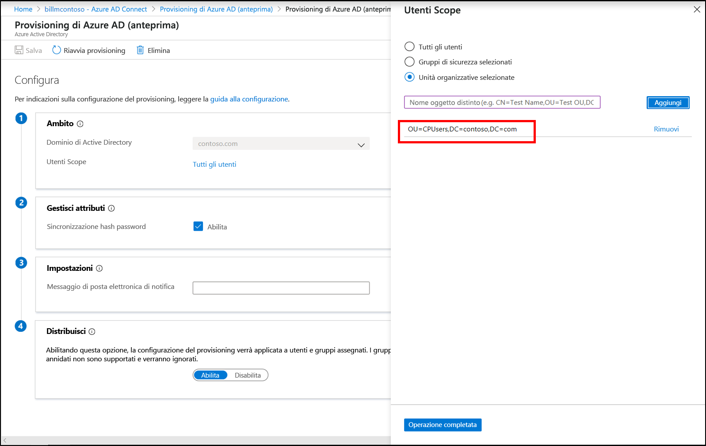 
 9.  Fare clic su **Fine** e su **Salva**.
 10. L'ambito dovrebbe ora essere impostato su una unità organizzativa. 
 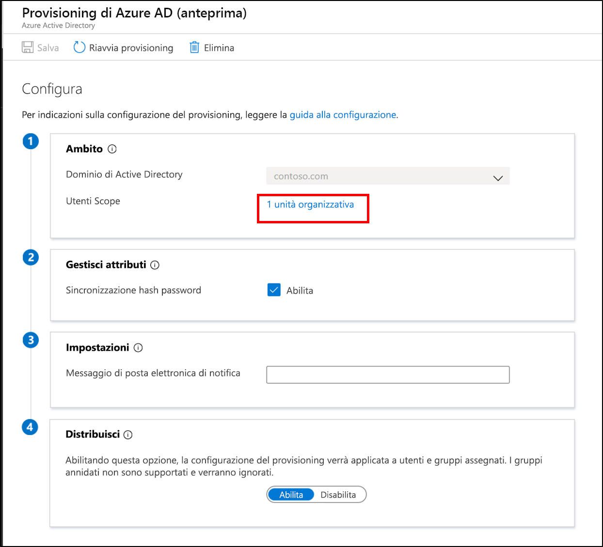 
 

## Verificare che il provisioning cloud venga applicato agli utenti
A questo punto verificare che gli utenti presenti nella directory locale siano stati sincronizzati e che ora siano inclusi nel tenant di Azure AD.  Per essere completata, questa operazione può richiedere alcune ore.  Per verificare se il provisioning cloud è stato applicato agli utenti, seguire questa procedura:

1. Selezionare il [portale di Azure](https://portal.azure.com) e accedere con un account che dispone di una sottoscrizione di Azure.
2. A sinistra selezionare **Azure Active Directory**
3. Fare clic su **Azure AD Connect**
4. Fare clic su **Gestione del provisioning (anteprima)**
5. Fare clic sul pulsante **Log**
6. Cercare un nome utente per verificare che sia stato incluso nel provisioning cloud

È inoltre possibile verificare che l'utente e il gruppo esistano in Azure AD.

## Avviare l'utilità di pianificazione
Il servizio di sincronizzazione di Azure AD Connect sincronizza le modifiche rilevate nella directory locale usando un'utilità di pianificazione. Ora che sono state modificate le regole, è possibile riavviare l'utilità di pianificazione.  Eseguire la procedura descritta di seguito:

1.  Nel server che esegue il servizio di sincronizzazione di Azure AD Connect aprire PowerShell con privilegi di amministratore
2.  Eseguire `Set-ADSyncScheduler -SyncCycleEnabled $true`.
3.  Eseguire `Start-ADSyncSyncCycle`.  Premere INVIO.  

>[!NOTE] 
>Se si esegue l'utilità di pianificazione personalizzata per il servizio di sincronizzazione di AAD Connect, abilitarla. 

## Si è verificato un errore
Nel caso il progetto pilota non funzioni come previsto, è possibile tornare nella configurazione del servizio di sincronizzazione di Azure AD Connect seguendo questa procedura:
1.  Disabilitare la configurazione del provisioning nel portale di Azure. 
2.  Disabilitare tutte le regole di sincronizzazione personalizzate create per il provisioning cloud usando l'editor delle regole di sincronizzazione. La disabilitazione genera una sincronizzazione completa in tutti i connettori.

## Configurare il servizio di sincronizzazione di Azure AD Connect per escludere l'unità organizzativa pilota
Dopo aver verificato che gli utenti dell'unità organizzativa pilota vengono gestiti correttamente dal provisioning cloud, è possibile riconfigurare Azure AD Connect per escludere l'unità organizzativa pilota creata in precedenza.  L'agente di provisioning cloud gestirà la sincronizzazione di questi utenti in futuro.  Usare la procedura seguente per definire l'ambito di Azure AD Connect.

 1. Nel server che esegue Azure AD Connect fare doppio clic sull'icona di Azure AD Connect.
 2. Fare clic su **Configura**.
 3. Selezionare **Personalizzazione delle opzioni di sincronizzazione** e quindi fare clic su Avanti.
 4. Accedere a Azure AD e fare clic su **Avanti**.
 5. Nella schermata **Connessione delle directory** fare clic su **Avanti**.
 6. Nella schermata **Filtro di domini e unità organizzative** selezionare **Sincronizza le unità organizzative e i domini selezionati**.
 7. Espandere il dominio e **deselezionare** l'unità organizzativa **CPUsers**.  Fare clic su **Avanti**.
 
 9. Nella schermata **Funzionalità facoltative** fare clic su **Avanti**.
 10. Nella schermata **Ready to configure** (Pronto per la configurazione) fare clic su **Configure** (Configura).
 11. Al termine, fare clic su **Esci**. 

## Passaggi successivi 

- [Cos'è il provisioning?](what-is-provisioning.md)
- [Che cos'è il provisioning cloud di Azure AD Connect?](what-is-cloud-provisioning.md)

