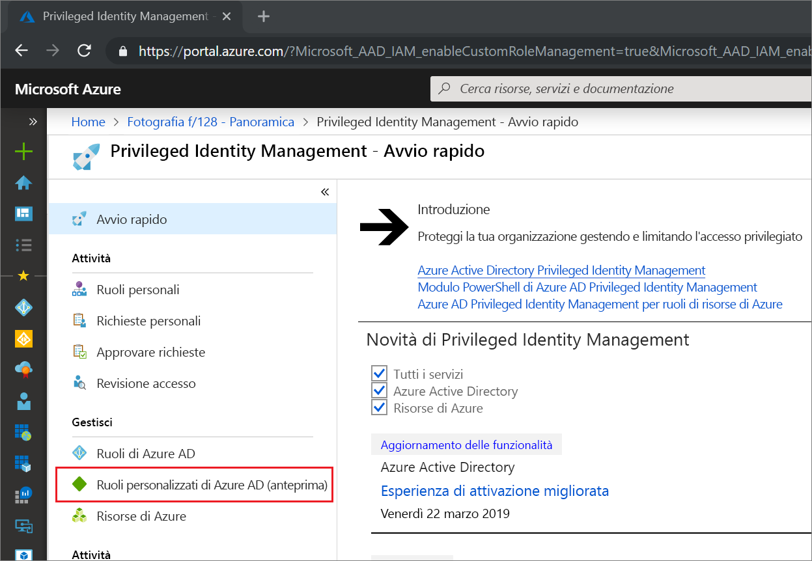
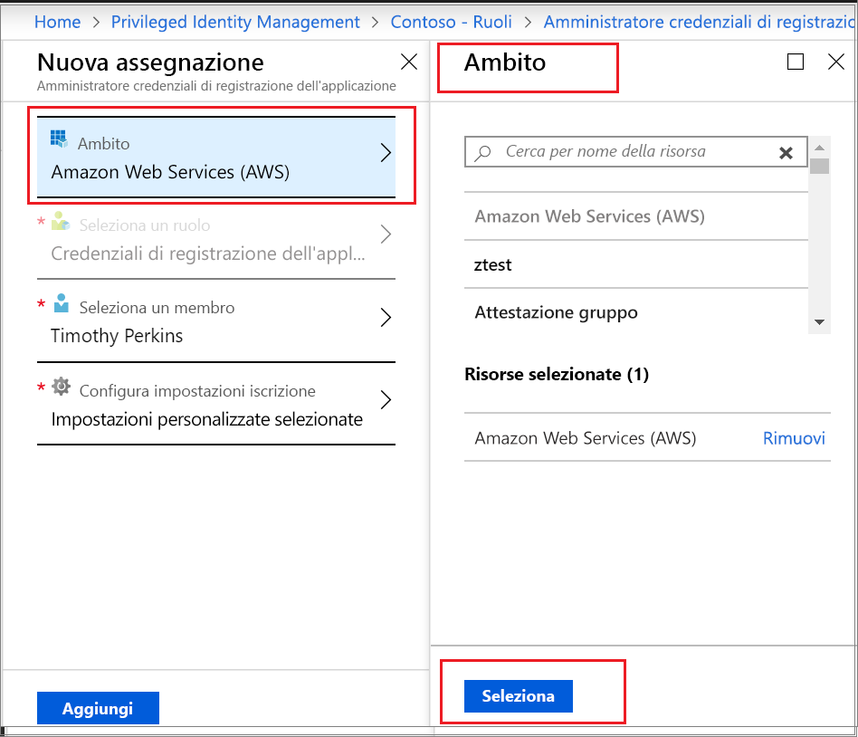

# Attivare un ruolo personalizzato di Azure AD in Privileged Identity Management

Privileged Identity Management in Azure Active Directory (Azure AD) ora supporta l'assegnazione JIT e con vincoli di tempo ai ruoli personalizzati creati per gestire le applicazioni nell'esperienza di amministrazione di Gestione delle identità e degli accessi. Per altre informazioni su come creare ruoli personalizzati per delegare la gestione delle applicazioni in Azure AD, vedere [Ruoli di amministratore personalizzati in Azure Active Directory (anteprima)](../users-groups-roles/roles-custom-overview.md).

> [!NOTE]
> I ruoli personalizzati di Azure AD non sono integrati nei ruoli della directory predefiniti durante la fase di anteprima. Non appena la funzionalità sarà disponibile a livello generale, la gestione dei ruoli verrà eseguita nell'esperienza dei ruoli predefiniti.

## Attivare un ruolo

Quando è necessario attivare un Azure AD ruolo personalizzato, richiedere l'attivazione selezionando l'opzione di navigazione ruoli personali in Privileged Identity Management.

1. Accedere al [portale di Azure](https://portal.azure.com).
1. Aprire Azure AD [Privileged Identity Management](https://portal.azure.com/?Microsoft_AAD_IAM_enableCustomRoleManagement=true&Microsoft_AAD_IAM_enableCustomRoleAssignment=true&feature.rbacv2roles=true&feature.rbacv2=true&Microsoft_AAD_RegisteredApps=demo#blade/Microsoft_Azure_PIMCommon/CommonMenuBlade/quickStart).

1. Selezionare **Ruoli personalizzati di Azure AD** per visualizzare un elenco delle assegnazioni di ruolo personalizzato di Azure AD idonee.

   

> [!Note] 
>  Prima di assegnare un ruolo, è necessario creare o configurare un ruolo. Per ulteriori informazioni sulla configurazione dei ruoli personalizzati di AAD, vedere [qui] (https://docs.microsoft.com/azure/active-directory/privileged-identity-management/azure-ad-custom-roles-configure)

1. Nella pagina **Ruoli personalizzati di Azure AD (anteprima)** individuare l'assegnazione necessaria.
1. Selezionare **Attivazione del ruolo** per aprire la pagina **Attiva**.
1. Se il ruolo richiede l'autenticazione a più fattori, fare clic su **Verificare la propria identità prima di procedere**. È necessario eseguire l'autenticazione solo una volta per sessione.
1. Selezionare **Verifica la mia identità** e seguire le istruzioni per fornire le eventuali verifiche di sicurezza aggiuntive.
1. Per specificare un ambito dell'applicazione personalizzato, selezionare **Ambito** per aprire il riquadro del filtro. Richiedere l'accesso a un ruolo a livello dell'ambito minimo necessario. Se l'assegnazione è a livello dell'ambito dell'applicazione, è possibile eseguire l'attivazione solo a livello di tale ambito.

   

1. Se necessario, specificare un'ora di inizio di attivazione personalizzata. In tal caso, il membro del ruolo viene attivato all'ora specificata.
1. Nella casella **Motivo** immettere il motivo della richiesta di attivazione. Questa opzione può essere configurata come obbligatoria o meno nell'impostazione del ruolo.
1. Selezionare **Attiva**.

Se il ruolo non richiede l'approvazione, viene attivato in base alle impostazioni definite e aggiunto all'elenco dei ruoli attivi. Per iniziare a usare il ruolo attivato, seguire la procedura descritta in [Assegnare un ruolo personalizzato di Azure AD in Privileged Identity Management](azure-ad-custom-roles-assign.md).

Se per attivare il ruolo è necessaria l'approvazione, si riceverà una notifica di Azure che informa l'utente che la richiesta è in attesa di approvazione.

## Passaggi successivi

- [Assegnare un ruolo personalizzato di Azure AD](azure-ad-custom-roles-assign.md)
- [Rimuovere o aggiornare un'assegnazione di ruolo personalizzato di Azure AD](azure-ad-custom-roles-update-remove.md)
- [Configurare un'assegnazione di ruolo personalizzato di Azure AD](azure-ad-custom-roles-configure.md)
- [Definizioni dei ruoli in Azure AD](../users-groups-roles/directory-assign-admin-roles.md)
