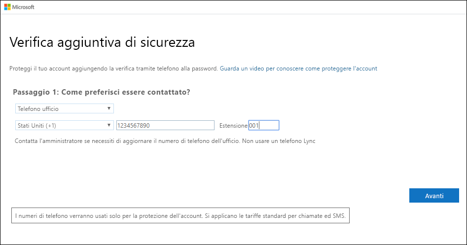
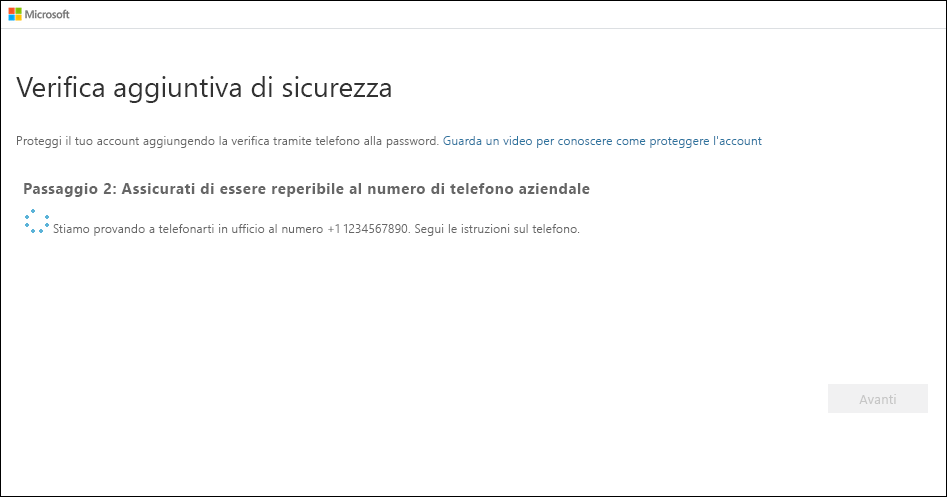
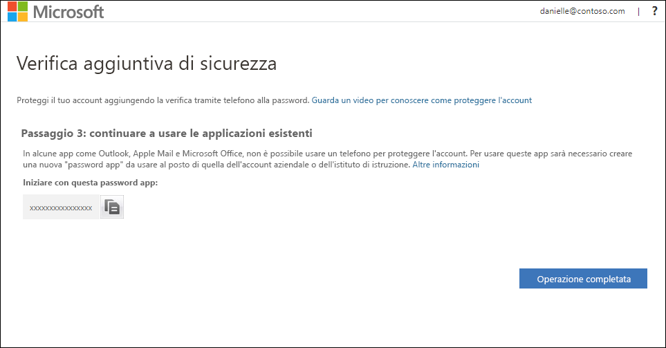

# Configurare il telefono dell'ufficio come metodo di verifica a due fattori

È possibile configurare il telefono dell'ufficio per usarlo come metodo di verifica a due fattori.

>[!Note]
> Se l'opzione Telefono ufficio è disattivata, è possibile che l'organizzazione non consenta di usare un numero di telefono dell'ufficio per la verifica. In questo caso, sarà necessario selezionare un altro metodo oppure contattare l'amministratore per ottenere supporto.

## Configurare il telefono dell'ufficio come metodo di verifica

1. Nella pagina **Verifica di sicurezza aggiuntiva** selezionare **Telefono ufficio** nell'area **Passaggio 1: indicare il modo in cui si preferisce essere contattati**, selezionare il paese o l'area geografica nell'elenco a discesa e quindi digitare il numero di telefono dell'ufficio e infine il numero di interno, se presente.

    

2. Si riceverà una telefonata da Microsoft, in cui verrà richiesto di premere cancelletto (#) sul telefono dell'ufficio per la verifica della propria identità.

    

3. Dall'area **Passaggio 3: continuare a usare le applicazioni esistenti** copiare la password per le app visualizzata e incollarla in una posizione sicura.

    

    >[!Note]
    >Per informazioni su come usare la password per le app meno recenti, vedere [Gestire le password delle app](multi-factor-authentication-end-user-app-passwords.md). È necessario usare le password per le app solo se si continuano a usare app meno recenti che non supportano la verifica a due fattori.

4. Selezionare **Operazione completata**.

## Passaggi successivi

Dopo aver configurato il metodo di verifica a due fattori, è possibile aggiungere altri metodi, gestire le impostazioni e le password per le app, effettuare l'accesso oppure ottenere informazioni su alcuni problemi comuni relativi alla verifica a due fattori.

- [Gestire le impostazioni del metodo di verifica a due fattori](multi-factor-authentication-end-user-manage-settings.md)

- [Gestire le password delle app](multi-factor-authentication-end-user-app-passwords.md)

- [Accedere usando la verifica a due fattori](multi-factor-authentication-end-user-signin.md)

- [Risolvere i problemi relativi alla verifica a due fattori](multi-factor-authentication-end-user-troubleshoot.md)
