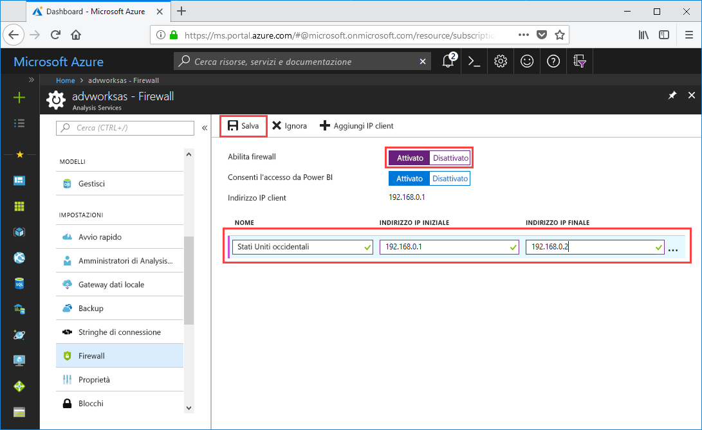

# Guida introduttiva: Configurare il firewall del server - Portale

Questa guida introduttiva consente di configurare un firewall per il server di Azure Analysis Services. L'abilitazione di un firewall e la configurazione di intervalli di indirizzi IP solo per i computer che accedono al server sono una parte importante della protezione dei dati e del server.

## Prerequisiti

- Un server di Analysis Services nella sottoscrizione. Per altre informazioni, vedere [Guida introduttiva: Creare un server - Portale](analysis-services-create-server.md) o [Guida introduttiva: Creare un server - PowerShell](analysis-services-create-powershell.md)
- Uno o più intervalli di indirizzi IP per i computer client (se necessario).
- Si noti che lo scenario di importazione da Power BI Premium attualmente non è supportato.

## Accedere al portale di Azure 

[Accedere al portale](https://portal.azure.com)

## Configurare un firewall

1. Fare clic sul server per aprire la pagina Panoramica. 
2. In **IMPOSTAZIONI** > **Firewall** > **Abilita firewall** fare clic su **Sì**.
3. Per consentire l'accesso DirectQuery dal servizio Power BI, in **Allow access from Power BI** (Consenti accesso da Power BI) fare clic su **Sì**.  
4. (Facoltativo) Specificare uno o più intervalli di indirizzi IP. Immettere un nome e un indirizzo IP iniziale e finale per ogni intervallo. Il nome della regola firewall deve essere limitato a 128 caratteri e può contenere solo caratteri maiuscoli, caratteri minuscoli, numeri, underscore e trattini. Gli spazi e altri caratteri speciali non sono consentiti.
5. Fare clic su **Save**.

     

## Pulire le risorse

Quando non sono più necessari, eliminare gli intervalli di indirizzi IP o disabilitare il firewall.

## Passaggi successivi
In questa guida introduttiva è stato illustrato come configurare un firewall per il server. Dopo avere creato il server e averlo protetto con un firewall, è possibile aggiungervi un modello di dati di esempio di base dal portale. Un modello di esempio è utile per avere informazioni sulla configurazione dei ruoli del database modello e sul test delle connessioni client. Per altre informazioni, continuare con l'esercitazione per l'aggiunta di un modello di esempio.

> [!div class="nextstepaction"]
> [Esercitazione: aggiungere un modello di esempio al server](analysis-services-create-sample-model.md)
