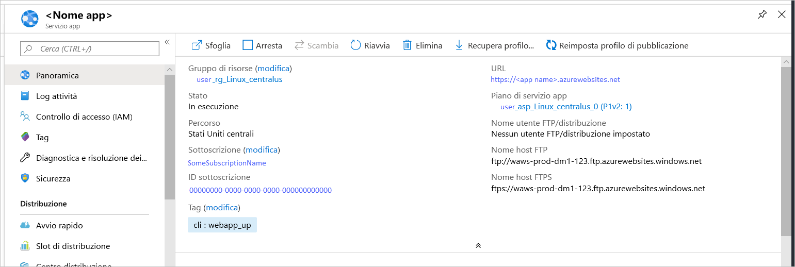

# <a name="quickstart-create-a-python-app-in-azure-app-service-on-linux"></a>Guida introduttiva: Creare un'app Python nel Servizio app di Azure in Linux

In questo articolo si distribuisce una semplice app Python nel [Servizio app in Linux](app-service-linux-intro.md), un servizio di hosting web ad alta scalabilità e con applicazione automatica di patch. Si userà inoltre l'[interfaccia della riga di comando di Azure](/cli/azure/install-azure-cli) tramite Azure Cloud Shell, interattivo e basato sul browser, in modo da poter seguire la procedura con un computer Mac, Linux o Windows.


## <a name="prerequisites"></a>Prerequisiti

Per completare questa guida introduttiva:

* <a href="https://www.python.org/downloads/" target="_blank">Installare Python 3.7</a>
* <a href="https://git-scm.com/" target="_blank">Installare Git</a>
* Una sottoscrizione di Azure. Se non se ne ha ancora una, creare un [account gratuito](https://azure.microsoft.com/free/?ref=microsoft.com&utm_source=microsoft.com&utm_medium=docs&utm_campaign=visualstudio) prima di iniziare.

## <a name="download-the-sample-locally"></a>Scaricare l'esempio in locale

In una finestra del terminale eseguire i comandi seguenti per clonare l'applicazione di esempio nel computer locale e passare alla directory con il codice di esempio.

```bash
git clone https://github.com/Azure-Samples/python-docs-hello-world
cd python-docs-hello-world
```

Il repository contiene un file *application.py*, che indica al servizio app che il repository contiene un'app Flask. Per altre informazioni, vedere [Processo di avvio di contenitore e personalizzazioni](how-to-configure-python.md).

## <a name="run-the-app-locally"></a>Eseguire l'app in locale

Eseguire l'applicazione in locale, in modo da verificare l'aspetto che assumerà dopo la distribuzione in Azure. Aprire una finestra del terminale e usare i comandi seguenti per installare le dipendenze necessarie e avviare il server di sviluppo predefinito. 

```bash
# In Bash (for Linux or Mac)
python3 -m venv venv
source venv/bin/activate
pip install -r requirements.txt
FLASK_APP=application.py flask run
```
```powershell
# In Powershell (for Windows)
py -3 -m venv env
env\scripts\activate
pip install -r requirements.txt
Set-Item Env:FLASK_APP ".\application.py"
flask run
```

Aprire un Web browser e passare all'app di esempio all'indirizzo `http://localhost:5000/`.

Nella pagina verrà visualizzato il messaggio **Hello World!** dell'app di esempio.


Nella finestra del terminale premere **CTRL+C** per uscire dal server Web.

[!INCLUDE [cloud-shell-try-it.md](../../../includes/cloud-shell-try-it.md)]

## <a name="download-the-sample"></a>Scaricare l'esempio

In Cloud Shell creare una directory quickstart e passare ad essa.

```bash
mkdir quickstart

cd $HOME/quickstart
```

Eseguire quindi il comando seguente per clonare il repository dell'app di esempio nella directory quickstart.

```bash
git clone https://github.com/Azure-Samples/python-docs-hello-world
```

Durante l'esecuzione, il comando visualizza informazioni simili all'esempio seguente:

```bash
Cloning into 'python-docs-hello-world'...
remote: Enumerating objects: 43, done.
remote: Total 43 (delta 0), reused 0 (delta 0), pack-reused 43
Unpacking objects: 100% (43/43), done.
Checking connectivity... done.
```

## <a name="create-a-web-app"></a>Creare un'app Web

Passare alla directory contenente il codice di esempio ed eseguire il comando `az webapp up`.

Nell'esempio seguente sostituire `<app-name>` con un nome di app univoco a livello globale. *I caratteri validi sono `a-z`, `0-9` e `-`* .

```bash
cd python-docs-hello-world

az webapp up -n <app-name>
```

L'esecuzione del comando può richiedere alcuni minuti. Durante l'esecuzione, il comando visualizza informazioni simili all'esempio seguente:

```json
The behavior of this command has been altered by the following extension: webapp
Creating Resource group 'appsvc_rg_Linux_CentralUS' ...
Resource group creation complete
Creating App service plan 'appsvc_asp_Linux_CentralUS' ...
App service plan creation complete
Creating app '<app-name>' ....
Webapp creation complete
Creating zip with contents of dir /home/username/quickstart/python-docs-hello-world ...
Preparing to deploy contents to app.
All done.
{
  "app_url": "https:/<app-name>.azurewebsites.net",
  "location": "Central US",
  "name": "<app-name>",
  "os": "Linux",
  "resourcegroup": "appsvc_rg_Linux_CentralUS ",
  "serverfarm": "appsvc_asp_Linux_CentralUS",
  "sku": "BASIC",
  "src_path": "/home/username/quickstart/python-docs-hello-world ",
  "version_detected": "-",
  "version_to_create": "python|3.7"
}
```

[!INCLUDE [AZ Webapp Up Note](../../../includes/app-service-web-az-webapp-up-note.md)]

## <a name="browse-to-the-app"></a>Passare all'app

Passare all'applicazione distribuita con il Web browser.

```bash
http://<app-name>.azurewebsites.net
```

Il codice di esempio Python è in esecuzione nel servizio app in Linux con un'immagine predefinita.


**Congratulazioni** La distribuzione della prima app Python nel Servizio app di Azure in Linux è stata completata.

## <a name="update-locally-and-redeploy-the-code"></a>Aggiornare e ridistribuire il codice in locale

In Cloud Shell immettere `code application.py` per aprire l'editor di Cloud Shell.


 Apportare una piccola modifica al testo nella chiamata a `return`:

```python
return "Hello Azure!"
```

Salvare le modifiche e uscire dall'editor. Usare il comando `^S` per salvare e `^Q` per uscire.

Ridistribuire l'app usando il comando [`az webapp up`](/cli/azure/webapp#az-webapp-up). Sostituire il nome dell'app in `<app-name>` e specificare un percorso in `<location-name>` (usando uno dei valori indicati dal comando [`az account list-locations`](/cli/azure/appservice?view=azure-cli-latest.md#az-appservice-list-locations)).

```bash
az webapp up -n <app-name> -l <location-name>
```

Al termine della distribuzione, tornare alla finestra del browser aperta nel passaggio **Passare all'app** e aggiornare la pagina.


## <a name="manage-your-new-azure-app"></a>Gestire la nuova app Azure

Accedere al <a href="https://portal.azure.com" target="_blank">portale di Azure</a> per gestire l'app creata.

Nel menu a sinistra scegliere **Servizi app** e quindi selezionare il nome dell'app Azure.


Verrà visualizzata la pagina Panoramica dell'app. Qui è possibile eseguire attività di gestione di base come l'esplorazione, l'arresto, l'avvio, il riavvio e l'eliminazione dell'app.



Il menu a sinistra fornisce varie pagine per la configurazione dell'app. 

[!INCLUDE [cli-samples-clean-up](../../../includes/cli-samples-clean-up.md)]

## <a name="next-steps"></a>Passaggi successivi

> [!div class="nextstepaction"]
> [Esercitazione: App Web Python (Django) con PostgreSQL](tutorial-python-postgresql-app.md)

> [!div class="nextstepaction"]
> [Configurare un'app Python](how-to-configure-python.md)

> [!div class="nextstepaction"]
> [Esercitazione: Eseguire un'app Python in un contenitore personalizzato](tutorial-custom-docker-image.md)
