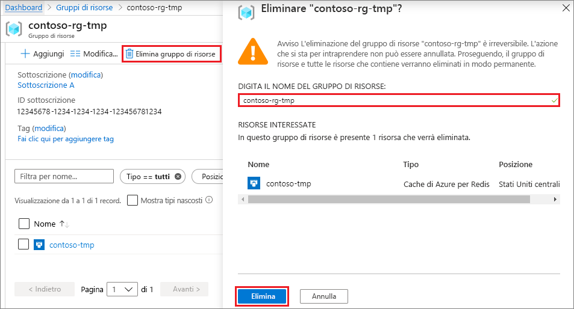

# <a name="quickstart-create-a-python-app-that-uses-azure-cache-for-redis"></a>Guida introduttiva: Creare un'app Python che usa Cache di Azure per Redis

In questo articolo si incorpora Cache di Azure per Redis in un'app Python per accedere a una cache sicura e dedicata accessibile da qualsiasi applicazione in Azure.

## <a name="prerequisites"></a>Prerequisiti

- Sottoscrizione di Azure: [creare un account gratuito](https://azure.microsoft.com/free/)
- [Python 2 o 3](https://www.python.org/downloads/)

## <a name="create-an-azure-cache-for-redis-instance"></a>Creare un'istanza di Azure Cache per Redis
[!INCLUDE [redis-cache-create](../../includes/redis-cache-create.md)]

[!INCLUDE [redis-cache-create](../../includes/redis-cache-access-keys.md)]

## <a name="install-redis-py"></a>Installare redis-py

[Redis py](https://github.com/andymccurdy/redis-py) è un'interfaccia di Python per Cache Redis di Azure. Usare lo strumento per i pacchetti Python, *pip*, per installare il pacchetto *redis-py* da un prompt dei comandi. 

Nell'esempio seguente è stato usato *pip3* per Python 3 per installare *redis-py* in Windows 10 da un prompt dei comandi dell'amministratore.


## <a name="read-and-write-to-the-cache"></a>Leggere e scrivere nella cache

Eseguire Python dalla riga di comando e testare la cache tramite il codice seguente. Sostituire `<Your Host Name>` e `<Your Access Key>` con i valori dell'istanza in uso della cache di Azure per Redis. Il formato del nome host è *\<DNS name>.redis.cache.windows.net*.

```python
>>> import redis
>>> r = redis.StrictRedis(host='<Your Host Name>',
        port=6380, db=0, password='<Your Access Key>', ssl=True)
>>> r.set('foo', 'bar')
True
>>> r.get('foo')
b'bar'
```

> [!IMPORTANT]
> Per la cache di Azure per Redis versione 3.0 o successive, viene applicato il controllo del certificato SSL. È necessario impostare in modo esplicito ssl_ca_certs quando ci si connette alla cache di Azure per Redis. Per RedHat Linux, i certificati ssl_ca_certs si trovano nel modulo dei certificati */etc/pki/tls/certs/ca-bundle.crt*.

## <a name="create-a-python-sample-app"></a>Creare un'app di esempio Python

Creare un nuovo file di testo, aggiungere lo script seguente e salvare il file come *PythonApplication1.py*. Sostituire `<Your Host Name>` e `<Your Access Key>` con i valori dell'istanza in uso della cache di Azure per Redis. Il formato del nome host è *\<DNS name>.redis.cache.windows.net*.

```python
import redis

myHostname = "<Your Host Name>"
myPassword = "<Your Access Key>"

r = redis.StrictRedis(host=myHostname, port=6380,
                      password=myPassword, ssl=True)

result = r.ping()
print("Ping returned : " + str(result))

result = r.set("Message", "Hello!, The cache is working with Python!")
print("SET Message returned : " + str(result))

result = r.get("Message")
print("GET Message returned : " + result.decode("utf-8"))

result = r.client_list()
print("CLIENT LIST returned : ")
for c in result:
    print("id : " + c['id'] + ", addr : " + c['addr'])
```

Eseguire *PythonApplication1.py* con Python. Vengono visualizzati risultati simili all'esempio seguente:


## <a name="clean-up-resources"></a>Pulire le risorse

Se l'uso delle risorse e del gruppo di risorse di Azure creati nella presente Guida introduttiva è terminato, è possibile eliminarli per evitare addebiti.

> [!IMPORTANT]
> L'eliminazione di un gruppo di risorse è irreversibile e comporta l'eliminazione definitiva del gruppo di risorse e di tutte le risorse incluse. Se l'istanza della cache di Azure per Redis è stata creata in un gruppo di risorse esistenti che si vuole conservare, è possibile eliminare solo la cache selezionando **Elimina** nella pagina **Panoramica** della cache. 

Per eliminare il gruppo di risorse e la relativa istanza della cache di Azure per Redis:

1. Accedere al [portale di Azure](https://portal.azure.com) e selezionare **Gruppi di risorse**.
1. Nella casella di testo **Filtra per nome** immettere il nome del gruppo di risorse che contiene l'istanza della cache, quindi selezionarlo nei risultati della ricerca. 
1. Nella pagina del gruppo di risorse selezionare **Elimina gruppo di risorse**.
1. Digitare il nome del gruppo di risorse e quindi selezionare **Elimina**.
   
   

## <a name="next-steps"></a>Passaggi successivi

> [!div class="nextstepaction"]
> [Creare una semplice app Web ASP.NET che usa Cache Redis di Azure.](./cache-web-app-howto.md)

