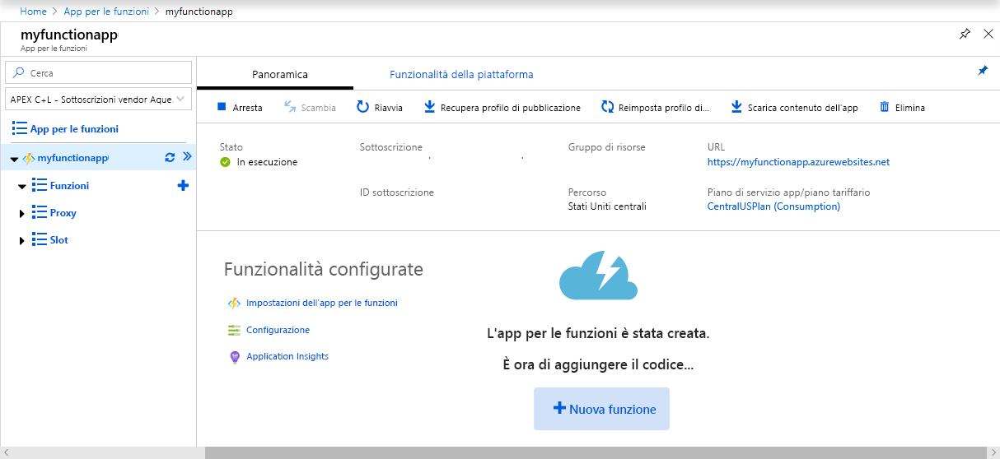
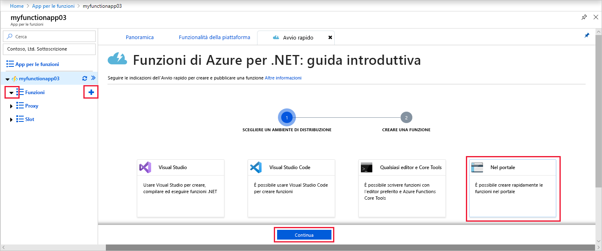
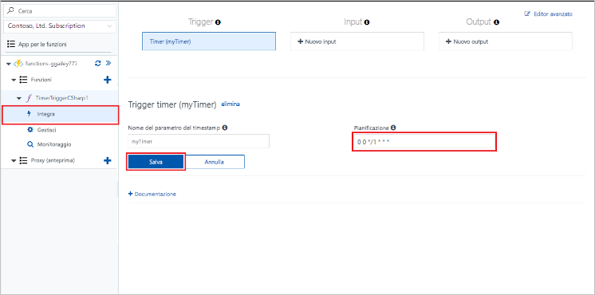

# Creare una funzione in Azure attivata da un timer

Informazioni su come usare Funzioni di Azure per creare una funzione [senza server](https://azure.microsoft.com/solutions/serverless/) eseguita in base a una pianificazione definita.

## Prerequisiti

Per completare questa esercitazione:

+ Se non si ha una sottoscrizione di Azure, creare un [account gratuito](https://azure.microsoft.com/free/?WT.mc_id=A261C142F) prima di iniziare.

## Creare un'app per le funzioni di Azure

[!INCLUDE [Create function app Azure portal](../../includes/functions-create-function-app-portal.md)]

Si creerà ora una funzione nella nuova app per le funzioni.

## Creare una funzione attivata da un timer

1. Espandere l'app per le funzioni e fare clic sul pulsante **+** accanto a **Funzioni**. Se questa è la prima funzione nell'app per le funzioni, selezionare **Nel portale** e quindi **Continua**. In caso contrario, andare direttamente al passaggio 3.

   

2. Scegliere **Altri modelli** e quindi **Termina e visualizza i modelli**.

    

3. Nel campo di ricerca digitare `timer` e configurare il nuovo trigger con le impostazioni indicate nella tabella sotto l'immagine.

    

    | Impostazione | Valore consigliato | Descrizione |
    |---|---|---|
    | **Nome** | Predefinito | Definisce il nome della funzione attivata dal timer. |
    | **Pianificare** | 0 \*/1 \* \* \* \* | [Espressione CRON](functions-bindings-timer.md#ncrontab-expressions) a sei campi che pianifica la funzione in modo che venga eseguita ogni minuto. |

4. Fare clic su **Create**(Crea). Viene creata una funzione nel linguaggio scelto che verrà eseguita ogni minuto.

5. Verificare l'esecuzione visualizzando le informazioni di traccia scritte nei log.

    

È ora possibile modificare la pianificazione della funzione in modo che venga eseguita ogni ora invece che ogni minuto.

## Aggiornare la pianificazione del timer

1. Espandere la funzione e fare clic su **Integrazione**. È a questo punto che si definiscono i binding di input e di output e si imposta la pianificazione. 

2. Nel campo **Pianificazione** immettere il nuovo valore `0 0 */1 * * *` per la pianificazione oraria e quindi fare clic su **Salva**.  

È ora disponibile una funzione che viene eseguita ogni ora. 

## Pulire le risorse

[!INCLUDE [Next steps note](../../includes/functions-quickstart-cleanup.md)]

## Passaggi successivi

È stata creata una funzione eseguita in base a una pianificazione. Per altre informazioni sui trigger timer, vedere [Pianificare l'esecuzione di codice con Funzioni di Azure](functions-bindings-timer.md).

[!INCLUDE [Next steps note](../../includes/functions-quickstart-next-steps.md)]
