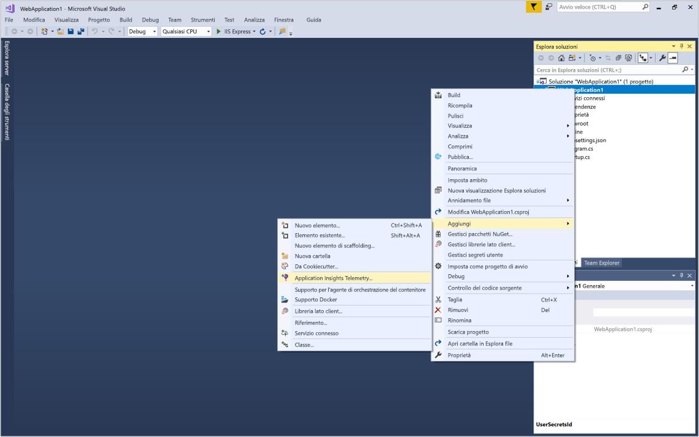
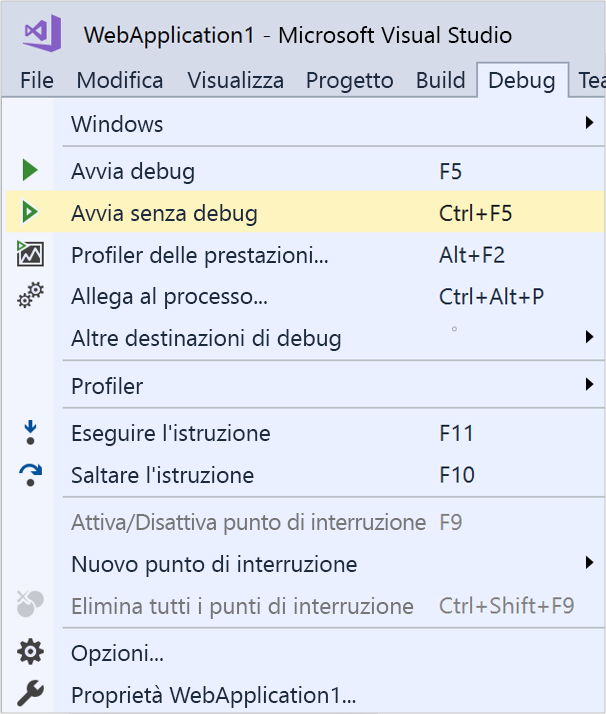
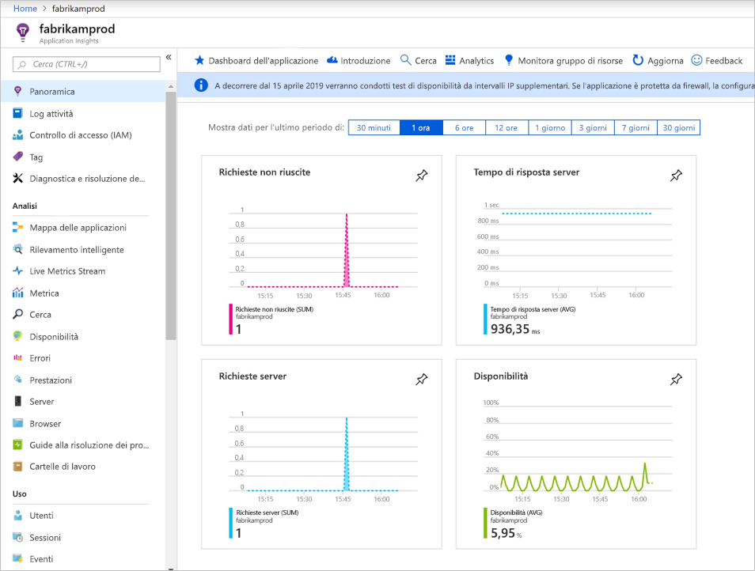
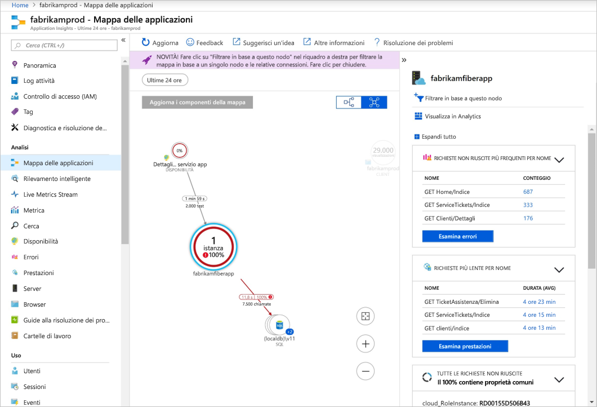
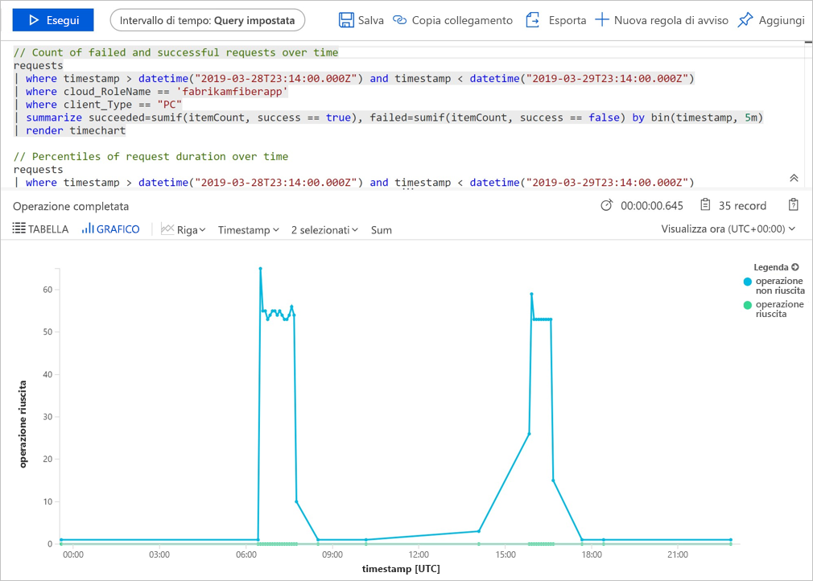
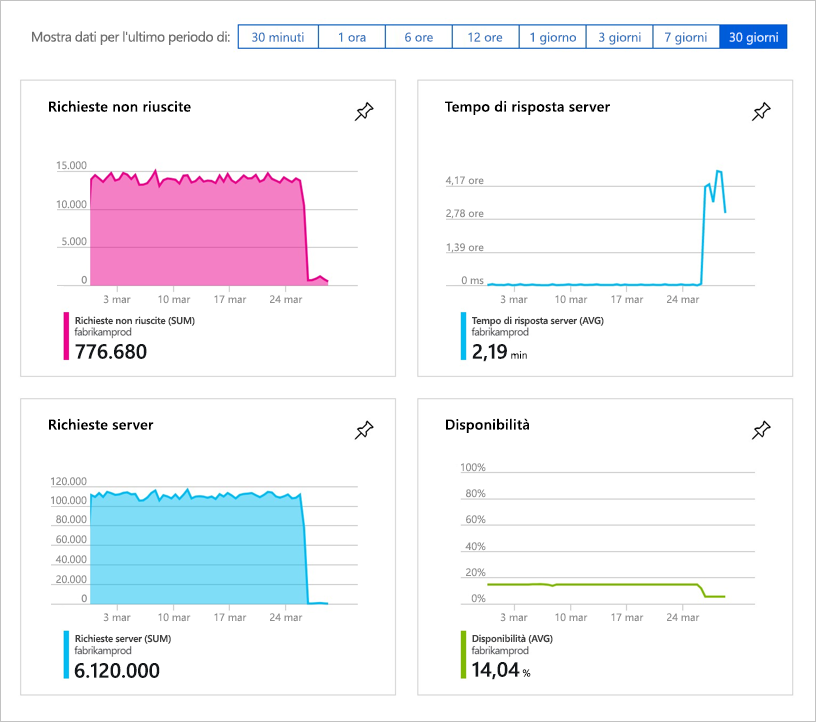
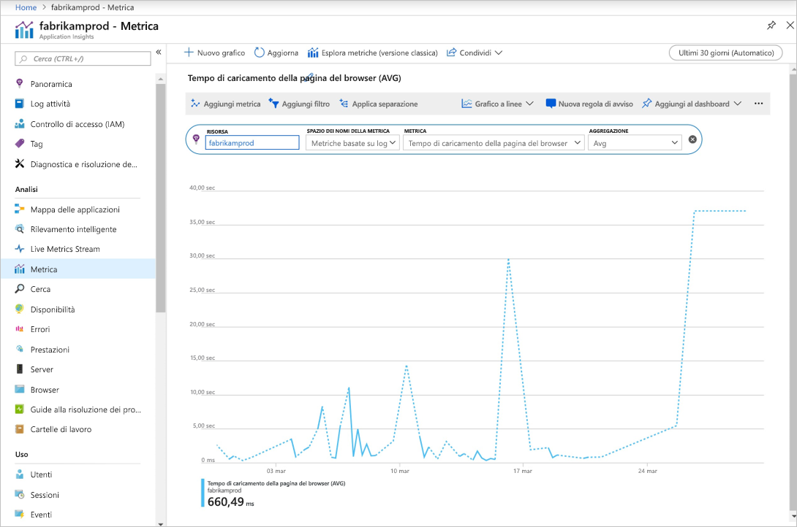

# Iniziare a monitorare l'applicazione Web ASP.NET Core

Con Azure Application Insights, è possibile monitorare facilmente la disponibilità, le prestazioni e l'uso dell'applicazione Web. È anche possibile identificare e diagnosticare rapidamente gli errori nell'applicazione senza attendere che vengano segnalati da un utente. 

Questa guida introduttiva illustra l'aggiunta di Application Insights SDK a un'applicazione Web ASP.NET Core esistente. Per informazioni sulla configurazione di Application Insights senza Visual Studio, vedere questo [articolo](https://docs.microsoft.com/azure/azure-monitor/app/asp-net-core).

## Prerequisiti

Per completare questa guida introduttiva:

- [Installare Visual Studio 2019](https://www.visualstudio.com/downloads/) con i carichi di lavoro seguenti:
  - Sviluppo Web e ASP.NET
  - Sviluppo di Azure
- [Installare .NET Core 2.0 SDK](https://www.microsoft.com/net/core)
- Saranno necessarie una sottoscrizione di Azure e un'applicazione Web .NET Core esistente.

Se non si ha un'applicazione Web ASP.NET Core, è possibile usare la guida dettagliata per [creare un'app ASP.NET Core e aggiungere Application Insights.](../../azure-monitor/app/asp-net-core.md)

Se non si ha una sottoscrizione di Azure, creare un account [gratuito](https://azure.microsoft.com/free/) prima di iniziare.

## Accedere al portale di Azure

Accedere al [portale di Azure](https://portal.azure.com/).

## Abilitare Application Insights

Application Insights può raccogliere dati di telemetria da un'applicazione connessa a Internet, indipendentemente dal fatto che sia in esecuzione in locale o nel cloud. Usare la procedura seguente per iniziare a visualizzare questi dati.

1. Selezionare **Crea una risorsa** > **Strumenti di sviluppo** > **Application Insights**.

   > [!NOTE]
   >Se è la prima volta che si crea una risorsa di Application Insights, consultare il documento [Create an Application Insights Resource (Creare una risorsa di Application Insights)](https://docs.microsoft.com/azure/azure-monitor/app/create-new-resource) per ulteriori informazioni.

    Verrà visualizzata una casella di configurazione. Usare la tabella seguente per completare i campi di input.

   | Impostazioni        |  valore           | Descrizione  |
   | ------------- |:-------------|:-----|
   | **Nome**      | Valore globalmente univoco | Nome che identifica l'app da monitorare |
   | **Gruppo di risorse**     | myResourceGroup      | Nome del nuovo gruppo di risorse per l'hosting dei dati di Application Insights; è possibile creare un nuovo gruppo di risorse o selezionarne uno esistente. |
   | **Posizione** | Stati Uniti orientali | Scegliere una località nelle vicinanze o vicina a quella in cui è ospitata l'app |

2. Fare clic su **Crea**.

## Configurare Application Insights SDK

1. Aprire il **progetto** dell'app Web ASP.NET Core in Visual Studio, quindi fare clic con il pulsante destro del mouse sul nome dell'app in **Esplora soluzioni** e scegliere **Aggiungi** > **Application Insights Telemetry**.

    

2. Fare clic sul pulsante **Inizia**

3. Selezionare l'account e la sottoscrizione > selezionare la **risorsa esistente** creata nel portale di Azure > fare clic su **Registra**.

4. Selezionare **Progetto** > **Gestisci pacchetti NuGet** > **Origine pacchetto: nuget.org** > **Aggiorna** per aggiornare i pacchetti di Application Insights SDK all'ultima versione stabile.

5. Selezionare **Debug** > **Avvia senza eseguire debug** (CTRL+F5) per avviare l'app.

    

> [!NOTE]
> Prima che i dati vengano visualizzati nel portale trascorrono 3-5 minuti. Se questa app è un'app di test a basso traffico, occorre ricordare che la maggior parte delle metriche viene acquisita solo in presenza di operazioni o richieste attive.

## Avviare il monitoraggio nel portale di Azure

1. Riaprire la pagina **Panoramica** di Application Insights nel portale di Azure selezionando **Home** e nelle risorse recenti selezionare la risorsa creata in precedenza per visualizzare informazioni dettagliate sull'applicazione attualmente in esecuzione.

   

2. Fare clic su **Mappa delle applicazioni** per ottenere un layout visivo delle relazioni di dipendenza tra i componenti dell'applicazione. Ogni componente mostra indicatori KPI come carico, prestazioni, errori e avvisi.

   

3. Fare clic sull'icona per l'**analisi delle app**  **Visualizza in Analisi**. Verrà aperta la finestra **Application Insights - Analisi**, che fornisce un linguaggio di query avanzato per l'analisi di tutti i dati raccolti da Application Insights. In questo caso viene generata una query che esegue il rendering del conteggio delle richieste sotto forma di grafico. È possibile scrivere query personalizzate per analizzare altri dati.

   

4. Tornare alla pagina **Panoramica** ed esaminare i dashboard degli indicatori KPI.  Questo dashboard fornisce statistiche relative all'integrità dell'applicazione, ad esempio il numero di richieste in ingresso, la durata delle richieste ed eventuali errori che si sono verificati. 

   

5. A sinistra fare clic su **Metrica**. Usare Esplora metriche per esaminare l'integrità e l'utilizzo della risorsa. È possibile fare clic su **Aggiungi nuovo grafico** per creare altre visualizzazioni personalizzate oppure selezionare **Modifica** per modificare tipi, altezze, tavolozza dei colori, raggruppamenti e metriche dei grafici esistenti. È ad esempio possibile creare un grafico che visualizza il tempo medio di caricamento delle pagine del browser selezionando "Tempo di caricamento della pagina del browser" nel menu a discesa Metriche e "Media" nell'aggregazione. Per altre informazioni su Esplora metriche di Azure, vedere [Introduzione Esplora metriche di Azure](../../azure-monitor/platform/metrics-getting-started.md).

     

## Video

- Video esterno dettagliato sulla [configurazione da zero di Application Insights con .NET Core e Visual Studio](https://www.youtube.com/watch?v=NoS9UhcR4gA&t).
- Video esterno dettagliato sulla [configurazione da zero di Application Insights con .NET Core e Visual Studio Code](https://youtu.be/ygGt84GDync).

## Pulire le risorse
Dopo aver completato i test, è possibile eliminare il gruppo di risorse e le risorse correlate. A tale scopo, seguire questa procedura.

> [!NOTE]
> Se si è usato un gruppo di risorse esistente, le istruzioni riportate di seguito non sono applicabili e sarà sufficiente eliminare la singola risorsa di Application Insights. Tenere presente che ogni volta che si elimina un gruppo di risorse vengono eliminate tutte le risorse sottostanti appartenenti a tale gruppo.

1. Scegliere **Gruppi di risorse** dal menu a sinistra del portale di Azure e quindi fare clic su **myResourceGroup**.
2. Nella pagina del gruppo di risorse fare clic su **Elimina**, digitare **myResourceGroup** nella casella di testo e quindi fare clic su **Elimina**.

## Passaggi successivi

> [!div class="nextstepaction"]
> [Rilevare e diagnosticare le eccezioni di run-time ](https://docs.microsoft.com/azure/application-insights/app-insights-tutorial-runtime-exceptions)
