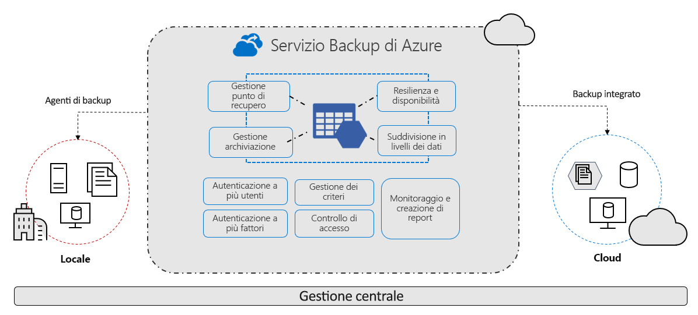

# Informazioni sul servizio Backup di Azure

Il servizio Backup di Azure offre soluzioni semplici, sicure ed economicamente convenienti per eseguire il backup dei dati e ripristinarli dal cloud di Microsoft Azure.

> [!VIDEO https://www.youtube.com/embed/elODShatt-c]

## Backup consentiti

- **Ambiente locale**: backup di file, cartelle e stato del sistema tramite l'[agente di Servizi di ripristino di Microsoft Azure](backup-support-matrix-mars-agent.md). In alternativa, usare l'agente DPM o del server di Backup di Azure per proteggere le macchine virtuali locali ([Hyper-V](back-up-hyper-v-virtual-machines-mabs.md) e [VMWare](backup-azure-backup-server-vmware.md)) e altri [carichi di lavoro locali](backup-mabs-protection-matrix.md)
- **Macchine virtuali di Azure** - [: backup di intere macchine virtuali Windows/Linux](backup-azure-vms-introduction.md) (usando le estensioni di backup) o backup di file, cartelle e stato del sistema tramite l'[agente di Servizi di ripristino di Microsoft Azure](backup-azure-manage-mars.md).
- **Condivisioni file di Azure** - [: backup di condivisioni file di Azure nell'account di archiviazione](backup-afs.md)
- **SQL Server in macchine virtuali di Azure** -  [: backup di database SQL Server in esecuzione in macchine virtuali di Azure](backup-azure-sql-database.md)
- **Database SAP HANA in macchine virtuali di Azure** - [: backup di database SAP HANA in esecuzione in macchine virtuali di Azure](backup-azure-sap-hana-database.md)

## Perché usare Backup di Azure

Backup di Azure offre i vantaggi principali seguenti:

- **Offload del backup locale**: backup di Azure offre una soluzione semplice per il backup delle risorse locali nel cloud. Consente di ottenere backup a breve e a lungo termine senza la necessità di distribuire complesse soluzioni locali.
- **Eseguire il backup di macchine virtuali IaaS di Azure**: backup di Azure fornisce backup indipendenti e isolati per prevenire la distruzione accidentale dei dati originali. I backup vengono archiviati in un insieme di credenziali di Servizi di ripristino con la gestione predefinita dei punti di ripristino. La configurazione e la scalabilità sono semplici, i backup sono ottimizzati ed è possibile eseguire il ripristino con facilità secondo necessità.
- **Scalabilità semplificata**: Backup di Azure sfrutta le potenzialità e la scalabilità illimitata del cloud di Azure per offrire disponibilità elevata, senza costi generali di manutenzione o monitoraggio.
- **Trasferimento di dati illimitato**: backup di Azure non limita la quantità di dati in ingresso o in uscita trasferiti o i costi per i dati trasferiti.
  - I dati in uscita sono i dati trasferiti da un insieme di credenziali di Servizi di ripristino durante un'operazione di ripristino.
  - Se si esegue un backup iniziale offline con il servizio Importazione/Esportazione di Azure per importare grandi quantità di dati, è previsto un addebito di costi per i dati in ingresso.  [Altre informazioni](backup-azure-backup-import-export.md).
- **Proteggere i dati**: [backup di Azure](backup-azure-security-feature-cloud.md)offre soluzioni per la protezione dei dati [in transito](backup-azure-security-feature.md) e inattivi.
- **Gestione e monitoraggio centralizzati**: backup di Azure offre [funzionalità di monitoraggio e avviso predefinite](backup-azure-monitoring-built-in-monitor.md) in un insieme di credenziali di servizi di ripristino. Queste funzionalità sono disponibili senza alcuna infrastruttura di gestione aggiuntiva. È anche possibile aumentare la copertura del monitoraggio e dei report tramite [Monitoraggio di Azure](backup-azure-monitoring-use-azuremonitor.md).
- **Ottenere backup coerenti**con l'app: un backup coerente con l'applicazione indica che un punto di ripristino ha tutti i dati necessari per ripristinare la copia di backup. Backup di Azure offre backup coerenti con l'applicazione, che eliminano la necessità di correzioni aggiuntive per ripristinare i dati. Il ripristino di dati coerenti con l'applicazione riduce il tempo di ripristino e consente quindi di tornare rapidamente allo stato operativo.
- Conservazione di **dati a breve e a lungo termine**: è possibile usare insiemi di credenziali dei [servizi di ripristino](backup-azure-recovery-services-vault-overview.md) per la conservazione dei dati a breve e a lungo termine.
- **Gestione automatica dell'archiviazione**. Gli ambienti ibridi richiedono spesso un'archiviazione eterogenea, in parte in locale e in parte nel cloud. Con Backup di Azure non sono previsti costi per l'uso di dispositivi di archiviazione locali. Backup di Azure alloca e gestisce automaticamente le risorse di archiviazione di backup e usa un modello di pagamento in base al consumo. Verranno addebitate le sole risorse di archiviazione usate. [Altre informazioni](https://azure.microsoft.com/pricing/details/backup) sui prezzi.
- **Più opzioni di archiviazione**: Backup di Azure offre due tipi di replica per garantire la disponibilità elevata delle risorse di archiviazione e/o dei dati.
  - L'[archiviazione con ridondanza locale](../storage/common/storage-redundancy-lrs.md) replica i dati tre volte (crea tre copie dei dati) in un'unità di scala di archiviazione in un data center. Tutte le copie dei dati si trovano nella stessa area geografica. L'archiviazione con ridondanza locale è un'opzione a costo contenuto per la protezione dei dati da errori hardware locali.
  - L'[archiviazione con ridondanza geografica](../storage/common/storage-redundancy-grs.md) è l'opzione di replica predefinita e consigliata. L'archiviazione con ridondanza geografica replica i dati in un'area secondaria a centinaia di chilometri di distanza dalla posizione primaria dei dati di origine. L'archiviazione con ridondanza geografica è più costosa dell'archiviazione con ridondanza locale, ma offre un livello più elevato di durabilità per i dati, anche in presenza di un'interruzione di servizio a livello di area.

## Passaggi successivi

- [Esaminare](backup-architecture.md) l'architettura e i componenti per diversi scenari di backup.
- [Verificare](backup-support-matrix.md) i requisiti di supporto e le limitazioni per il backup e per il [backup di macchine Virtuali di Azure](backup-support-matrix-iaas.md).
