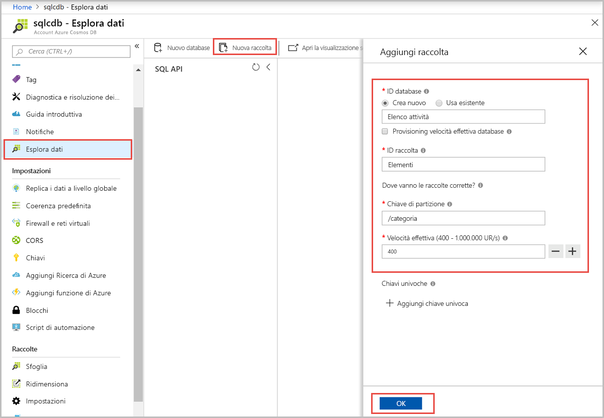
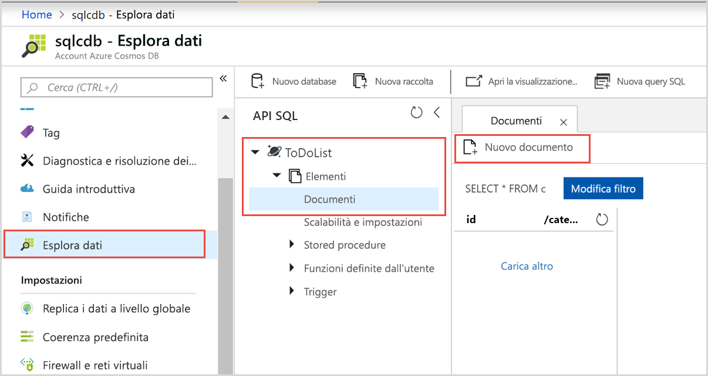
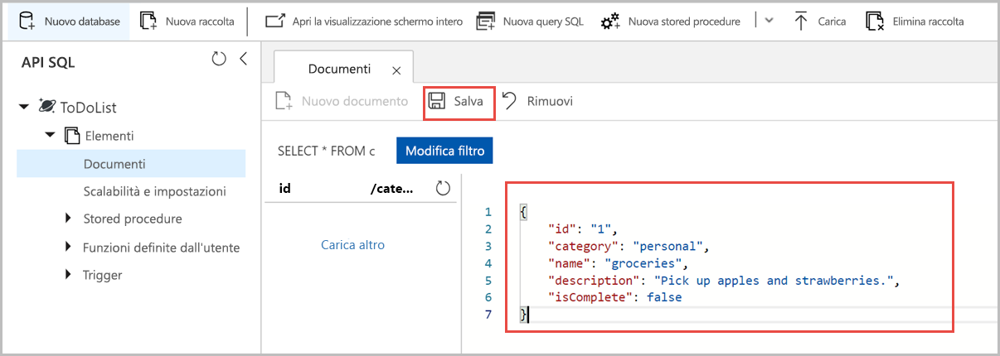

# <a name="quickstart-create-an-azure-cosmos-account-database-container-and-items-from-the-azure-portal"></a>Avvio rapido: Creare un account, un database, un contenitore ed elementi di Azure Cosmos dal portale di Azure

> [!div class="op_single_selector"]
> * [Azure portal](create-cosmosdb-resources-portal.md)
> * [.NET](create-sql-api-dotnet.md)
> * [Java](create-sql-api-java.md)
> * [Node.js](create-sql-api-nodejs.md)
> * [Python](create-sql-api-python.md)
> * [Xamarin](create-sql-api-xamarin-dotnet.md)
>  

Azure Cosmos DB è il servizio di database di Microsoft multimodello distribuito a livello globale. È possibile usare Cosmos DB per creare ed eseguire rapidamente query su chiavi/valori, database di documenti e database a grafo che sfruttano i vantaggi delle funzionalità di distribuzione globale e scalabilità orizzontale alla base di Azure Cosmos DB. 

Questo argomento di avvio rapido illustra come usare il portale di Azure per creare un account [API SQL](sql-api-introduction.md) di Azure Cosmos DB, creare un database e un contenitore di documenti e aggiungere dati al contenitore. 

## <a name="prerequisites"></a>Prerequisites

Una sottoscrizione di Azure o un account di prova gratuito di Azure Cosmos DB
- [!INCLUDE [quickstarts-free-trial-note](../../includes/quickstarts-free-trial-note.md)] 

- [!INCLUDE [cosmos-db-emulator-docdb-api](../../includes/cosmos-db-emulator-docdb-api.md)]  

<a id="create-account"></a>
## <a name="create-an-azure-cosmos-db-account"></a>Creare un account Azure Cosmos DB

[!INCLUDE [cosmos-db-create-dbaccount](../../includes/cosmos-db-create-dbaccount.md)]

<a id="create-container-database"></a>
## <a name="add-a-database-and-a-container"></a>Aggiungere un database e un contenitore 

È possibile usare Esplora dati nel portale di Azure per creare un database e un contenitore. 

1.  Scegliere **Esplora dati** dal menu di spostamento sinistro nella pagina dell'account Azure Cosmos DB, quindi selezionare **Nuovo contenitore**. 
    
    Può essere necessario scorrere verso destra per visualizzare la finestra **Aggiungi contenitore**.
    
    
    
1.  Nel riquadro **Aggiungi contenitore** immettere le impostazioni per il nuovo contenitore.
    
    |Impostazione|Valore consigliato|Descrizione
    |---|---|---|
    |**ID database**|ToDoList|Immettere *ToDoList* come nome del nuovo database. I nomi dei database devono avere una lunghezza compresa tra 1 e 255 caratteri e non possono contenere `/, \\, #, ?` o spazi finali. Selezionare l'opzione **Provision database throughput** (Provisioning delle unità di elaborazione del database) che consente di condividere le unità di elaborazione del database con tra tutti i contenitori al suo interno. Questa opzione permette anche di risparmiare sui costi. |
    |**Velocità effettiva**|400|Lasciare la velocità effettiva a 400 unità di richiesta al secondo (UR/s). Se si vuole ridurre la latenza, è possibile aumentare la velocità effettiva in un secondo momento.| 
    |**ID contenitore**|Items|Immettere *Items* come nome per il nuovo contenitore. Gli ID contenitore prevedono gli stessi requisiti relativi ai caratteri dei nomi di database.|
    |**Chiave di partizione**| /category| L'esempio descritto in questo articolo usa */category* come chiave di partizione.|

    
    Non aggiungere **chiavi univoche** per questo esempio. Le chiavi univoche consentono di aggiungere un livello di integrità dei dati al database garantendo l'univocità di uno o più valori per ogni chiave di partizione. Per altre informazioni, vedere [Chiavi univoche in Azure Cosmos DB](unique-keys.md).
    
1.  Selezionare **OK**. In Esplora dati vengono visualizzati il nuovo database e il nuovo contenitore creati.

## <a name="add-data-to-your-database"></a>Aggiungere dati al database

Aggiungere dati al nuovo database usando Esplora dati.

1. In **Esplora dati** espandere il database **ToDoList** e quindi il contenitore **Elementi**. Selezionare **Elementi** e quindi **Nuovo elemento**. 
   
   
   
1. Aggiungere la struttura seguente al documento sul lato destro del riquadro **Documenti**:

     ```json
     {
         "id": "1",
         "category": "personal",
         "name": "groceries",
         "description": "Pick up apples and strawberries.",
         "isComplete": false
     }
     ```

1. Selezionare **Salva**.
   
   
   
1. Selezionare **Nuovo documento** e creare e salvare un altro documento con un `id` univoco ed eventuali altri valori e proprietà desiderati. I documenti possono avere qualsiasi struttura perché Azure Cosmos DB non impone alcuno schema ai dati.

## <a name="query-your-data"></a>Eseguire query sui dati

[!INCLUDE [cosmos-db-create-sql-api-query-data](../../includes/cosmos-db-create-sql-api-query-data.md)] 

## <a name="clean-up-resources"></a>Pulire le risorse

[!INCLUDE [cosmosdb-delete-resource-group](../../includes/cosmos-db-delete-resource-group.md)]

Se si vuole eliminare solo il database e usare l'account Azure Cosmos in futuro, è possibile eliminare il database con i passaggi seguenti:

* Accedere all'account Azure Cosmos.
* Aprire **Esplora dati**, fare clic con il pulsante destro del mouse sul database che si vuole eliminare e selezionare **Elimina database**.
* Immettere l'ID o il nome del database per confermare l'operazione di eliminazione. 

## <a name="next-steps"></a>Passaggi successivi

In questa guida introduttiva si è appreso come creare un account Azure Cosmos DB e come creare un database e un contenitore con Esplora dati. È ora possibile importare dati aggiuntivi nell'account Azure Cosmos DB. 

> [!div class="nextstepaction"]
> [Importare dati in Azure Cosmos DB](import-data.md)
