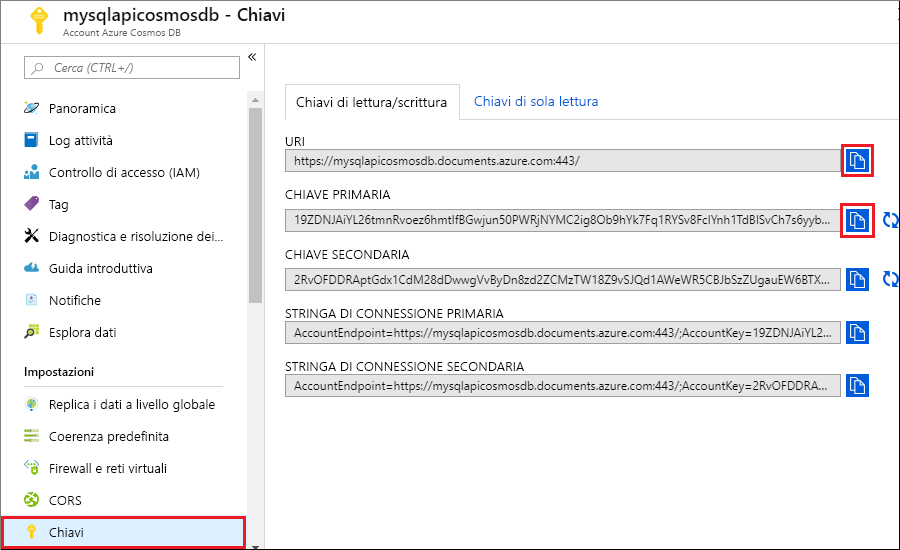

# <a name="quickstart-use-nodejs-to-connect-and-query-data-from-azure-cosmos-db-sql-api-account"></a>Avvio rapido: Usare Node.js per connettersi ai dati ed eseguire query da un account API SQL di Azure Cosmos DB

> [!div class="op_single_selector"]
> * [.NET V3](create-sql-api-dotnet.md)
> * [.NET V4](create-sql-api-dotnet-V4.md)
> * [Java](create-sql-api-java.md)
> * [Node.js](create-sql-api-nodejs.md)
> * [Python](create-sql-api-python.md)
> * [Xamarin](create-sql-api-xamarin-dotnet.md)

Questo argomento di avvio rapido illustra come usare un'app Node.js per connettersi all'account [API SQL](sql-api-introduction.md) in Azure Cosmos DB. È quindi possibile usare le query SQL di Azure Cosmos DB per eseguire query e gestire i dati. L'app Node.js compilata in questo articolo usa [SQL JavaScript SDK](sql-api-sdk-node.md). Questa guida introduttiva usa la versione 2.0 di [JavaScript SDK](https://www.npmjs.com/package/@azure/cosmos).

## <a name="prerequisites"></a>Prerequisites

[!INCLUDE [quickstarts-free-trial-note](../../includes/quickstarts-free-trial-note.md)] 
[!INCLUDE [cosmos-db-emulator-docdb-api](../../includes/cosmos-db-emulator-docdb-api.md)]

* Inoltre:
    * [Node.js](https://nodejs.org/en/) versione v6.0.0 o successiva
    * [Git](https://git-scm.com/)

## <a name="create-a-database"></a>Creazione di un database 

[!INCLUDE [cosmos-db-create-dbaccount](../../includes/cosmos-db-create-dbaccount.md)]

## <a name="add-a-container"></a>Aggiungere un contenitore

[!INCLUDE [cosmos-db-create-collection](../../includes/cosmos-db-create-collection.md)]

## <a name="add-sample-data"></a>Aggiungere dati di esempio

[!INCLUDE [cosmos-db-create-sql-api-add-sample-data](../../includes/cosmos-db-create-sql-api-add-sample-data.md)]

## <a name="query-your-data"></a>Eseguire query sui dati

[!INCLUDE [cosmos-db-create-sql-api-query-data](../../includes/cosmos-db-create-sql-api-query-data.md)]

## <a name="clone-the-sample-application"></a>Clonare l'applicazione di esempio

Clonare ora un'app Node.js da GitHub, impostare la stringa di connessione ed eseguirla.

1. Aprire un prompt dei comandi, creare una nuova cartella denominata git-samples e quindi chiudere il prompt dei comandi.

    ```bash
    md "C:\git-samples"
    ```

2. Aprire una finestra del terminale Git, ad esempio Git Bash, ed eseguire il comando `cd` per passare a una nuova cartella in cui installare l'app di esempio.

    ```bash
    cd "C:\git-samples"
    ```

3. Eseguire il comando seguente per clonare l'archivio di esempio. Questo comando crea una copia dell'app di esempio nel computer in uso.

    ```bash
    git clone https://github.com/Azure-Samples/azure-cosmos-db-sql-api-nodejs-getting-started.git
    ```

## <a name="review-the-code"></a>Esaminare il codice

Questo passaggio è facoltativo. Per scoprire in che modo le risorse del database Azure Cosmos vengono create nel codice, è possibile esaminare i frammenti di codice seguenti. In alternativa, è possibile passare ad [Aggiornare la stringa di connessione](#update-your-connection-string). 

Si noti che, se si ha familiarità con la versione precedente di JavaScript SDK, ci si potrebbe aspettare di vedere termini come "raccolta" e "documento". Poiché Azure Cosmos DB supporta [più modelli di API](https://docs.microsoft.com/azure/cosmos-db/introduction), nella versione 2.0+ di JavaScript SDK vengono usati i termini generici "contenitore", che può essere una raccolta, un grafo o una tabella, ed "elemento" per descrivere il contenuto del contenitore.

Tutti i frammenti di codice seguenti sono tratti dal file **app.js**.

* L'oggetto `CosmosClient` viene inizializzato.

    ```javascript
    const client = new CosmosClient({ endpoint, key });
    ```

* Creare un nuovo database Azure Cosmos.

    ```javascript
    const { database } = await client.databases.createIfNotExists({ id: databaseId });
    ```

* Viene creato un nuovo contenitore (raccolta) all'interno del database.

    ```javascript
    const { container } = await client.database(databaseId).containers.createIfNotExists({ id: containerId });
    ```

* Viene creato un elemento (documento).

    ```javascript
    const { item } = await client.database(databaseId).container(containerId).items.create(itemBody);
    ```

* Viene eseguita una query SQL su JSON nel database della famiglia. La query restituisce tutti i figli della famiglia "Anderson". 

    ```javascript
      const querySpec = {
        query: 'SELECT VALUE r.children FROM root r WHERE r.lastName = @lastName',
        parameters: [
          {
            name: '@lastName',
            value: 'Andersen'
          }
        ]
      }

      const { resources: results } = await client
        .database(databaseId)
        .container(containerId)
        .items.query(querySpec)
        .fetchAll()
      for (var queryResult of results) {
        let resultString = JSON.stringify(queryResult)
        console.log(`\tQuery returned ${resultString}\n`)
      }
    ```    

## <a name="update-your-connection-string"></a>Aggiornare la stringa di connessione

Tornare ora al portale di Azure per ottenere i dettagli della stringa di connessione dell'account Azure Cosmos. Copiare la stringa di connessione nell'app in modo che possa connettersi al database.

1. Nell'account Azure Cosmos nel [portale di Azure](https://portal.azure.com/) fare clic su **Chiavi** nel riquadro di spostamento sinistro e quindi su **Chiavi di lettura/scrittura**. Usare i pulsanti di copia sul lato destro dello schermo per copiare l'URI e la chiave primaria nel file `config.js` nel passaggio seguente.

    

2. Aprire il file `config.js`. 

3. Copiare il valore di URI dal portale (usando il pulsante di copia) e impostarlo come valore della chiave di endpoint in `config.js`. 

    `config.endpoint = "<Your Azure Cosmos account URI>"`

4. Copiare quindi il valore di CHIAVE PRIMARIA dal portale e impostarlo come valore di `config.key` in `config.js`. L'app è stata aggiornata con tutte le informazioni necessarie per comunicare con Azure Cosmos DB. 

    `config.key = "<Your Azure Cosmos account key>"`
    
## <a name="run-the-app"></a>Eseguire l'app

1. Eseguire `npm install` in un terminale per installare i moduli npm necessari

2. Eseguire `node app.js` in un terminale per avviare l'applicazione Node.js.

È ora possibile tornare a Esplora dati per modificare e usare questi nuovi dati.

## <a name="review-slas-in-the-azure-portal"></a>Esaminare i contratti di servizio nel portale di Azure

[!INCLUDE [cosmosdb-tutorial-review-slas](../../includes/cosmos-db-tutorial-review-slas.md)]

## <a name="clean-up-resources"></a>Pulire le risorse

[!INCLUDE [cosmosdb-delete-resource-group](../../includes/cosmos-db-delete-resource-group.md)]

## <a name="next-steps"></a>Passaggi successivi

In questo argomento di avvio rapido si è appreso come creare un account Azure Cosmos, come creare un contenitore con Esplora dati e come eseguire un'app. È ora possibile importare dati aggiuntivi nel database Azure Cosmos. 

> [!div class="nextstepaction"]
> [Importare dati in Azure Cosmos DB](import-data.md)


