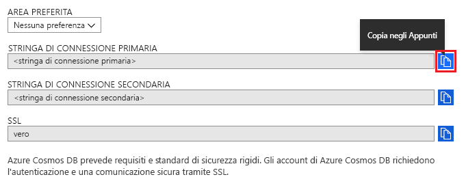

# Usare MongoDB Compass per connettersi all'API di Azure Cosmos DB per MongoDB 

Questa esercitazione illustra come usare [MongoDB Compass](https://www.mongodb.com/products/compass) per l'archiviazione e/o la gestione dei dati in Cosmos DB. Per questa procedura dettagliata viene usata l'API di Azure Cosmos DB per MongoDB. Compass è un'interfaccia utente grafica per MongoDB comunemente usata per visualizzare i dati, eseguire query ad-hoc e gestire i dati. 

Cosmos DB è il servizio di database di Microsoft multimodello distribuito a livello globale. È possibile creare rapidamente database di documenti, chiave/valore e a grafo ed eseguire query su di essi sfruttando in ognuno dei casi i vantaggi offerti dalle funzionalità di scalabilità orizzontale e distribuzione globale alla base di Cosmos DB.

## Prerequisiti 
Per connettersi all'account Cosmos DB usando Robo 3T, è necessario:

* Scaricare e installare [Compass](https://www.mongodb.com/download-center/compass?jmp=hero)
* Avere le informazioni relative alla [stringa di connessione](connect-mongodb-account.md) di Cosmos DB

## Connettersi all'API di Cosmos DB per MongoDB 
Per connettere l'account Cosmos DB a Compass, è possibile seguire questa procedura:

1. Recuperare le informazioni di connessione per l'account Cosmos configurato con l'API di Azure Cosmos DB per MongoDB usando le istruzioni riportate [qui](connect-mongodb-account.md).

    

2. Fare clic sul pulsante **Copia negli Appunti** accanto a **Stringa di connessione primaria/secondaria** in Cosmos DB. Facendo clic su questo pulsante l'intera stringa di connessione verrà copiata negli Appunti. 

    

3. Aprire Compass nel desktop/computer e fare clic su **Connetti** e quindi su **Connetti a**. 

4. Compass rileverà automaticamente una stringa di connessione negli Appunti e richiederà se si vuole usarla per la connessione. Fare clic su **Sì** come illustrato nello screenshot seguente.

    

5. Quando si fa clic su **Sì** nel passaggio precedente, i dettagli dalla stringa di connessione verranno popolati automaticamente. Rimuovere il valore inserito automaticamente nel campo **Replica Set Name** (Nome set di repliche) per assicurarsi che venga lasciato vuoto. 

    

6. Fare clic su **Connetti** nella parte inferiore della pagina. L'account Cosmos DB e i database dovrebbero ora essere visibili all'interno di MongoDB Compass.

## Passaggi successivi

- Informazioni su come [usare Studio 3T](mongodb-mongochef.md) con l'API di Azure Cosmos DB per MongoDB.
- Esplorare gli [esempi](mongodb-samples.md) di MongoDB con l'API di Azure Cosmos DB per MongoDB.