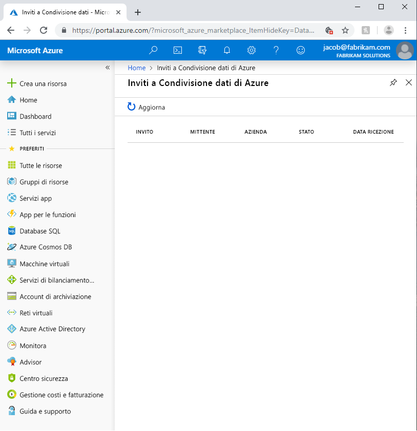

# <a name="troubleshoot-common-issues-in-azure-data-share"></a>Risolvere i problemi comuni della condivisione dati di Azure 

Questo articolo illustra come risolvere i problemi comuni per la condivisione di dati di Azure. 

## <a name="azure-data-share-invitations"></a>Inviti a Condivisione dati di Azure 

In alcuni casi quando un nuovo utente fa clic su **Accept Invitation** (Accetta invito) nel messaggio di posta elettronica di invito ricevuto, viene visualizzato un elenco di inviti vuoto. 



L'errore descritto in precedenza è un problema noto del servizio ed è attualmente in fase di analisi. Per ovviare al problema, seguire questa procedura. 

1. Nel portale di Azure passare a **Sottoscrizioni**
1. Selezionare la sottoscrizione usata per Condivisione dati di Azure
1. Fare clic su **Provider di risorse**
1. Cercare Microsoft.DataShare
1. Fare clic su **Registra**

Per completare questa procedura, è necessario il [ruolo Collaboratore di Controllo degli accessi in base al ruolo in Azure](https://docs.microsoft.com/azure/role-based-access-control/built-in-roles#contributor). 

Se non è ancora possibile visualizzare un invito alla condivisione dati, contattare il provider di dati e assicurarsi che abbia inviato l'invito all'indirizzo di posta elettronica di accesso di Azure e *non* all'alias di posta elettronica personale. 

> [!IMPORTANT]
> Se è già stato accettato un invito a Condivisione dati di Azure e il servizio è stato chiuso prima della configurazione dell'archiviazione, seguire le istruzioni della guida pratica su [come configurare un mapping di set di dati](how-to-configure-mapping.md) per informazioni su come completare la configurazione della condivisione dati ricevuta e iniziare a ricevere dati. 

## <a name="error-when-creating-or-receiving-a-new-data-share"></a>Errore durante la creazione o la ricezione di una nuova condivisione dati

"Errore: l'operazione ha restituito un codice di stato non valido ' richiesta non valida '"

"Errore: AuthorizationFailed"

"Error: role assignment to storage account" (Errore: assegnazione di ruolo all'account di archiviazione)


Se viene visualizzato uno degli errori indicati in precedenza durante la creazione o la ricezione di una nuova condivisione dati, le autorizzazioni per l'account di archiviazione non sono sufficienti. L'autorizzazione richiesta è *Microsoft.Authorization/role assignments/write*, che è disponibile nel ruolo di proprietario dell'account di archiviazione o può essere assegnata a un ruolo personalizzato. Anche se si è creato l'account di archiviazione è stato creato, NON si è automaticamente il proprietario di tale account. Seguire questa procedura per concedere a se stessi il ruolo di proprietario dell'account di archiviazione. In alternativa, è possibile creare un ruolo personalizzato con questa autorizzazione al quale è possibile aggiungere se stessi.  

1. Passare all'account di archiviazione nel portale di Azure.
1. Selezionare **Controllo di accesso (IAM)** .
1. Fare clic su **Aggiungi**.
1. Aggiungere se stessi come proprietario.

## <a name="troubleshooting-sql-based-sharing"></a>Risoluzione dei problemi di condivisione basata su SQL

"Errore: i set di impostazioni x non sono stati aggiunti perché non si dispone delle autorizzazioni necessarie per la condivisione".

Se questo errore viene visualizzato quando si aggiunge un set di dati da un'origine basata su SQL, è possibile che non sia stato creato un utente per l'identità del servizio gestito di condivisione dati di Azure nel SQL Server.  Per risolvere il problema, eseguire lo script seguente:

```sql
    create user <share_acct_name> from external provider;     
    exec sp_addrolemember db_owner, <share_acct_name>; 
```      
Si noti che il *< share_acc_name >* è il nome dell'account di condivisione dati. Se non è ancora stato creato un account di condivisione dati, è possibile tornare a questo prerequisito in un secondo momento.         

Assicurarsi di aver seguito tutti i prerequisiti elencati nell'esercitazione [condividere i dati](share-your-data.md) .

## <a name="next-steps"></a>Passaggi successivi

Per informazioni su come iniziare a condividere i dati, procedere con l'esercitazione sulla [condivisione dei dati](share-your-data.md).

