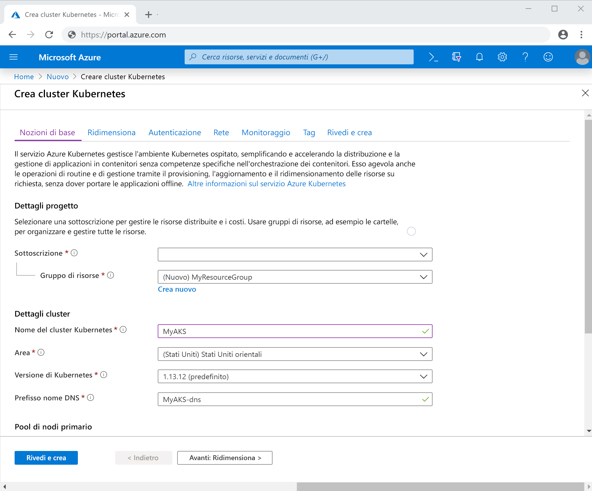
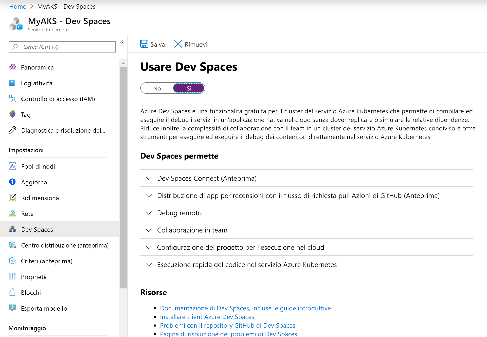

# <a name="quickstart-debug-and-iterate-on-kubernetes-visual-studio--net-core---azure-dev-spaces"></a>Avvio rapido: Eseguire il debug e l'iterazione in Kubernetes: Visual Studio e .NET Core - Azure Dev Spaces

In questa guida si apprenderà come:

- Configurare Azure Dev Spaces con un cluster Kubernetes gestito in Azure.
- Sviluppare codice in modo iterativo nei contenitori con Visual Studio.
- Eseguire il debug del codice in esecuzione nel cluster con Visual Studio.

Azure Dev Spaces consente anche di eseguire il debug e l'iterazione usando:
- [Java e Visual Studio Code](quickstart-java.md)
- [Node.js e Visual Studio Code](quickstart-nodejs.md)
- [.NET Core e Visual Studio Code](quickstart-netcore.md)

## <a name="prerequisites"></a>Prerequisites

- Una sottoscrizione di Azure. Se non si ha un account, è possibile [crearne uno gratuito](https://azure.microsoft.com/free).
- Visual Studio 2019 in Windows con il carico di lavoro Sviluppo di Azure installato. Si può anche usare Visual Studio 2017 in Windows con il carico di lavoro Sviluppo Web e [Visual Studio Tools per Kubernetes](https://aka.ms/get-vsk8stools) installato. Se Visual Studio non è installato, scaricarlo [qui](https://aka.ms/vsdownload?utm_source=mscom&utm_campaign=msdocs).

## <a name="create-an-azure-kubernetes-service-cluster"></a>Creare un cluster del servizio Azure Kubernetes

È necessario creare un cluster del servizio Azure Kubernetes in un'[area supportata][supported-regions]. Per creare un cluster:

1. Accedere al [portale di Azure](https://portal.azure.com)
1. Selezionare *+Crea una risorsa > Servizio Kubernetes*. 
1. Compilare i campi _Sottoscrizione_, _Gruppo di risorse_, _Nome del cluster Kubernetes_, _Area_, _Versione di Kubernetes_ e _Prefisso nome DNS_.

    

1. Fare clic su *Rivedi e crea*.
1. Fare clic su *Crea*.

## <a name="enable-azure-dev-spaces-on-your-aks-cluster"></a>Abilitare Azure Dev Spaces nel cluster del servizio Azure Kubernetes

Passare al cluster del servizio Azure Kubernetes nel portale di Azure e fare clic su *Dev Spaces*. Impostare *Usa Dev Spaces* su *Sì* e fare clic su *Salva*.



## <a name="create-a-new-aspnet-web-app"></a>Creare una nuova app Web ASP.NET

1. Aprire Visual Studio.
1. Creare un nuovo progetto.
1. Scegliere *Applicazione Web ASP.NET Core* e fare clic su *Avanti*.
1. Denominare il progetto *webfrontend* e fare clic su *Crea*.
1. Quando richiesto, scegliere *Applicazione Web (Model-View-Controller)* per il modello.
1. Selezionare *.NET Core* e *ASP.NET Core 2.1* nella parte superiore.
1. Fare clic su *Crea*.

## <a name="connect-your-project-to-your-dev-space"></a>Connettere il progetto al proprio spazio di Dev Spaces

Nel progetto selezionare **Azure Dev Spaces** nell'elenco a discesa delle impostazioni di avvio, come mostrato di seguito.


Nella finestra di dialogo Azure Dev Spaces selezionare *Sottoscrizione* e *Cluster del servizio Azure Kubernetes*. Lasciare l'opzione *Spazio* impostata sul valore *predefinito*e abilitare la casella di controllo *Accessibile pubblicamente*. Fare clic su *OK*.


Questa procedura distribuisce il servizio nello spazio di Dev Spaces *predefinito* con un URL accessibile pubblicamente. Se si sceglie un cluster che non è stato configurato per l'uso di Azure Dev Spaces, verrà visualizzato un messaggio che chiede se si vuole eseguire la configurazione. Fare clic su *OK*.


L'URL pubblico del servizio in esecuzione nello spazio *predefinito* è visualizzato nella finestra *Output*:

```cmd
Starting warmup for project 'webfrontend'.
Waiting for namespace to be provisioned.
Using dev space 'default' with target 'MyAKS'
...
Successfully built 1234567890ab
Successfully tagged webfrontend:devspaces-11122233344455566
Built container image in 39s
Waiting for container...
36s

Service 'webfrontend' port 'http' is available at http://default.webfrontend.1234567890abcdef1234.eus.azds.io/
Service 'webfrontend' port 80 (http) is available at http://localhost:62266
Completed warmup for project 'webfrontend' in 125 seconds.
```

Nell'esempio precedente l'URL pubblico è http://default.webfrontend.1234567890abcdef1234.eus.azds.io/. Passare all'URL pubblico del servizio e interagire con il servizio in esecuzione nel proprio spazio.

È possibile che questo processo abbia disabilitato l'accesso pubblico al proprio servizio. Per abilitare l'accesso pubblico, è possibile aggiornare il [valore ingress in *values.yaml*][ingress-update].

## <a name="update-code"></a>Aggiornare il codice

Se Visual Studio è ancora connesso allo spazio di sviluppo, fare clic sul pulsante Arresta. Cambiare la riga 20 di `Controllers/HomeController.cs` in:
    
```csharp
ViewData["Message"] = "Your application description page in Azure.";
```

Salvare le modifiche e avviare il servizio scegliendo **Azure Dev Spaces** dal menu a discesa delle impostazioni di avvio. Aprire l'URL pubblico del servizio in un browser e fare clic su *Informazioni*. Notare che viene visualizzato il messaggio aggiornato.

Invece di ricompilare e ridistribuire una nuova immagine del contenitore ogni volta che vengono apportate modifiche al codice, Azure Dev Spaces ricompila in modo incrementale il codice nel contenitore esistente in modo da velocizzare il ciclo di modifica/debug.

## <a name="setting-and-using-breakpoints-for-debugging"></a>Impostazione e uso di punti di interruzione per il debug

Se Visual Studio è ancora connesso allo spazio di sviluppo, fare clic sul pulsante Arresta. Aprire `Controllers/HomeController.cs` e fare clic in un punto della riga 20 per posizionarvi il cursore. Per impostare un punto di interruzione premere *F9* oppure fare clic su *Debug* e quindi su *Attiva/Disattiva punto di interruzione*. Per avviare il servizio in modalità debug nello spazio di Dev Spaces, premere *F5* oppure fare clic su *Debug* e quindi su *Avvia debug*.

Aprire il servizio in un browser e notare che non vengono visualizzati messaggi. Tornare in Visual Studio e notare che la riga 20 è evidenziata. Il punto di interruzione impostato ha sospeso il servizio in corrispondenza della riga 20. Per riprendere il servizio, premere *F5* oppure fare clic su *Debug* e quindi su *Continua*. Tornare nel browser e notare che ora il messaggio è visualizzato.

Durante l'esecuzione del servizio in Kubernetes con un debugger collegato, si ha accesso completo alle informazioni di debug, ad esempio su stack di chiamate, variabili locali ed eccezioni.

Rimuovere il punto di interruzione posizionando il cursore sulla riga 20 di `Controllers/HomeController.cs` e premendo *F9*.

## <a name="clean-up-your-azure-resources"></a>Pulire le risorse di Azure

Passare al gruppo di risorse nel portale di Azure e fare clic su *Elimina gruppo di risorse*. In alternativa, è possibile usare il comando [az aks delete](/cli/azure/aks#az-aks-delete):

```cmd
az group delete --name MyResourceGroup --yes --no-wait
```

## <a name="next-steps"></a>Passaggi successivi

> [!div class="nextstepaction"]
> [Uso di più contenitori e sviluppo in team](multi-service-netcore-visualstudio.md)

[ingress-update]: how-dev-spaces-works.md#how-running-your-code-is-configured
[supported-regions]: https://azure.microsoft.com/global-infrastructure/services/?products=kubernetes-service
