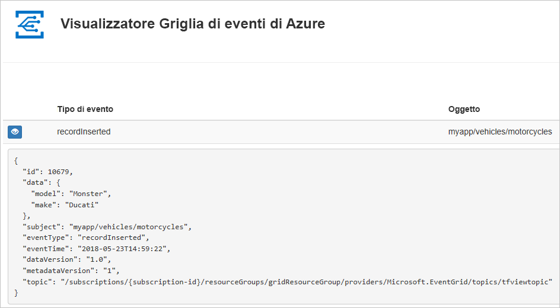
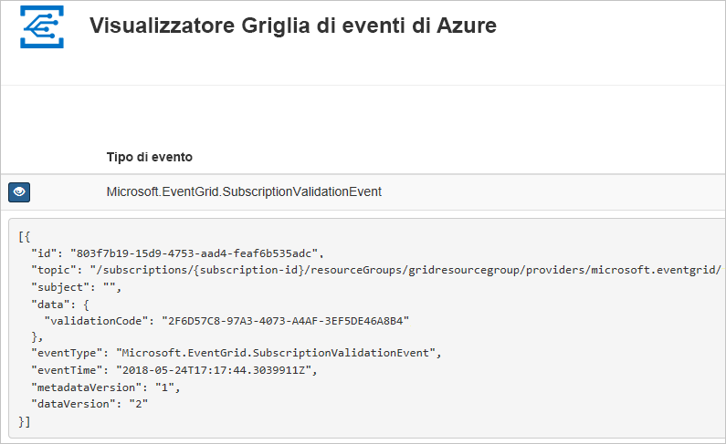

# <a name="quickstart-route-custom-events-to-web-endpoint-with-azure-cli-and-event-grid"></a>Guida introduttiva: Instradare eventi personalizzati all'endpoint Web con l'interfaccia della riga di comando di Azure e Griglia di eventi

La griglia di eventi di Azure è un servizio di gestione degli eventi per il cloud. Questo articolo illustra come usare l'interfaccia della riga di comando di Azure per creare un argomento personalizzato, sottoscrivere l'argomento e attivare l'evento per visualizzare il risultato.

In genere, si inviano eventi a un endpoint che elabora i dati dell'evento e intraprende azioni. Per maggiore semplicità, tuttavia, in questo articolo gli eventi vengono inviati a un'app Web che raccoglie e visualizza i messaggi.

Al termine, i dati degli eventi saranno stati inviati all'app Web.



[!INCLUDE [quickstarts-free-trial-note.md](../../includes/quickstarts-free-trial-note.md)]

[!INCLUDE [cloud-shell-try-it.md](../../includes/cloud-shell-try-it.md)]

Se si sceglie di installare e usare l'interfaccia della riga di comando in locale, per questo articolo è necessario eseguire la versione più recente dell'interfaccia della riga di comando di Azure (2.0.24 o versione successiva). Per trovare la versione, eseguire `az --version`. Se è necessario eseguire l'installazione o l'aggiornamento, vedere [Installare l'interfaccia della riga di comando di Azure](/cli/azure/install-azure-cli).

Se non si usa Cloud Shell, prima è necessario accedere usando `az login`.

## <a name="create-a-resource-group"></a>Creare un gruppo di risorse

Gli argomenti della griglia di eventi sono risorse di Azure e devono essere inseriti in un gruppo di risorse di Azure. Un gruppo di risorse è una raccolta logica in cui le risorse di Azure vengono distribuite e gestite.

Creare un gruppo di risorse con il comando [az group create](/cli/azure/group#az-group-create). 

L'esempio seguente crea un gruppo di risorse denominato *gridResourceGroup* nella località *westus2*.

```azurecli-interactive
az group create --name gridResourceGroup --location westus2
```

[!INCLUDE [event-grid-register-provider-cli.md](../../includes/event-grid-register-provider-cli.md)]

## <a name="create-a-custom-topic"></a>Creare un argomento personalizzato

Un argomento di Griglia di eventi fornisce un endpoint definito dall'utente in cui vengono pubblicati gli eventi. L'esempio seguente crea l'argomento personalizzato nel gruppo di risorse. Sostituire `<your-topic-name>` con un nome univoco per l'argomento. Il nome dell'argomento personalizzato deve essere univoco perché fa parte della voce DNS. Deve inoltre essere un nome di lunghezza compresa tra 3 e 50 caratteri, contenente solo valori compresi tra a e z, A e Z, 0 e 9 e "-".

```azurecli-interactive
topicname=<your-topic-name>

az eventgrid topic create --name $topicname -l westus2 -g gridResourceGroup
```

## <a name="create-a-message-endpoint"></a>Creare un endpoint del messaggio

Prima di sottoscrivere l'argomento personalizzato, creare l'endpoint per il messaggio dell'evento. L'endpoint richiede in genere azioni basate sui dati degli eventi. Per semplificare questa guida introduttiva, si distribuisce un'[app Web preesistente](https://github.com/Azure-Samples/azure-event-grid-viewer) che visualizza i messaggi di evento. La soluzione distribuita include un piano di servizio app, un'app Web del servizio app e codice sorgente da GitHub.

Sostituire `<your-site-name>` con un nome univoco per l'app Web. Il nome dell'app Web deve essere univoco perché fa parte della voce DNS.

```azurecli-interactive
sitename=<your-site-name>

az group deployment create \
  --resource-group gridResourceGroup \
  --template-uri "https://raw.githubusercontent.com/Azure-Samples/azure-event-grid-viewer/master/azuredeploy.json" \
  --parameters siteName=$sitename hostingPlanName=viewerhost
```

Per il completamento della distribuzione possono essere necessari alcuni minuti. Dopo il completamento della distribuzione, visualizzare l'app Web per assicurarsi che sia in esecuzione. In un Web browser passare a: `https://<your-site-name>.azurewebsites.net`

Il sito dovrebbe essere visibile senza messaggi attualmente visualizzati.

## <a name="subscribe-to-a-custom-topic"></a>Sottoscrivere un argomento personalizzato

Si sottoscrive un argomento di Griglia di eventi per indicare di quali eventi si vuole tenere traccia e dove inviarli. L'esempio seguente sottoscrive l'argomento personalizzato creato e passa l'URL dall'app Web come endpoint per la notifica dell'evento.

L'endpoint per l'app Web deve includere il suffisso `/api/updates/`.

```azurecli-interactive
endpoint=https://$sitename.azurewebsites.net/api/updates

az eventgrid event-subscription create \
  --source-resource-id "/subscriptions/{subscription-id}/resourceGroups/{resource-group}/providers/Microsoft.EventGrid/topics/$topicname" 
  --name demoViewerSub 
  --endpoint $endpoint
  
```

Visualizzare nuovamente l'app Web e notare che all'app è stato inviato un evento di convalida della sottoscrizione. Selezionare l'icona a forma di occhio per espandere i dati dell'evento. Griglia di eventi invia l'evento di convalida in modo che l'endpoint possa verificare che voglia ricevere i dati dell'evento. L'app Web include il codice per convalidare la sottoscrizione.




## <a name="send-an-event-to-your-custom-topic"></a>Inviare un evento all'argomento personalizzato

Attivare un evento per vedere come la Griglia di eventi distribuisce il messaggio nell'endpoint. Ottenere prima di tutto l'URL e la chiave per l'argomento personalizzato.

```azurecli-interactive
endpoint=$(az eventgrid topic show --name $topicname -g gridResourceGroup --query "endpoint" --output tsv)
key=$(az eventgrid topic key list --name $topicname -g gridResourceGroup --query "key1" --output tsv)
```

Per semplificare questo articolo, si useranno dati di evento di esempio da inviare all'argomento personalizzato. In genere, i dati dell'evento vengono inviati da un'applicazione o un servizio di Azure. L'esempio seguente crea i dati di esempio dell'evento:

```azurecli-interactive
event='[ {"id": "'"$RANDOM"'", "eventType": "recordInserted", "subject": "myapp/vehicles/motorcycles", "eventTime": "'`date +%Y-%m-%dT%H:%M:%S%z`'", "data":{ "make": "Ducati", "model": "Monster"},"dataVersion": "1.0"} ]'
```

L'elemento `data` del JSON è il payload dell'evento. Questo campo accetta qualsiasi JSON ben formato. È anche possibile usare il campo oggetto per il filtro e il routing avanzato.

CURL è un'utilità che invia richieste HTTP. In questo articolo CURL viene usato per inviare l'evento all'argomento. 

```azurecli-interactive
curl -X POST -H "aeg-sas-key: $key" -d "$event" $endpoint
```

È stato attivato l'evento e Griglia di eventi ha inviato il messaggio all'endpoint configurato al momento della sottoscrizione. Visualizzare l'app Web per vedere l'evento appena inviato.

```json
[{
  "id": "1807",
  "eventType": "recordInserted",
  "subject": "myapp/vehicles/motorcycles",
  "eventTime": "2017-08-10T21:03:07+00:00",
  "data": {
    "make": "Ducati",
    "model": "Monster"
  },
  "dataVersion": "1.0",
  "metadataVersion": "1",
  "topic": "/subscriptions/{subscription-id}/resourceGroups/{resource-group}/providers/Microsoft.EventGrid/topics/{topic}"
}]
```

## <a name="clean-up-resources"></a>Pulire le risorse
Se si intende continuare a usare questo evento o l'app per visualizzare gli eventi, non è necessario pulire le risorse create in questo articolo. In caso contrario, usare il comando seguente per eliminare le risorse create con questo articolo.

```azurecli-interactive
az group delete --name gridResourceGroup
```

## <a name="next-steps"></a>Passaggi successivi

Ora che si è appreso come creare argomenti e sottoscrizioni di eventi, è possibile approfondire le operazioni possibili con la griglia di eventi:

- [Informazioni sulla griglia di eventi](overview.md)
- [Indirizzare gli eventi di archiviazione BLOB a un endpoint Web personalizzato (anteprima)](../storage/blobs/storage-blob-event-quickstart.md?toc=%2fazure%2fevent-grid%2ftoc.json)
- [Monitorare le modifiche alla macchina virtuale con la griglia di eventi di Azure e le app per la logica](monitor-virtual-machine-changes-event-grid-logic-app.md)
- [Trasmettere Big Data a un data warehouse](event-grid-event-hubs-integration.md)
