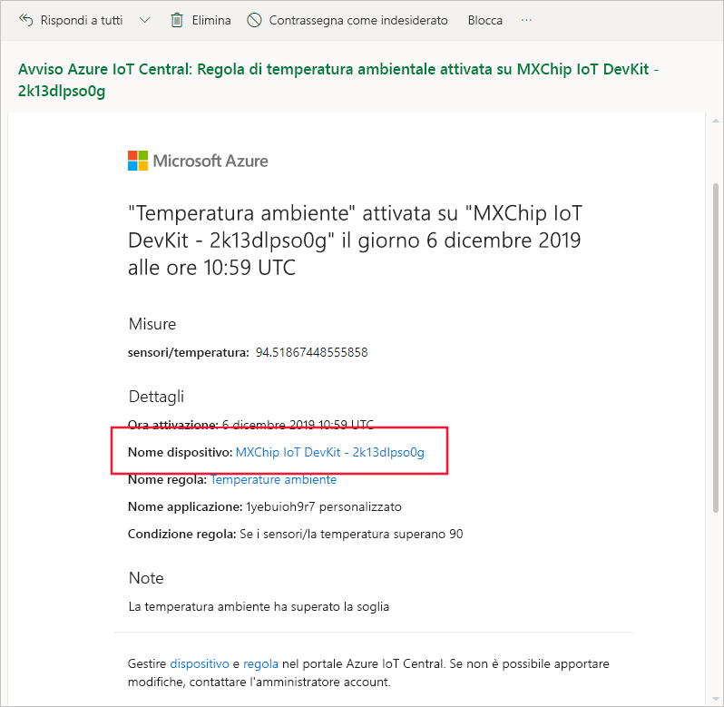
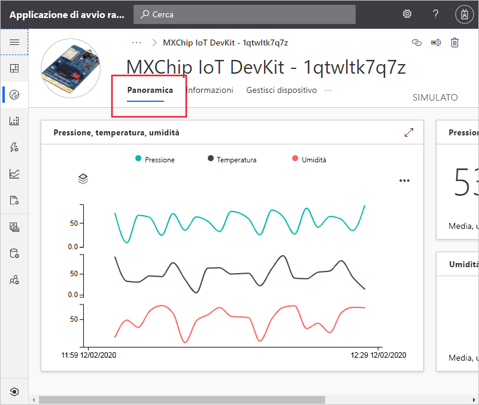
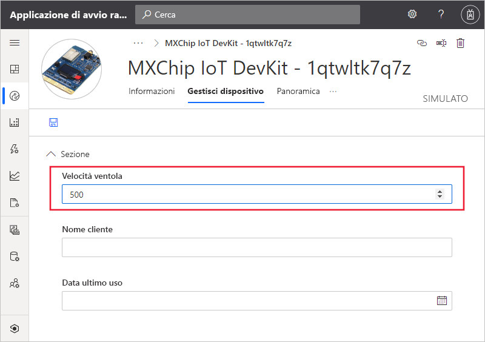

# Avvio rapido: Usare Azure IoT Central per monitorare i dispositivi

*Questo articolo è rivolto a operatori, autori e amministratori.*

Questo avvio rapido illustra come un operatore può usare l'applicazione Microsoft Azure IoT Central per monitorare i dispositivi e modificare le impostazioni.

## Prerequisites

Prima di iniziare, è opportuno completare i tre avvii rapidi precedenti [Creare un'applicazione Azure IoT Central](./quick-deploy-iot-central.md), [Aggiungere un dispositivo simulato a un'applicazione IoT Central](./quick-create-pnp-device.md) e [Configurare le regole e le azioni per il dispositivo](quick-configure-rules.md).

## Ricevere una notifica

Azure IoT Central invia le notifiche sui dispositivi come messaggi di posta elettronica. Lo sviluppatore ha aggiunto una regola per l'invio di una notifica quando la temperatura di un dispositivo sensore connesso supera una soglia. Controllare i messaggi di posta elettronica inviati all'account scelto dal generatore per la ricezione delle notifiche.

Aprire il messaggio di posta elettronica ricevuto al termine dell'avvio rapido [Configurare le regole e le azioni per il dispositivo](quick-configure-rules.md). Nel messaggio di posta elettronica selezionare il collegamento al dispositivo:

Nel browser si apre la visualizzazione **Panoramica** per il dispositivo simulato creato negli argomenti di avvio rapido precedenti:

## Ricercare la causa di un problema

Un operatore può visualizzare le informazioni sul dispositivo nelle pagine **Panoramica**, **Informazioni** e **Comandi**. Lo sviluppatore ha creato una visualizzazione **Gestisci dispositivo** che consente di modificare le informazioni del dispositivo e di impostarne le proprietà.

Il grafico del dashboard mostra il tracciato della temperatura del dispositivo. Si decide che la temperatura del dispositivo è troppo alta.

## Correggere un problema

Per apportare una modifica al dispositivo, usare la pagina **Gestisci dispositivo**.

Impostare **Velocità della ventola** su 500 per raffreddare il dispositivo. Scegliere **Salva** per aggiornare il dispositivo. Quando il dispositivo conferma la modifica delle impostazioni, lo stato della proprietà cambia in **sincronizzato**:

## Passaggi successivi

In questa guida introduttiva si è appreso come:

* Ricevere una notifica
* Ricercare la causa di un problema
* Correggere un problema

Ora che si sa come monitorare il dispositivo, il passaggio successivo consigliato è il seguente:

> [!div class="nextstepaction"]
> [Creare e gestire un modello di dispositivo](howto-set-up-template.md).
