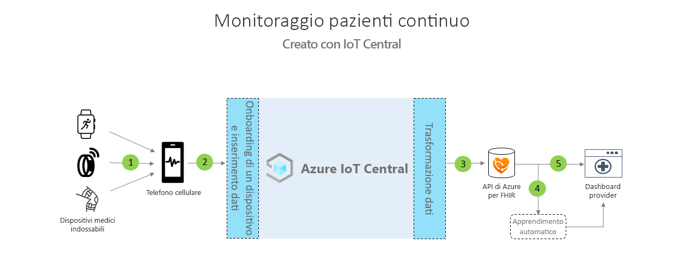

# Architettura del monitoraggio pazienti continuo

È possibile creare soluzioni di monitoraggio continuo dei pazienti usando il modello di app fornito e l'architettura descritta di seguito come linee guida.

>[!div class="mx-imgBorder"] 
>

1. Dispositivi medicali che comunicano tramite Bluetooth a basso consumo (Bluetooth Low Energy, BLE)
1. Gateway telefono cellulare che riceve dati Bluetooth a basso consumo e li invia a IoT Central
1. Esportazione continua dei dati sanitari dei pazienti all'API di Azure per FHIR&reg;
1. Machine Learning basato su dati interoperativi
1. Dashboard del team di assistenza basato sui dati FHIR

## Dettagli
Questa sezione illustra in modo più dettagliato ogni parte del diagramma dell'architettura.

### Dispositivi medicali Bluetooth a basso consumo
Molti dispositivi medicali indossabili nel settore IoT sanitario sono di tipo Bluetooth a basso consumo. Non sono in grado di comunicare direttamente con il cloud e dovranno passare attraverso un gateway. Questa architettura suggerisce di usare un'applicazione per telefoni cellulari come gateway.

### Gateway telefono cellulare
La funzione principale dell'applicazione per telefoni cellulari prevede l'inserimento di dati Bluetooth a basso consumo dai dispositivi medicali e la comunicazione con Azure IoT Central. L'app può inoltre guidare i pazienti attraverso un flusso di configurazione e provisioning del dispositivo e aiutarli a visualizzare i dati sanitari personali. Altre soluzioni possono usare un gateway tablet o un gateway statico, se all'interno di una stanza ospedaliera, per ottenere lo stesso flusso di comunicazione.

### Esportare nell'API di Azure per FHIR&reg;
Azure IoT Central è conforme a HIPAA e dotato di certificazione HITRUST&reg;, ma potrebbe essere necessario inviare i dati sanitari dei pazienti all'API di Azure per FHIR. L'[API di Azure per FHIR](../../healthcare-apis/overview.md) è un'API conforme, basata su standard e completamente gestita per i dati sanitari clinici, che consente di creare nuovi sistemi di engagement con i dati sanitari. Consente lo scambio di dati rapido tramite le API per FHIR ed è supportata da un'offerta PaaS (Platform-as-a-Service) gestita nel cloud. Usando la funzionalità di esportazione dei dati continua di IoT Central, è possibile inviare i dati all'API di Azure per FHIR.

### Machine Learning
Dopo aver aggregato i dati e averli convertiti nel formato FHIR, è possibile creare modelli di Machine Learning in grado di arricchire le informazioni dettagliate e abilitare processi decisionali più intelligente per il team di assistenza sanitaria. È disponibile un'ampia gamma di servizi che possono essere usati per creare, sottoporre a training e distribuire modelli di Machine Learning. Per altre informazioni su come usare le offerte di Machine Learning di Azure, vedere la [documentazione di Machine Learning](../../machine-learning/index.yml).

### Dashboard del provider
I dati disponibili nell'API di Azure per FHIR possono essere usati per creare un dashboard di informazioni dettagliate sui pazienti o possono essere integrati direttamente in un sistema di cartelle mediche elettroniche per consentire ai team di assistenza sanitaria di visualizzare lo stato dei pazienti. I team di assistenza sanitaria possono usare questo dashboard per prendersi cura dei pazienti che hanno bisogno assistenza e per individuare in anticipo eventuali segnali di peggioramento. Per informazioni su come creare un dashboard del provider in tempo reale di Power BI, seguire la [guida pratica](howto-health-data-triage.md).

## Passaggi successivi
* [Informazioni su come distribuire un modello di applicazione di monitoraggio pazienti continuo](tutorial-continuous-patient-monitoring.md)