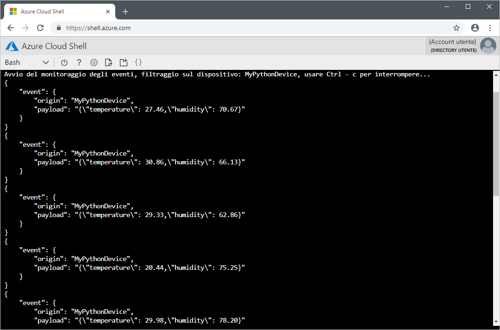

# <a name="quickstart-send-telemetry-from-a-device-to-an-iot-hub-and-read-it-with-a-back-end-application-python"></a>Guida introduttiva: Inviare dati di telemetria da un dispositivo a un hub IoT e leggere i dati con un'applicazione di back-end (Python)

[!INCLUDE [iot-hub-quickstarts-1-selector](../../includes/iot-hub-quickstarts-1-selector.md)]

L'hub IoT è un servizio di Azure che consente di acquisire volumi elevati di dati di telemetria dai dispositivi IoT nel cloud per l'archiviazione o l'elaborazione. In questa Guida rapida, si inviano dati di telemetria da un'applicazione del dispositivo simulato, tramite l'Hub IoT, a un'applicazione di back-end per l'elaborazione.

La guida introduttiva usa un'applicazione Python già pronta per inviare i dati di telemetria e un'utilità da riga di comando per leggere i dati di telemetria dall'hub. Prima di eseguire queste due applicazioni, creare un hub IoT e registrare un dispositivo con l'hub.

Se non si ha una sottoscrizione di Azure, creare un [account gratuito](https://azure.microsoft.com/free/?WT.mc_id=A261C142F) prima di iniziare.

## <a name="prerequisites"></a>Prerequisiti

Eseguire questo comando per aggiungere l'estensione Microsoft Azure IoT per l'interfaccia della riga di comando di Azure all'istanza di Cloud Shell. L'estensione IoT aggiunge i comandi specifici di hub IoT, IoT Edge e servizio Device Provisioning in hub IoT all'interfaccia della riga di comando di Azure.

```azurecli-interactive
az extension add --name azure-cli-iot-ext
```

Scaricare il progetto di esempio di Python da https://github.com/Azure-Samples/azure-iot-samples-python/archive/master.zip ed estrarre l'archivio ZIP.

Installare [Python 3.7 o versione successiva](https://www.python.org/downloads/) nel computer di sviluppo. Per altre versioni supportate di Python, vedere l'articolo sulle [funzionalità per i dispositivi IoT di Azure](https://github.com/Azure/azure-iot-sdk-python/tree/master/azure-iot-device#azure-iot-device-features) nella documentazione dell'SDK.

## <a name="create-an-iot-hub"></a>Creare un hub IoT

[!INCLUDE [iot-hub-include-create-hub](../../includes/iot-hub-include-create-hub.md)]

## <a name="register-a-device"></a>Registrare un dispositivo

È necessario registrare un dispositivo con l'hub IoT perché questo possa connettersi. In questa guida introduttiva si usa Azure Cloud Shell per registrare un dispositivo simulato.

1. Eseguire il comando seguente in Azure Cloud Shell per creare l'identità del dispositivo.

    **YourIoTHubName**: sostituire il segnaposto in basso con il nome scelto per l'hub IoT.

    **MyPythonDevice**: nome del dispositivo da registrare. È consigliabile usare **MyPythonDevice**, come illustrato. Se si sceglie un altro nome per il dispositivo, sarà necessario usare tale nome anche nell'ambito di questo articolo e aggiornare il nome del dispositivo nelle applicazioni di esempio prima di eseguirle.

    ```azurecli-interactive
    az iot hub device-identity create --hub-name {YourIoTHubName} --device-id MyPythonDevice
    ```

1. Eseguire il comando seguente in Azure Cloud Shell per ottenere la _stringa di connessione del dispositivo_ per il dispositivo registrato:

    **YourIoTHubName**: sostituire il segnaposto in basso con il nome scelto per l'hub IoT.

    ```azurecli-interactive
    az iot hub device-identity show-connection-string --hub-name {YourIoTHubName} --device-id MyPythonDevice --output table
    ```

    Annotare la stringa di connessione del dispositivo, che avrà questo aspetto:

   `HostName={YourIoTHubName}.azure-devices.net;DeviceId=MyPythonDevice;SharedAccessKey={YourSharedAccessKey}`

    Il valore verrà usato più avanti in questa guida di avvio rapido.

## <a name="send-simulated-telemetry"></a>Inviare dati di telemetria simulati

L'applicazione del dispositivo simulato si connette a un endpoint specifico del dispositivo nell'hub IoT e invia dati di telemetria simulati di temperatura e umidità.

1. In una finestra del terminale locale passare alla cartella radice del progetto Python di esempio. Passare quindi alla cartella **iot-hub\Quickstarts\simulated-device**.

1. Aprire il file **SimulatedDevice.py** in un editor di testo di propria scelta.

    Sostituire il valore della variabile `CONNECTION_STRING` con la stringa di connessione del dispositivo annotata in precedenza. Salvare quindi le modifiche nel file **SimulatedDevice.py**.

1. Nella finestra del terminale locale eseguire i comandi seguenti per installare le librerie necessarie per l'applicazione del dispositivo simulato:

    ```cmd/sh
    pip install azure-iot-device
    ```

1. Nella finestra del terminale locale eseguire i comandi seguenti per eseguire l'applicazione del dispositivo simulato:

    ```cmd/sh
    python SimulatedDevice.py
    ```

    La schermata seguente mostra l'output mentre l'applicazione del dispositivo simulato invia i dati di telemetria all'hub IoT:

    


## <a name="read-the-telemetry-from-your-hub"></a>Leggere i dati di telemetria dell'hub

L'estensione dell'interfaccia della riga di comando dell'hub IoT può connettersi all'endpoint **Eventi** sul lato servizio dell'hub IoT. L'estensione riceve i messaggi da dispositivo a cloud inviati dal dispositivo simulato. In genere, un'applicazione di back-end di hub IoT viene eseguita nel cloud per ricevere ed elaborare i messaggi da dispositivo a cloud.

Eseguire i comandi seguenti in Azure Cloud Shell, sostituendo `YourIoTHubName` con il nome dell'hub IoT:

```azurecli-interactive
az iot hub monitor-events --hub-name {YourIoTHubName} --device-id MyPythonDevice 
```

Lo screenshot seguente mostra l'output mentre l'estensione riceve i dati di telemetria inviati dal dispositivo simulato all'hub:



## <a name="clean-up-resources"></a>Pulire le risorse

[!INCLUDE [iot-hub-quickstarts-clean-up-resources](../../includes/iot-hub-quickstarts-clean-up-resources.md)]

## <a name="next-steps"></a>Passaggi successivi

In questa guida di avvio rapido è stato configurato un hub IoT, è stato registrato un dispositivo, sono stati inviati dati di telemetria simulati all'hub usando un'applicazione Python e sono stati letti i dati di telemetria dall'hub usando una semplice applicazione back-end.

Per informazioni su come controllare il dispositivo simulato da un'applicazione back-end, continuare nella Guida introduttiva successiva.

> [!div class="nextstepaction"]
> [Guida introduttiva: controllare un dispositivo connesso a un hub IoT](quickstart-control-device-python.md)
