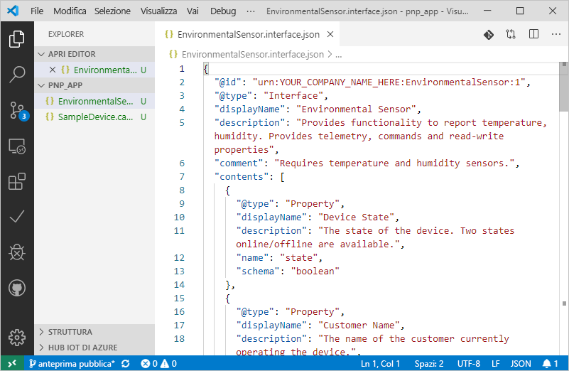
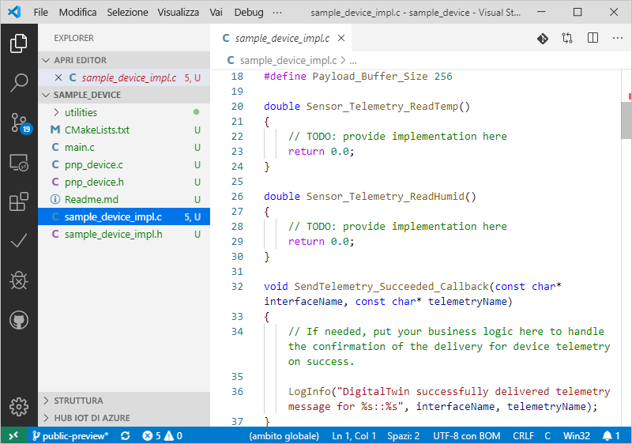

# <a name="quickstart-use-a-device-capability-model-to-create-an-iot-plug-and-play-preview-device-linux"></a>Avvio rapido: Usare un modello di funzionalità di dispositivo per creare un dispositivo di anteprima Plug and Play IoT (Linux)

[!INCLUDE [iot-pnp-quickstarts-1-selector.md](../../includes/iot-pnp-quickstarts-1-selector.md)]

Un _modello di funzionalità di dispositivo_ descrive le funzionalità di un dispositivo Plug and Play IoT. Un modello di funzionalità di dispositivo è spesso associato a uno SKU di prodotto. Le funzionalità definite nel modello di funzionalità di dispositivo sono organizzate in interfacce riutilizzabili. È possibile generare la bozza di codice del dispositivo da un modello di funzionalità di dispositivo. Questa guida di avvio rapido illustra come usare VS Code su Ubuntu Linux per creare un dispositivo Plug and Play IoT usando un modello di funzionalità di dispositivo.

## <a name="prerequisites"></a>Prerequisites

Questa guida di avvio rapido presuppone che si stia usando Ubuntu Linux con un ambiente desktop. I passaggi in questa esercitazione sono stati testati con Ubuntu 18.04.

Per completare questa guida di avvio rapido, è necessario installare il software seguente nel computer Linux locale:

* Installare **GCC**, **Git**, **cmake** e tutte le dipendenze tramite il comando `apt-get`:

    ```sh
    sudo apt-get update
    sudo apt-get install -y git cmake build-essential curl libcurl4-openssl-dev libssl-dev uuid-dev
    ```

    Verificare che la versione di `cmake` sia superiore alla **2.8.12** e che la versione di **GCC** sia superiore alla **4.4.7**.

    ```sh
    cmake --version
    gcc --version
    ```

* [Visual Studio Code](https://code.visualstudio.com/).

### <a name="install-azure-iot-tools"></a>Installare Azure IoT Tools

Usare la procedura seguente per installare il pacchetto di estensione [Azure IoT Tools per VS Code](https://marketplace.visualstudio.com/items?itemName=vsciot-vscode.azure-iot-tools):

1. In VS Code selezionare **Estensioni**.
1. Cercare **Azure IoT Tools**.
1. Selezionare **Installa**.

### <a name="get-the-connection-string-for-your-company-model-repository"></a>Ottenere la stringa di connessione per il repository dei modelli aziendali

La _stringa di connessione del repository dei modelli aziendali_ è disponibile nel [portale di Azure Certified per IoT](https://preview.catalog.azureiotsolutions.com) quando si accede con un account aziendale o dell'istituto di istruzione Microsoft o con l'ID partner Microsoft se disponibile. Dopo aver eseguito l'accesso selezionare **Company repository** (Repository aziendale) e quindi **Stringhe di connessione**.

[!INCLUDE [cloud-shell-try-it.md](../../includes/cloud-shell-try-it.md)]

[!INCLUDE [iot-pnp-prepare-iot-hub.md](../../includes/iot-pnp-prepare-iot-hub.md)]

## <a name="prepare-the-development-environment"></a>Preparare l'ambiente di sviluppo

In questo argomento di avvio rapido viene usato lo strumento di gestione librerie [Vcpkg](https://github.com/microsoft/vcpkg) per installare Azure IoT SDK per dispositivi per C nell'ambiente di sviluppo.

Aprire una shell. Eseguire questo comando per installare Vcpkg:

```bash
cd ~
git clone https://github.com/microsoft/vcpkg
cd vcpkg
./bootstrap-vcpkg.sh
./vcpkg install azure-iot-sdk-c[public-preview,use_prov_client]
```

Il completamento di questa operazione richiederà alcuni minuti.

## <a name="author-your-model"></a>Creare il modello

In questa guida di avvio rapido si useranno un modello di funzionalità di dispositivo di esempio esistente e le interfacce associate.

1. Creare una directory `pnp_app` nell'unità locale. Questa cartella viene usata per i file del modello di dispositivo e lo stub del codice del dispositivo.

    ```bash
    cd ~
    mkdir pnp_app
    ```

1. Scaricare il modello di funzionalità di dispositivo e l'esempio di interfaccia e salvare i file nella cartella `pnp_app`.

    ```bash
    cd pnp_app
    curl -O -L https://raw.githubusercontent.com/Azure/IoTPlugandPlay/master/samples/SampleDevice.capabilitymodel.json
    curl -O -L https://raw.githubusercontent.com/Azure/IoTPlugandPlay/master/samples/EnvironmentalSensor.interface.json
    ```

1. Aprire la cartella `pnp_app` con VS Code. È possibile visualizzare i file con IntelliSense:

    

1. Nei file scaricati sostituire `<YOUR_COMPANY_NAME_HERE>` nei campi `@id` e `schema` con un valore univoco. Usare solo i caratteri a-z, A-Z, 0-9 e il carattere di sottolineatura. Per altre informazioni, vedere il [formato dell'identificatore gemello digitale](https://github.com/Azure/IoTPlugandPlay/tree/master/DTDL#digital-twin-identifier-format).

## <a name="generate-the-c-code-stub"></a>Generare lo stub del codice C

A questo punto, si dispone di un modello di funzionalità di dispositivo e delle interfacce associate ed è possibile generare il codice del dispositivo che implementa il modello. Per generare lo stub del codice C in VS Code:

1. Con la cartella `pnp_app` aperta in VS Code, usare **CTRL+MAIUSC+P** per aprire il riquadro comandi, immettere **Plug and Play IoT** e selezionare **Generate Device Code Stub** (Genera stub codice dispositivo).

    > [!NOTE]
    > La prima volta che si usa l'utilità del generatore di codice di Plug and Play IoT è necessario attendere alcuni secondi il completamento del download e l'installazione.

1. Scegliere il file **SampleDevice.capabilitymodel.json** da usare per generare lo stub del codice del dispositivo.

1. Immettere il nome di progetto **sample_device**. Si tratta del nome dell'applicazione del dispositivo.

1. Scegliere **ANSI C** come linguaggio.

1. Scegliere **Via IoT Hub device connection string** (Tramite stringa di connessione del dispositivo hub IoT) come metodo di connessione.

1. Scegliere **CMake Project on Linux** (Progetto CMake su Linux) come modello di progetto.

1. Scegliere la modalità **Via Vcpkg** (Tramite Vcpkg) per includere l'SDK per dispositivi.

1. Nello stesso percorso del file DCM verrà creata una nuova cartella denominata **sample_device**, contenente i file stub del codice del dispositivo generati. VS Code apre una nuova finestra per visualizzarli.
    

## <a name="build-and-run-the-code"></a>Compilare ed eseguire il codice

Per compilare lo stub del codice del dispositivo generato, si usa il codice sorgente dell'SDK per dispositivi. L'applicazione compilata simula un dispositivo che si connette a un hub IoT. L'applicazione invia proprietà e dati di telemetria e riceve comandi.

1. Creare una cartella delle compilazioni **CMake** per l'applicazione **sample_device**:

    ```bash
    cd ~/pnp_app/sample_device
    mkdir cmake
    cd cmake
    ```

1. Eseguire CMake per compilare l'app con l'SDK. Il comando seguente presuppone che **vcpkg** sia stato installato nella home directory:

    ```bash
    cmake .. -DCMAKE_TOOLCHAIN_FILE=~/vcpkg/scripts/buildsystems/vcpkg.cmake -Duse_prov_client=ON -Dhsm_type_symm_key:BOOL=ON
    cmake --build .
    ```

1. Al termine della compilazione, eseguire l'applicazione passando come parametro la stringa di connessione del dispositivo dell'hub IoT.

    ```sh
    cd ~/pnp_app/sample_device/cmake
    ./sample_device "<YourDeviceConnectionString>"
    ```

1. L'applicazione del dispositivo inizia a inviare dati all'hub IoT.

    

## <a name="validate-the-code"></a>Convalidare il codice

### <a name="publish-device-model-files-to-model-repository"></a>Pubblicare i file del modello di dispositivo nel repository dei modelli

Per convalidare il codice del dispositivo con la CLI **az**, è necessario pubblicare i file nel repository dei modelli.

1. Con la cartella `pnp_app` aperta in VS Code, usare **CTRL+MAIUSC+P** per aprire il riquadro comandi, digitare e selezionare **Plug and Play IoT: Submit files to Model Repository** (Plug & Play IoT: Invia file al repository dei modelli).

1. Selezionare i file `SampleDevice.capabilitymodel.json` e `EnvironmentalSensor.interface.json`.

1. Immettere la stringa di connessione del repository dei modelli aziendali.

    > [!NOTE]
    > La stringa di connessione è necessaria solo la prima volta che ci si connette al repository.

1. Nella notifica e nella finestra di output di VS Code è possibile verificare che i file siano stati pubblicati correttamente.

    > [!NOTE]
    > Se vengono visualizzati errori durante la pubblicazione dei file del modello di dispositivo, è possibile provare a usare il comando **IoT Plug and Play: Sign out Model Repository** (Plug & Play IoT: Disconnetti repository dei modelli) per disconnettersi e ripetere la procedura.

### <a name="use-the-azure-iot-cli-to-validate-the-code"></a>Usare l'interfaccia della riga di comando di Azure IoT per convalidare il codice

Dopo l'avvio del dispositivo client di esempio, è possibile verificare che funzioni con l'interfaccia della riga di comando di Azure.

Usare il comando seguente per visualizzare i dati di telemetria inviati dal dispositivo di esempio. Potrebbe essere necessario attendere un minuto o due prima che i dati di telemetria vengano visualizzati nell'output:

```azurecli-interactive
az iot dt monitor-events --hub-name <YourIoTHubNme> --device-id <YourDeviceID>
```

Usare il comando seguente per visualizzare tutte le proprietà inviate dal dispositivo:

```azurecli-interactive
az iot dt list-properties --device-id <YourDeviceID> --hub-name <YourIoTHubNme> --source private --repo-login "<YourCompanyModelRepositoryConnectionString>"
```

[!INCLUDE [iot-pnp-clean-resources.md](../../includes/iot-pnp-clean-resources.md)]

## <a name="next-steps"></a>Passaggi successivi

In questa guida di avvio rapido si è appreso come creare un dispositivo Plug and Play IoT usando un modello di funzionalità di dispositivo.

Per altre informazioni sui modelli di funzionalità di dispositivo e su come creare modelli personalizzati, continuare con l'esercitazione:

> [!div class="nextstepaction"]
> [Esercitazione: Creare e testare un modello di funzionalità di dispositivo con Visual Studio Code](tutorial-pnp-visual-studio-code.md)
