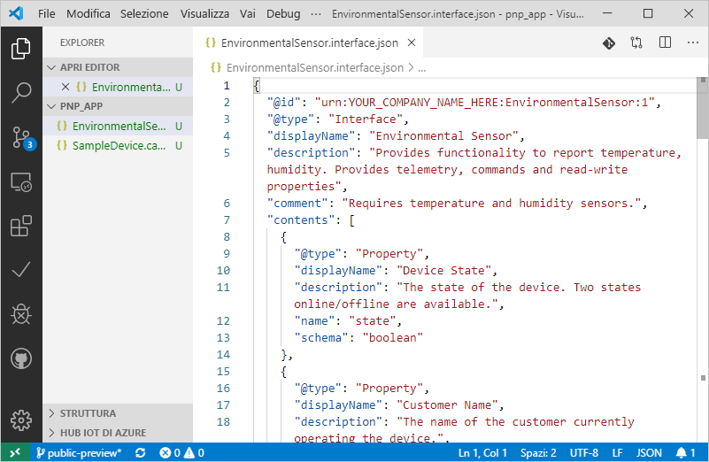
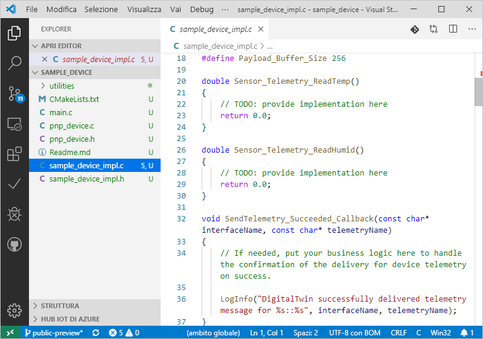

# <a name="quickstart-use-a-device-capability-model-to-create-an-iot-plug-and-play-device"></a>Guida introduttiva: Usare un modello di funzionalità di dispositivo per creare un dispositivo Plug and Play IoT

Un _modello di funzionalità di dispositivo_ descrive le funzionalità di un dispositivo Plug and Play IoT. Un modello di funzionalità di dispositivo è spesso associato a uno SKU di prodotto. Le funzionalità definite nel modello di funzionalità di dispositivo sono organizzate in interfacce riutilizzabili. È possibile generare la bozza di codice del dispositivo da un modello di funzionalità di dispositivo. Questa guida di avvio rapido illustra come usare VS Code per creare un dispositivo Plug and Play IoT usando un modello di funzionalità di dispositivo.

## <a name="prerequisites"></a>Prerequisiti

Per completare questa guida di avvio rapido, è necessario installare il software seguente nel computer locale:

* [Visual Studio (Community, Professional o Enterprise)](https://visualstudio.microsoft.com/downloads/): assicurarsi di includere il componente **Gestione pacchetti NuGet** e il carico di lavoro **Sviluppo per desktop con C++** quando si installa Visual Studio.
* [Git](https://git-scm.com/download/).
* [CMake](https://cmake.org/download/).
* [Visual Studio Code](https://code.visualstudio.com/).

### <a name="install-azure-iot-tools"></a>Installare Azure IoT Tools

Usare la procedura seguente per installare il pacchetto di estensione [Azure IoT Tools per VS Code](https://marketplace.visualstudio.com/items?itemName=vsciot-vscode.azure-iot-tools):

1. In VS Code selezionare **Estensioni**.
1. Cercare **Azure IoT Tools**.
1. Selezionare **Installa**.

### <a name="install-the-azure-iot-explorer"></a>Installare Azure IoT Explorer

Scaricare e installare lo strumento Azure IoT Explorer dalla pagina delle [versioni più recenti](https://github.com/Azure/azure-iot-explorer/releases).

### <a name="get-the-connection-string-for-your-company-model-repository"></a>Ottenere la stringa di connessione per il repository dei modelli aziendali

La _stringa di connessione del repository dei modelli aziendali_ è disponibile nel [portale di Azure Certified per IoT](https://preview.catalog.azureiotsolutions.com) quando si accede con un account aziendale o dell'istituto di istruzione Microsoft o con l'ID partner Microsoft se disponibile. Dopo aver eseguito l'accesso selezionare **Company repository** (Repository aziendale) e quindi **Stringhe di connessione**.

[!INCLUDE [cloud-shell-try-it.md](../../includes/cloud-shell-try-it.md)]

## <a name="prepare-an-iot-hub"></a>Preparare un hub IoT

Per completare questa guida di avvio rapido, la sottoscrizione di Azure deve includere anche un hub IoT di Azure. Se non si ha una sottoscrizione di Azure, creare un [account gratuito](https://azure.microsoft.com/free/?WT.mc_id=A261C142F) prima di iniziare.

> [!NOTE]
> Durante la fase di anteprima pubblica, le funzionalità Plug and Play IoT sono disponibili solo negli hub IoT creati nelle regioni **Stati Uniti centrali**, **Europa settentrionale** e **Giappone orientale**.

Aggiungere l'estensione IoT di Microsoft Azure per l'interfaccia della riga di comando di Azure:

```azurecli-interactive
az extension add --name azure-cli-iot-ext
```

Eseguire il comando seguente per creare l'identità del dispositivo nell'hub IoT. Sostituire i segnaposto **YourIoTHubName** e **YourDevice** con i nomi effettivi. Se non è disponibile alcun hub IoT, seguire [queste istruzioni per crearne uno](../iot-hub/iot-hub-create-using-cli.md):

```azurecli-interactive
az iot hub device-identity create --hub-name [YourIoTHubName] --device-id [YourDevice]
```

Eseguire i comandi seguenti per ottenere la _stringa di connessione del dispositivo_ per il dispositivo appena registrato:

```azurecli-interactive
az iot hub device-identity show-connection-string --hub-name [YourIoTHubName] --device-id [YourDevice] --output table
```

Eseguire i comandi seguenti per ottenere la _stringa di connessione dell'hub IoT_ per l'hub:

```azurecli-interactive
az iot hub show-connection-string --hub-name [YourIoTHubName] --output table
```

## <a name="prepare-the-development-environment"></a>Preparare l'ambiente di sviluppo

### <a name="get-azure-iot-device-sdk-for-c"></a>Ottenere Azure IoT SDK per dispositivi per C

In questa guida di avvio rapido verrà preparato un ambiente di sviluppo che è possibile usare per clonare e compilare Azure IoT SDK per dispositivi per C.

1. Aprire un prompt dei comandi. Eseguire il comando seguente per clonare il repository GitHub [Azure IoT C SDK](https://github.com/Azure/azure-iot-sdk-c):

    ```cmd/sh
    git clone https://github.com/Azure/azure-iot-sdk-c --recursive -b public-preview
    ```

    Il completamento di questa operazione richiederà alcuni minuti.

1. Creare una sottodirectory `pnp_app` nella radice del clone locale del repository. Questa cartella viene usata per i file del modello di dispositivo e lo stub del codice del dispositivo.

    ```cmd/sh
    cd azure-iot-sdk-c
    mkdir pnp_app
    ```

## <a name="author-your-model"></a>Creare il modello

In questa guida di avvio rapido si useranno un modello di funzionalità di dispositivo di esempio esistente e le interfacce associate.

1. Scaricare il [modello di funzionalità di dispositivo](https://github.com/Azure/IoTPlugandPlay/blob/master/samples/SampleDevice.capabilitymodel.json) e l'[esempio di interfaccia](https://github.com/Azure/IoTPlugandPlay/blob/master/samples/EnvironmentalSensor.interface.json) e salvare i file nella cartella `pnp_app`.

    > [!TIP]
    > Per scaricare un file da GitHub, passare al file, fare clic con il pulsante destro del mouse su **Raw** e quindi scegliere **Save link as** (Salva collegamento con nome).

1. Aprire la cartella `pnp_app` con VS Code. È possibile visualizzare i file con IntelliSense:

    

1. Nei file scaricati sostituire `<YOUR_COMPANY_NAME_HERE>` nei campi `@id` e `schema` con un valore univoco. Usare solo i caratteri a-z, A-Z, 0-9 e il carattere di sottolineatura. Per altre informazioni, vedere il [formato dell'identificatore gemello digitale](https://github.com/Azure/IoTPlugandPlay/tree/master/DTDL#digital-twin-identifier-format).

## <a name="generate-the-c-code-stub"></a>Generare lo stub del codice C

A questo punto, si dispone di un modello di funzionalità di dispositivo e delle interfacce associate ed è possibile generare il codice del dispositivo che implementa il modello. Per generare lo stub del codice C in VS Code:

1. Dopo avere aperto la cartella con i file del modello di funzionalità di dispositivo, premere **CTRL+MAIUSC+P** per aprire il riquadro comandi, immettere **Plug and Play IoT** e selezionare **Generate Device Code Stub** (Genera stub codice dispositivo).

    > [!NOTE]
    > La prima volta che si usa l'utilità del generatore di codice di Plug and Play IoT è necessario attendere alcuni secondi il completamento del download.

1. Scegliere il file del modello di funzionalità di dispositivo da usare per generare lo stub del codice del dispositivo.

1. Immettere il nome del progetto **sample_device**, che sarà il nome dell'applicazione del dispositivo.

1. Scegliere **ANSI C** come linguaggio.

1. Scegliere **Progetto CMake** come tipo di progetto.

1. Scegliere **Via IoT Hub device connection string** (Tramite stringa di connessione del dispositivo hub IoT) come metodo di connessione.

1. VS Code apre una nuova finestra contenente i file stub di codice di dispositivo generati.
    

## <a name="build-the-code"></a>Compilare il codice

Per compilare lo stub del codice del dispositivo generato, si usa l'SDK per dispositivi. L'applicazione compilata simula un dispositivo che si connette a un hub IoT. L'applicazione invia proprietà e dati di telemetria e riceve comandi.

1. In VS Code aprire `CMakeLists.txt` nella cartella radice dell'SDK del dispositivo.

1. Aggiungere la riga seguente alla fine del file `CMakeLists.txt` per includere la cartella dello stub del codice del dispositivo durante la compilazione:

    ```txt
    add_subdirectory(pnp_app/sample_device)
    ```

1. Creare una sottodirectory cmake nella directory radice dell'SDK del dispositivo e passare a tale cartella:

    ```cmd\sh
    mkdir cmake
    cd cmake
    ```

1. Eseguire i comandi seguenti per compilare l'SDK del dispositivo e lo stub del codice generato:

    ```cmd\sh
    cmake .. -Duse_prov_client=ON -Dhsm_type_symm_key:BOOL=ON
    cmake --build . -- /m /p:Configuration=Release
    ```

    > [!NOTE]
    > Se cmake non trova il compilatore C++, vengono visualizzati errori di compilazione durante l'esecuzione del comando precedente. In tal caso, provare a eseguire questo comando al [prompt dei comandi di Visual Studio](https://docs.microsoft.com/dotnet/framework/tools/developer-command-prompt-for-vs).

1. Al termine della compilazione, eseguire l'applicazione passando come parametro la stringa di connessione del dispositivo dell'hub IoT.

    ```cmd\sh
    cd azure-iot-sdk-c\cmake\pnp_app\sample_device\Release\
    sample_device.exe "[IoT Hub device connection string]"
    ```

1. L'applicazione del dispositivo inizia a inviare dati all'hub IoT.

    

## <a name="validate-the-code"></a>Convalidare il codice

### <a name="publish-device-model-files-to-model-repository"></a>Pubblicare i file del modello di dispositivo nel repository dei modelli

Per convalidare il codice del dispositivo con **Azure IoT Explorer**, è necessario pubblicare i file nel repository dei modelli.

1. Dopo avere aperto la cartella con i file del modello di funzionalità di dispositivo, premere **CTRL+MAIUSC+P** per aprire il riquadro comandi, digitare e selezionare **IoT Plug & Play: Submit files to Model Repository** (Plug & Play IoT: Invia file al repository dei modelli).

1. Selezionare i file `SampleDevice.capabilitymodel.json` e `EnvironmentalSensor.interface.json`.

1. Immettere la stringa di connessione del repository dei modelli aziendali.

    > [!NOTE]
    > La stringa di connessione è necessaria solo la prima volta che ci si connette al repository.

1. Nella notifica e nella finestra di output di VS Code è possibile verificare che i file siano stati pubblicati correttamente.

    > [!NOTE]
    > Se vengono visualizzati errori durante la pubblicazione dei file del modello di dispositivo, è possibile provare a usare il comando **IoT Plug and Play: Sign out Model Repository** (Plug & Play IoT: Disconnetti repository dei modelli) per disconnettersi e ripetere la procedura.

### <a name="use-the-azure-iot-explorer-to-validate-the-code"></a>Usare Azure IoT Explorer per convalidare il codice

1. Aprire Azure IoT Explorer. Viene visualizzata la pagina **App configurations** (Configurazioni app).

1. Immettere la stringa di connessione dell'hub IoT e fare clic su **Connetti**.

1. Dopo la connessione viene visualizzata la pagina della panoramica del dispositivo.

1. Per aggiungere il repository aziendale, selezionare **Impostazioni**, quindi **+ Nuovo** e infine **Company repository** (Repository aziendale).

1. Aggiungere la stringa di connessione del repository dei modelli aziendali. Selezionare **Connessione**.

1. Nella pagina della panoramica del dispositivo individuare l'identità del dispositivo creata in precedenza e selezionarla per visualizzare altri dettagli.

1. Espandere l'interfaccia con ID **urn:azureiot:EnvironmentalSensor:1** per visualizzare le primitive Plug and Play IoT, ovvero le proprietà, i comandi e i dati di telemetria.

1. Selezionare la pagina **Telemetria** per visualizzare i dati di telemetria inviati dal dispositivo.

1. Selezionare la pagina **Properties(non-writable)** (Proprietà - non scrivibili) per visualizzare le proprietà non scrivibili segnalate dal dispositivo.

1. Selezionare la pagina **Properties(writable)** (Proprietà - scrivibili) per visualizzare le proprietà scrivibili che è possibile aggiornare.

1. Espandere la proprietà **name**, aggiornarla con un nuovo nome e selezionare **update writable property** (Aggiorna proprietà scrivibile). 
2. Per visualizzare il nuovo nome nella colonna **Reported Property** (Proprietà segnalata), fare clic sul pulsante **Aggiorna** nella parte superiore della pagina.

1. Selezionare la pagina **Comando** per visualizzare tutti i comandi supportati dal dispositivo.

1. Espandere il comando **blink** e impostare un nuovo intervallo di tempo per l'intermittenza. Selezionare **Invia comando** per chiamare il comando nel dispositivo.

1. Passare al dispositivo simulato per verificare che il comando venga eseguito come previsto.

## <a name="next-steps"></a>Passaggi successivi

In questa guida di avvio rapido si è appreso come creare un dispositivo Plug and Play IoT usando un modello di funzionalità di dispositivo.

Per altre informazioni su Plug and Play IoT, continuare con l'esercitazione:

> [!div class="nextstepaction"]
> [Creare e testare un modello di funzionalità di dispositivo con Visual Studio Code](tutorial-pnp-visual-studio-code.md)
