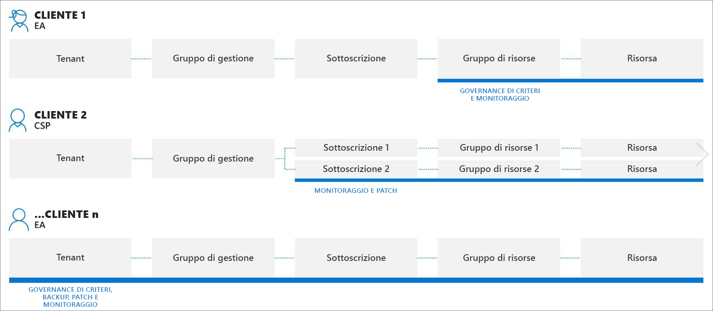
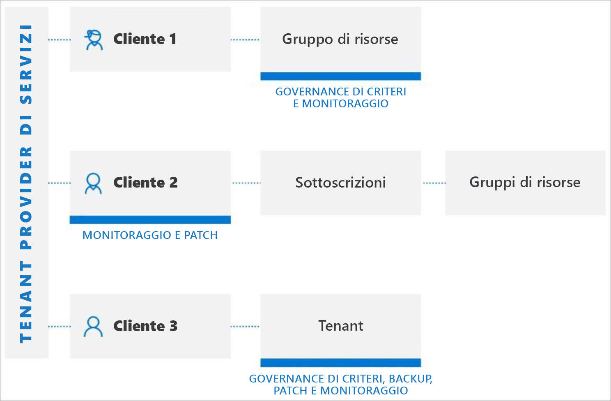

# Esperienze di gestione tra tenant

Un provider di servizi può usare la [gestione risorse delegate di Azure](../concepts/azure-delegated-resource-management.md) per gestire le risorse di Azure per più clienti dal tenant nel [portale di Azure](https://portal.azure.com). La maggior parte delle attività e dei servizi può essere eseguita nelle risorse di Azure delegate tra i tenant gestiti. Questo articolo descrive alcuni degli scenari avanzati in cui la gestione risorse delegate di Azure può essere efficace.

> [!NOTE]
> La gestione delle risorse delegate di Azure può essere usata anche [all'interno di un'azienda che dispone di più tenant Azure ad](enterprise.md) per semplificare l'amministrazione tra tenant.

## Informazioni sui tenant dei clienti

Un tenant di Azure Active Directory (Azure AD) è una rappresentazione di un'organizzazione. Si tratta di un'istanza dedicata di Azure AD che un'organizzazione riceve quando crea una relazione con Microsoft iscrivendosi ad Azure, Microsoft 365 o ad altri servizi. Ogni tenant di Azure AD è distinto e separato dagli altri tenant di Azure AD e ha un proprio ID tenant (un GUID). Per altre informazioni, vedere [Informazioni su Azure Active Directory](../../active-directory/fundamentals/active-directory-whatis.md).

In genere, per gestire le risorse di Azure per un cliente, i provider di servizi devono accedere al portale di Azure usando un account associato al tenant del cliente, richiedendo a un amministratore del tenant del cliente di creare e gestire gli account utente per il provider di servizi.

Con la gestione risorse delegate di Azure, il processo di onboarding specifica gli utenti all'interno del tenant del provider di servizi che potranno accedere a sottoscrizioni, gruppi di risorse e risorse nel tenant del cliente e gestirli. Questi utenti possono quindi accedere al portale di Azure usando le proprie credenziali. All'interno del portale di Azure possono gestire le risorse appartenenti a tutti i clienti a cui hanno accesso. Per eseguire questa operazione, visitare la pagina [Clienti personali](../how-to/view-manage-customers.md) nel portale di Azure o accedere direttamente al contesto della sottoscrizione di tale cliente nel portale di Azure o tramite API.

La gestione risorse delegate di Azure consente una maggiore flessibilità nella gestione delle risorse per più clienti senza dover accedere ad account diversi in tenant diversi. Un provider di servizi, ad esempio, può avere tre clienti, con responsabilità e livelli di accesso diversi, come illustrato di seguito:

Usando la gestione delle risorse delegata di Azure, gli utenti autorizzati possono accedere al tenant del provider di servizi per accedere a queste risorse, come illustrato di seguito:

## Supporto delle API e degli strumenti di gestione

È possibile eseguire le attività di gestione nelle risorse delegate direttamente nel portale oppure usando le API e gli strumenti di gestione, ad esempio l'interfaccia della riga di comando di Azure e Azure PowerShell. Quando si usano le risorse delegate, è possibile utilizzare tutte le API esistenti, purché la funzionalità sia supportata per la gestione tra tenant e l'utente disponga delle autorizzazioni appropriate.

Il [cmdlet Azure PowerShell Get-AzSubscription](https://docs.microsoft.com/powershell/module/Az.Accounts/Get-AzSubscription?view=azps-3.5.0) Mostra il **tenantID** per ogni sottoscrizione, consentendo di identificare se una sottoscrizione restituita appartiene al tenant del provider di servizi o a un tenant del cliente gestito.

Analogamente, i comandi dell'interfaccia della riga di comando di Azure come [AZ account list](https://docs.microsoft.com/cli/azure/account?view=azure-cli-latest#az-account-list) mostrano gli attributi **homeTenantId** e **managedByTenants** .

> [!TIP]
> Se questi valori non vengono visualizzati quando si usa l'interfaccia della riga di comando di Azure, provare a cancellare la cache eseguendo `az account clear` seguito da `az login --identity`.

Sono inoltre disponibili API specifiche per l'esecuzione di attività di gestione delle risorse delegate di Azure. Per altre informazioni, vedere la sezione **Riferimento**.

## Scenari e servizi avanzati

La maggior parte delle attività e dei servizi può essere eseguita nelle risorse delegate tra i tenant gestiti. Di seguito sono riportati alcuni scenari principali in cui la gestione tra tenant può essere efficace.

[Azure Arc per server (anteprima)](../../azure-arc/servers/overview.md):

- [Connettere computer Windows Server o Linux esterni ad Azure](../../azure-arc/servers/quickstart-onboard-portal.md) a sottoscrizioni e/o gruppi di risorse delegate in Azure
- Gestire computer connessi usando costrutti di Azure, ad esempio Criteri di Azure e assegnazione di tag

[Automazione di Azure](../../automation/index.yml):

- Usare gli account di automazione per accedere e lavorare con le risorse dei clienti delegate

[Backup di Azure](../../backup/index.yml):

- Eseguire il backup e il ripristino dei dati dei clienti nei tenant dei clienti
- Utilizzare [Esplora backup](../../backup/monitor-azure-backup-with-backup-explorer.md) per visualizzare le informazioni operative degli elementi di backup (incluse le risorse di Azure non ancora configurate per il backup) e le informazioni di monitoraggio (processi e avvisi) per le sottoscrizioni Delegate. Esplora backup è attualmente disponibile solo per i dati delle macchine virtuali di Azure.
- Usare i [report di backup](../../backup/configure-reports.md) nelle sottoscrizioni delegate per tenere traccia delle tendenze cronologiche, analizzare il consumo di archiviazione dei backup e controllare i backup e i ripristini.

[Servizio Azure Kubernetes](../../aks/index.yml):

- Gestire gli ambienti Kubernetes ospitati e distribuire e gestire le applicazioni in contenitori nei tenant dei clienti

[Monitoraggio di Azure](../../azure-monitor/index.yml):

- Visualizzare avvisi per le sottoscrizioni delegate, con la possibilità di visualizzare gli avvisi in tutte le sottoscrizioni
- Visualizzare i dettagli del log attività per le sottoscrizioni delegate
- Log Analytics: eseguire query sui dati dalle aree di lavoro del cliente remoto in più tenant
- Creare avvisi nei tenant dei clienti che attivano l'automazione, ad esempio runbook di Automazione di Azure o Funzioni di Azure, nel tenant del provider di servizi tramite webhook

[Criteri di Azure](../../governance/policy/index.yml):

- Gli snapshot di conformità mostrano i dettagli per i criteri assegnati nelle sottoscrizioni delegate
- Creare e modificare le definizioni dei criteri in una sottoscrizione delegata
- Assegnare le definizioni dei criteri definite dal cliente nella sottoscrizione delegata
- I clienti visualizzano i criteri creati dal provider di servizi insieme ai criteri che hanno creato personalmente
- Può [correggere deployIfNotExists o modificare le assegnazioni nel tenant del cliente](../how-to/deploy-policy-remediation.md)

[Azure Resource Graph](../../governance/resource-graph/index.yml):

- Include ora l'ID tenant nei risultati delle query restituiti, consentendo di determinare se una sottoscrizione appartiene al tenant del cliente o al tenant del provider di servizi

[Centro sicurezza di Azure](../../security-center/index.yml):

- Visibilità tra tenant
  - Monitorare la conformità ai criteri di sicurezza e garantire la copertura della sicurezza tra le risorse di tutti i tenant
  - Monitoraggio continuo della conformità alle normative per più clienti in una singola visualizzazione
  - Monitorare, valutare e classificare in ordine di priorità le raccomandazioni sulla sicurezza di utilità pratica con il calcolo del punteggio di sicurezza
- Gestione del comportamento di sicurezza tra tenant
  - Gestire i criteri di sicurezza
  - Intervenire sulle risorse non conformi alle raccomandazioni sulla sicurezza di utilità pratica
  - Raccogliere e archiviare i dati relativi alla sicurezza
- Rilevamento e protezione dalle minacce tra tenant
  - Rilevare le minacce tra le risorse dei tenant
  - Applicare controlli avanzati di protezione dalle minacce, ad esempio l'accesso JIT alle macchine virtuali
  - Rafforzare la configurazione dei gruppi di sicurezza di rete con Protezione avanzata adattiva per la rete
  - Assicurarsi che i server eseguano solo le applicazioni e i processi che devono eseguire con i controlli applicazione adattivi
  - Monitorare le modifiche apportate a file e voci del Registro di sistema importanti con Monitoraggio dell'integrità dei file

[Azure Sentinel](../../sentinel/multiple-tenants-service-providers.md):

- Gestire le risorse di Azure Sentinel [nei tenant dei clienti](../../sentinel/multiple-tenants-service-providers.md)
- [Tenere traccia degli attacchi e visualizzare gli avvisi di sicurezza in più tenant dei clienti](https://techcommunity.microsoft.com/t5/azure-sentinel/using-azure-lighthouse-and-azure-sentinel-to-monitor-across/ba-p/1043899)

[Integrità dei servizi di Azure](../../service-health/index.yml):

- Monitorare l'integrità delle risorse dei clienti con Integrità risorse di Azure
- Tenere traccia dell'integrità dei servizi di Azure usati dai clienti

[Azure Site Recovery](../../site-recovery/index.yml):

- Gestire le opzioni di ripristino di emergenza per le macchine virtuali di Azure nei tenant dei clienti (tenere presente che non è possibile usare gli account RunAs per copiare le estensioni delle macchine virtuali)

[Macchine virtuali di Azure](../../virtual-machines/index.yml):

- Usare le estensioni macchina virtuale di Azure per fornire attività di configurazione e automazione post-distribuzione sulle macchine virtuali di Azure nei tenant dei clienti
- Usare la diagnostica di avvio per risolvere i problemi delle macchine virtuali di Azure nei tenant dei clienti
- Accedere alle macchine virtuali con la console seriale nei tenant dei clienti
- Si noti che non è possibile usare Azure Active Directory per l'accesso remoto a una macchina virtuale e non è possibile integrare una macchina virtuale con un insieme di credenziali delle chiavi per password, segreti o chiavi crittografiche per la crittografia del disco

[Rete virtuale di Azure](../../virtual-network/index.yml):

- Distribuire e gestire reti virtuali e schede di interfaccia di rete virtuale nei tenant dei clienti

Richieste di supporto:

- Aprire le richieste di supporto per le risorse delegate dal pannello **Guida e supporto** nel portale di Azure (selezionando il piano di supporto disponibile per l'ambito delegato)

## Limitazioni correnti
In tutti gli scenari tenere presenti le limitazioni correnti seguenti:

- Le richieste gestite da Azure Resource Manager possono essere eseguite usando la gestione risorse delegate di Azure. Gli URI delle operazioni per queste richieste iniziano con `https://management.azure.com`. Tuttavia, le richieste gestite da un'istanza di un tipo di risorsa, ad esempio l'accesso ai segreti dell'insieme di credenziali delle chiavi o l'accesso ai dati di archiviazione, non sono supportate con la gestione delle risorse delegate di Azure. Gli URI delle operazioni per queste richieste iniziano in genere con un indirizzo univoco per l'istanza, ad esempio `https://myaccount.blob.core.windows.net` o `https://mykeyvault.vault.azure.net/`. Il secondo è in genere usato per le operazioni di dati invece che per le operazioni di gestione. 
- Le assegnazione di ruolo devono usare i [ruoli predefiniti](../../role-based-access-control/built-in-roles.md) del controllo degli accessi in base al ruolo. Tutti i ruoli predefiniti sono attualmente supportati con la gestione risorse delegate di Azure, ad eccezione di Proprietario e dei ruoli predefiniti con l'autorizzazione [DataActions](../../role-based-access-control/role-definitions.md#dataactions). Il ruolo Amministratore Accesso utenti è supportato solo per uso limitato nell'[assegnazione di ruoli a identità gestite](../how-to/deploy-policy-remediation.md#create-a-user-who-can-assign-roles-to-a-managed-identity-in-the-customer-tenant).  I ruoli personalizzati e i [ruoli di amministratore della sottoscrizione classica](../../role-based-access-control/classic-administrators.md) non sono supportati.
- Sebbene sia possibile caricare sottoscrizioni che utilizzano Azure Databricks, gli utenti nel tenant di gestione non possono avviare Azure Databricks aree di lavoro in una sottoscrizione delegata in questo momento.
- Sebbene sia possibile eseguire l'onboarding di sottoscrizioni e gruppi di risorse per la gestione risorse delegate di Azure con blocchi di risorse, tali blocchi non impediranno l'esecuzione di azioni da parte degli utenti nel tenant di gestione. [Negare le assegnazioni](../../role-based-access-control/deny-assignments.md) che proteggono le risorse gestite dal sistema, ad esempio quelle create dalle applicazioni gestite di Azure o i progetti di Azure (assegnazioni di rifiuto assegnate dal sistema), impedisce agli utenti del tenant di gestione di agire su tali risorse; Tuttavia, a questo punto gli utenti del tenant del cliente non possono creare le proprie assegnazioni di rifiuto (assegnazioni di nega assegnate dall'utente).

## Passaggi successivi

- Eseguire l'onboarding dei clienti nella gestione risorse delegate di Azure, [usando i modelli di Azure Resource Manager](../how-to/onboard-customer.md) o [pubblicando un'offerta di servizi gestiti privata o pubblica in Azure Marketplace](../how-to/publish-managed-services-offers.md).
- [Visualizzare e gestire i clienti](../how-to/view-manage-customers.md) passando a **Clienti personali** nel portale di Azure.
