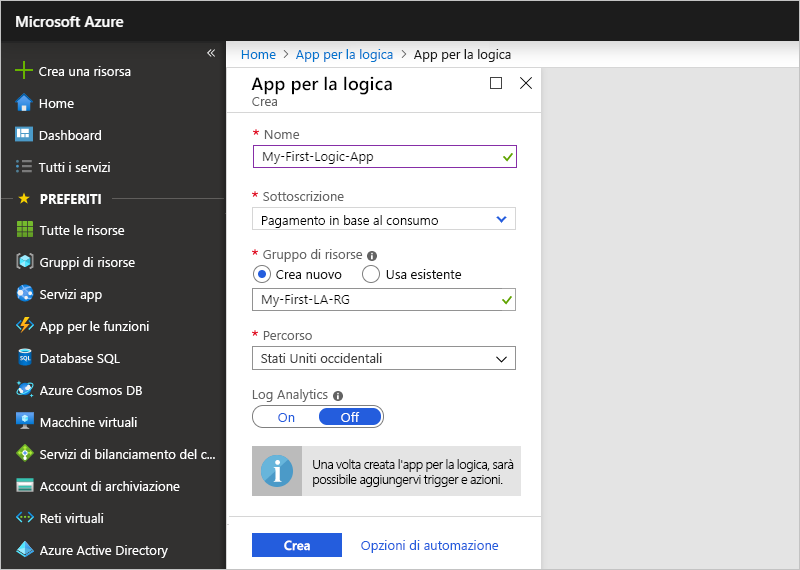
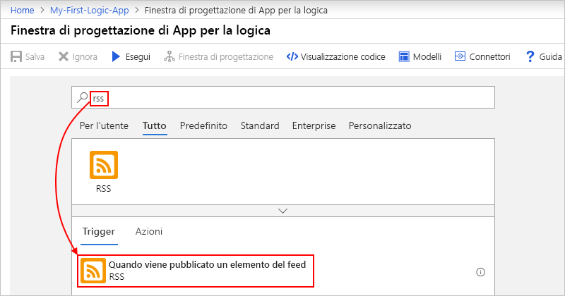
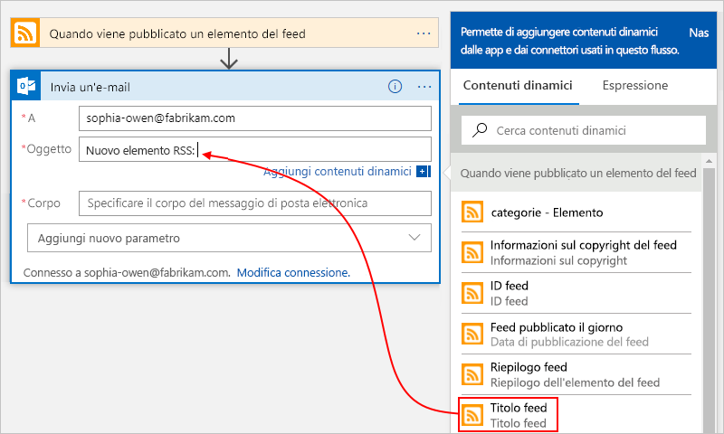
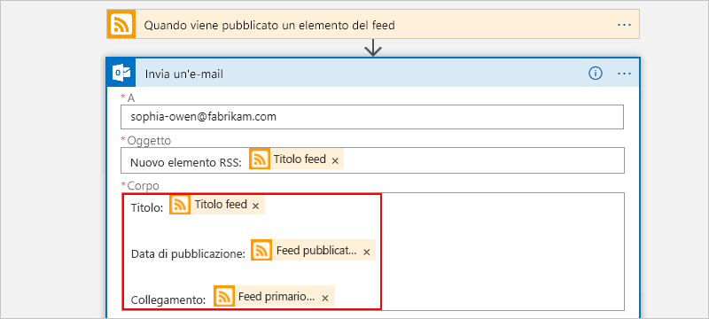
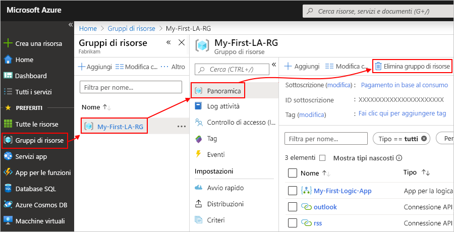
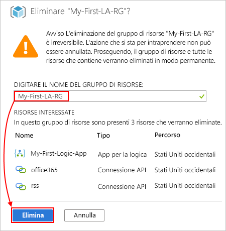

# Guida introduttiva: Creare il primo flusso di lavoro con App per la logica di Azure - Portale di Azure

Questa guida di avvio rapido introduce i concetti generali di base sulla creazione del primo flusso di lavoro usando [App per la logica di Azure](../logic-apps/logic-apps-overview.md), ad esempio la creazione di un'app per la logica vuota, l'aggiunta di un trigger e un'azione e il test dell'app per la logica. In questa guida di avvio rapido viene creata un'app per la logica che verifica la presenza di nuovi elementi nel feed RSS di un sito Web a intervalli regolari. Se sono presenti nuovi elementi, l'app per la logica invia un messaggio di posta elettronica per ogni elemento. Al termine, a livello generale l'app per la logica dovrebbe avere un flusso di lavoro simile al seguente:

Per questo scenario, è necessario un account di posta elettronica di un servizio supportato da App per la logica, ad esempio Office 365 Outlook, Outlook.com o Gmail. Per altri servizi di posta elettronica supportati, [vedere l'elenco dei connettori](https://docs.microsoft.com/connectors/). In questo esempio l'app per la logica usa Office 365 Outlook. Se si usa un servizio di posta elettronica diverso, la procedura generale complessiva è la stessa, ma l'interfaccia utente potrebbe essere leggermente diversa.

Se inoltre non si ha una sottoscrizione di Azure, è necessario [iscriversi per creare un account Azure gratuito](https://azure.microsoft.com/free/).

## Accedere al portale di Azure

Accedere al [portale di Azure](https://portal.azure.com) con le credenziali dell'account Azure.

## Creare l'app per la logica

1. Dalla home page di Azure nella casella di ricerca trovare e selezionare **App per la logica**.

   

1. Nella pagina **App per la logica** selezionare **Aggiungi**.

   

1. Nel riquadro **App per la logica** specificare i dettagli dell'app per la logica come illustrato di seguito. Al termine, selezionare **Crea**.

   

   | Proprietà | Valore | DESCRIZIONE |
   |----------|-------|-------------|
   | **Nome** | <*logic-app-name*> | Il nome dell'app per la logica, che può contenere solo lettere, numeri, trattini (`-`), caratteri di sottolineatura (`_`), parentesi (`(`, `)`) e punti (`.`). Questo esempio usa "My-First-Logic-app". |
   | **Sottoscrizione** | <*nome sottoscrizione di Azure*> | Il nome della sottoscrizione di Azure |
   | **Gruppo di risorse** | <*Azure-resource-group-name*> | Nome del [gruppo di risorse di Azure](../azure-resource-manager/resource-group-overview.md) usato per organizzare le risorse correlate. Questo esempio usa "My-First-LA-RG". |
   | **Posizione** | <*Area di Azure*> | L'area in cui archiviare le informazioni sull'app per la logica. Questo esempio usa "Stati Uniti occidentali". |
   | **Log Analytics** | Off | Lasciare l'impostazione **No** per la registrazione diagnostica. |
   ||||

1. Dopo che Azure ha distribuito l'app, sulla barra degli strumenti di Azure selezionare **Notifiche** > **Vai alla risorsa** per l'app per la logica distribuita.

   

   In alternativa, è possibile trovare e selezionare l'app per la logica digitando il nome nella casella di ricerca.

   Viene visualizzata la finestra Progettazione app per la logica, che mostra una pagina con un video introduttivo e i trigger più usati. In **Modelli** selezionare **App per la logica vuota**.

   

Aggiungere quindi un [trigger](../logic-apps/logic-apps-overview.md#logic-app-concepts) che attiva il flusso di lavoro quando nel feed RSS è presente un nuovo elemento. Ogni app per la logica deve essere avviata con un trigger, che viene attivato quando si verifica un determinato evento o quando viene soddisfatta una condizione specifica. Ogni volta che il trigger viene attivato, il motore di App per la logica di Azure crea un'istanza dell'app per la logica che avvia ed esegue il flusso di lavoro.

## Aggiungere il trigger RSS

1. In **Progettazione app per la logica** nella casella di ricerca selezionare **Tutti**.

1. Nella casella di ricerca immettere `rss` per trovare il connettore RSS. Dall'elenco dei trigger selezionare il trigger **Quando viene pubblicato un elemento del feed**.

   

1. Specificare queste informazioni per il trigger, come mostrato e descritto di seguito:

   

   | Proprietà | Valore | DESCRIZIONE |
   |----------|-------|-------------|
   | **URL feed RSS** | `http://feeds.reuters.com/reuters/topNews` | Collegamento per il feed RSS che si vuole monitorare |
   | **Interval** | 1 | Numero di intervalli di attesa tra i controlli |
   | **Frequenza** | Minuto | Unità di tempo per ogni intervallo tra i controlli  |
   ||||

   La combinazione di intervallo e frequenza consente di definire la pianificazione per il trigger dell'app per la logica. Questa app per la logica controlla il feed ogni minuto.

1. Per comprimere i dettagli del trigger, fare clic sulla barra del titolo del trigger.

   

1. Salvare l'app per la logica. Sulla barra degli strumenti della finestra di progettazione selezionare **Salva**.

L'app per la logica è ora attiva, ma non esegue alcuna operazione oltre a controllare il feed RSS. Aggiungere quindi un'azione per la risposta all'attivazione del trigger.

## Aggiungere l'azione di "invio messaggio di posta elettronica"

Aggiungere un'[azione](../logic-apps/logic-apps-overview.md#logic-app-concepts) per l'invio di un messaggio di posta elettronica quando è disponibile un nuovo elemento nel feed RSS.

1. Nel trigger **Quando viene pubblicato un elemento del feed** selezionare **Nuovo passaggio**.

   

1. In **Scegliere un'azione** e nella casella di ricerca selezionare **Tutte**.

1. Nella casella di ricerca immettere `send an email` per trovare i connettori che offrono questa azione. Nell'elenco di azioni selezionare l'azione di "invio messaggio di posta elettronica" per il servizio di posta elettronica che si vuole usare. Questo esempio usa il connettore Office 365 Outlook che include l'azione **Invia un messaggio**.

   

   Per filtrare l'elenco di azioni in base a un'app o a un servizio specifico, si può selezionare prima l'app o il servizio:

   * Per un account aziendale o dell'istituto di istruzione di Azure, selezionare Office 365 Outlook.
   * Per gli account Microsoft personali, selezionare Outlook.com.

1. Se il connettore di posta elettronica selezionato richiede di autenticare l'identità, eseguire il passaggio per creare una connessione tra l'app per la logica e il servizio di posta elettronica.

   > [!NOTE]
   > In questo esempio specifico l'autenticazione dell'identità viene eseguita manualmente. Tuttavia, i connettori che richiedono l'autenticazione differiscono nei tipi di autenticazione supportati. Sono anche disponibili opzioni per configurare il modo in cui si vuole gestire l'autenticazione. Ad esempio, quando si usano modelli di Azure Resource Manager per la distribuzione, è possibile parametrizzare e proteggere gli input che si vogliono modificare spesso o facilmente, ad esempio le informazioni di connessione. Per altre informazioni, vedere gli argomenti seguenti:
   >
   > * [Parametri del modello per la distribuzione](../logic-apps/logic-apps-azure-resource-manager-templates-overview.md#template-parameters)
   > * [Autorizzare le connessioni OAuth](../logic-apps/logic-apps-deploy-azure-resource-manager-templates.md#authorize-oauth-connections)
   > * [Eseguire l'autenticazione dell'accesso con le identità gestite](../logic-apps/create-managed-service-identity.md)
   > * [Eseguire l'autenticazione delle connessioni per la distribuzione di app per la logica](../logic-apps/logic-apps-azure-resource-manager-templates-overview.md#authenticate-connections)

1. Nell'azione **Invia un messaggio di posta elettronica** specificare i dati da includere nel messaggio.

   1. Nella casella **A** immettere l'indirizzo di posta elettronica del destinatario. AI fini del test è possibile usare il proprio indirizzo di posta elettronica.

      Per il momento ignorare l'elenco **Aggiungi contenuto dinamico** che viene visualizzato. Quando si fa clic all'interno di alcune caselle di modifica, viene visualizzato questo elenco che mostra tutti i parametri disponibili del passaggio precedente che è possibile includere come input nel flusso di lavoro.

   1. Nella casella **Oggetto** immettere questo testo seguito da uno spazio vuoto: `New RSS item: `

      

   1. Nell'elenco **Aggiungi contenuto dinamico** selezionare **Titolo feed** per includere il titolo dell'elemento RSS.

      

      Al termine dell'operazione, l'oggetto del messaggio sarà simile al seguente:

      

      Se nella finestra di progettazione viene visualizzato un ciclo "For each", è stato selezionato un token per una matrice, ad esempio il token **categories-item**. Per questi tipi di token la finestra di progettazione aggiunge automaticamente questo ciclo intorno all'azione che fa riferimento a tale token. In questo modo, l'app per la logica esegue la stessa azione su ogni elemento della matrice. Per rimuovere il ciclo, selezionare i **puntini di sospensione** ( **...** ) nella barra del titolo del ciclo e quindi scegliere **Elimina**.

   1. Nella casella **Corpo** immettere questo testo e selezionare questi token per il corpo del messaggio di posta elettronica. Per aggiungere righe vuote in una casella di modifica, premere MAIUSC+INVIO.

      

      | Proprietà | DESCRIZIONE |
      |----------|-------------|
      | **Titolo feed** | Titolo dell'elemento |
      | **Data di pubblicazione del feed** | Data e ora di pubblicazione dell'elemento |
      | **Collegamento al feed primario** | URL dell'elemento |
      |||

1. Salvare l'app per la logica.

Testare quindi l'app per la logica.

## Eseguire l'app per la logica

Per avviare manualmente l'app per la logica, sulla barra degli strumenti della finestra di progettazione selezionare **Esegui**. In alternativa, attendere che l'app per la logica controlli il feed RSS in base alla pianificazione specificata (ogni minuto). Se il feed RSS include nuovi elementi, l'app per la logica invia un messaggio di posta elettronica per ogni nuovo elemento. In caso contrario, l'app per la logica attende l'intervallo successivo prima di controllare di nuovo. Se non si riceve alcun messaggio di posta elettronica, controllare la cartella della posta indesiderata.

Ecco un esempio di messaggio di posta elettronica inviato dall'app per la logica.

Da un punto di vista tecnico, quando il trigger controlla il feed RSS e trova nuovi elementi, il trigger viene attivato e il motore di App per la logica di Azure crea un'istanza del flusso di lavoro dell'app per la logica che esegue le azioni nel flusso di lavoro. Se il trigger non trova nuovi elementi, non viene attivato e non crea un'istanza del flusso di lavoro.

Sono state completate la creazione e l'esecuzione della prima app per la logica con il portale di Azure.

## Pulire le risorse

Quando questo esempio non è più necessario, eliminare il gruppo di risorse contenente l'app per la logica e le risorse correlate.

1. Nel menu principale di Azure selezionare **Gruppi di risorse** e quindi il gruppo di risorse dell'app per la logica. Nel riquadro **Panoramica** selezionare **Elimina gruppo di risorse**.

   

1. Quando viene visualizzato il riquadro di conferma immettere il nome del gruppo di risorse e selezionare **Elimina**.

   

> [!NOTE]
> Quando si elimina un'app per la logica, non viene eseguita alcuna nuova istanza di esecuzione. Tutte le esecuzioni in corso e in sospeso vengono annullate. Se si dispone di migliaia di esecuzioni, l'annullamento potrebbe richiedere molto tempo.

## Passaggi successivi

In questa esercitazione è stata creata la prima app per la logica che verifica la presenza di aggiornamenti del feed RSS in base alla pianificazione specificata (ogni minuto) ed esegue un'azione (invio di un messaggio di posta elettronica) quando sono presenti aggiornamenti. Per altre informazioni, continuare con questa esercitazione che consente di creare flussi di lavoro più avanzati basati sulla pianificazione:

> [!div class="nextstepaction"]
> [Controllare il traffico con un'app per la logica basata su utilità di pianificazione](../logic-apps/tutorial-build-schedule-recurring-logic-app-workflow.md)
