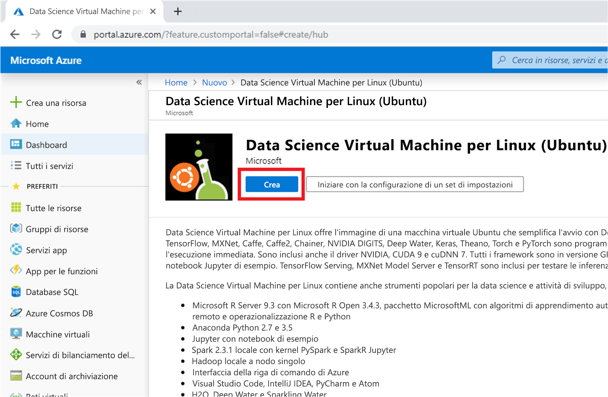
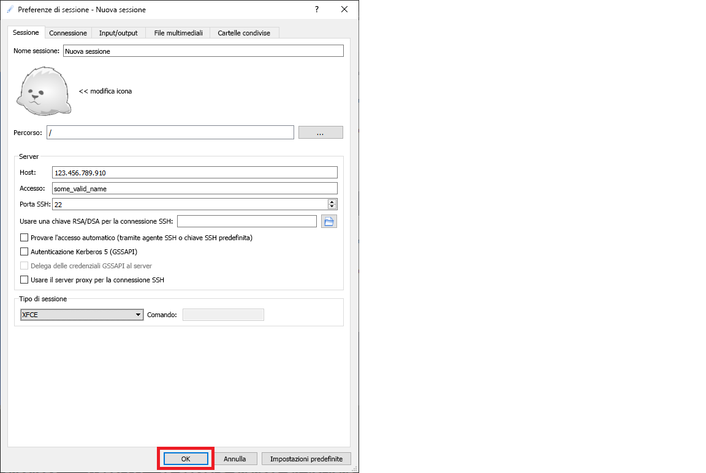

# <a name="quickstart-set-up-the-data-science-virtual-machine-for-linux-ubuntu"></a>Guida introduttiva: Configurare la Data Science Virtual Machine per Linux (Ubuntu)

Iniziare a usare una Data Science Virtual Machine Ubuntu.

## <a name="prerequisites"></a>Prerequisiti

Per creare una Data Science Virtual Machine Windows, è necessaria una sottoscrizione di Azure. [Provare Azure gratuitamente](https://azure.com/free).

## <a name="create-your-data-science-virtual-machine-for-linux"></a>Creare la macchina virtuale per l'analisi scientifica dei dati per Linux

Di seguito sono elencati i passaggi per la creazione di un'istanza della macchina virtuale per l'analisi scientifica dei dati per Linux:

1. Passare al [portale di Azure](https://portal.azure.com). È possibile che venga richiesto di accedere all'account Azure, se non è stato ancora eseguito l'accesso.
1. Trovare l'elenco delle macchine virtuali digitando "data science virtual machine", quindi selezionare "Data Science Virtual Machine for Linux (Ubuntu)".
    
    

1. Nella finestra successiva selezionare **Crea**.

   [](media/dsvm-ubuntu-intro/create-linux-expanded.png#lightbox)

1. Si verrà reindirizzati al pannello "Crea macchina virtuale".
   
   

1. Immettere le informazioni seguenti per configurare ogni passaggio della procedura guidata:

    1. **Nozioni di base**:
    
       * **Sottoscrizione** Se si hanno più sottoscrizioni, selezionare quella in cui verrà creata e fatturata la macchina virtuale. È necessario disporre di privilegi di creazione delle risorse per questa sottoscrizione.
       * **Gruppo di risorse**: creare un nuovo gruppo di risorse o selezionarne uno esistente.
       * **Nome macchina virtuale**: immettere il nome della macchina virtuale. È il nome con cui verrà visualizzata nel portale di Azure.
       * **Area**: selezionare il data center più appropriato. Per l'accesso più veloce alla rete, in genere è il data center che include la maggior parte dei dati o è più vicino alla propria posizione fisica. Vedere altre informazioni sulle [aree di Azure](https://azure.microsoft.com/global-infrastructure/regions/).
       * **Immagine**: Lasciare il valore predefinito.
       * **Dimensione**: questo campo dovrebbe essere completato automaticamente con una dimensione appropriata per carichi di lavoro generali. Vedere altre informazioni sulle [dimensioni delle VM Linux in Azure](../../virtual-machines/linux/sizes.md).
       * **Tipo di autenticazione**: per velocizzare la configurazione, selezionare "Password". 
         
         > [!NOTE]
         > Se si intende usare JupyterHub, assicurarsi di selezionare "Password", perché JupyterHub *non* è configurato per l'uso di chiavi pubbliche SSH.

       * **Nome utente**: immettere il nome utente dell'amministratore. È il nome utente che verrà usato per accedere alla macchina virtuale e non deve necessariamente essere uguale al nome utente Azure. *Non* usare lettere maiuscole.
         
         > [!NOTE]
         > Se si usano lettere maiuscole nel nome utente, JupyterHub non funzionerà e si verificherà un errore interno del server (errore 500).

       * **Password**: immettere la password che si userà per accedere alla macchina virtuale.    
    
   1. Selezionare **Rivedi e crea**.
   1. **Rivedi e crea**
      * Verificare che tutte le informazioni immesse siano corrette. 
      * Selezionare **Create** (Crea).
    
    Per il provisioning sono necessari circa 5 minuti. Lo stato viene visualizzato nel portale di Azure.

## <a name="how-to-access-the-ubuntu-data-science-virtual-machine"></a>Come accedere alla Data Science Virtual Machine Ubuntu

È possibile accedere alla DSVM Ubuntu in uno dei tre modi seguenti:

  * SSH per le sessioni terminale
  * X2Go per le sessioni grafiche
  * JupyterHub e JupyterLab per i notebook di Jupyter

È anche possibile collegare una Data Science Virtual Machine ad Azure Notebooks per eseguire istanze di Jupyter Notebook nella VM e ignorare le limitazioni del livello di servizio gratuito. Per altre informazioni, vedere [Gestire e configurare i progetti di Azure Notebooks](../../notebooks/configure-manage-azure-notebooks-projects.md#compute-tier).

### <a name="ssh"></a>SSH

Dopo aver creato la VM, se è stata configurata con l'accesso SSH è possibile accedervi usando SSH. Usare le credenziali dell'account creato nella sezione **Nozioni di base** del passaggio 3 per l'interfaccia della shell di testo. In Windows è possibile scaricare uno strumento client SSH come [PuTTY](https://www.putty.org). Se si preferisce un'interfaccia desktop grafica (sistema X Windows), è possibile usare l'inoltro X11 in PuTTY.

> [!NOTE]
> Nei test il client X2Go ha fornito prestazioni migliori di X11 Forwarding. È quindi consigliabile usare il client X2Go per un'interfaccia desktop grafica.

### <a name="x2go"></a>X2Go

Nella VM Linux è già stato effettuato il provisioning del server X2Go ed è possibile iniziare ad accettare connessioni client. Per connettersi al desktop con interfaccia grafica della VM Linux, è necessario completare la procedura seguente nel client:

1. Scaricare e installare il client X2Go per la piattaforma client da [X2Go](https://wiki.x2go.org/doku.php/doc:installation:x2goclient).
1. Prendere nota dell'indirizzo IP pubblico della macchina virtuale, che si può trovare nel portale di Azure aprendo la macchina virtuale appena creata.

   

1. Eseguire il client X2Go. Se la finestra "New Session" (Nuova sessione) non viene visualizzata automaticamente, passare a Session (Sessione) -> New Session (Nuova sessione).

1. Nella finestra di configurazione risultante immettere i parametri di configurazione seguenti.
   * **Scheda Session**(Sessione):
     * **Host**: immettere l'indirizzo IP della VM, di cui si è preso nota in precedenza.
     * **Accesso**: immettere il nome utente nella VM Linux.
     * **Porta SSH**: lasciare il valore predefinito 22.
     * **Session Type** (Tipo di sessione): modificare il valore in **XFCE**. Attualmente, la VM Linux supporta solo l'ambiente desktop XFCE.
   * **Scheda Supporti**: è possibile disattivare il supporto audio e la stampa client se non è necessario usarli.
   * **Shared folders** (Cartelle condivise): se si prevede di montare directory dei computer client nella VM Linux, aggiungere in questa scheda le directory dei computer client da condividere con la VM.

   
1. Selezionare **OK**.
1. Fare clic sulla casella nel riquadro destro della finestra di X2Go per visualizzare la schermata di accesso per la VM.
1. Immettere la password per la VM.
1. Selezionare **OK**.
1. Per completare la connessione potrebbe essere necessario concedere a X2Go l'autorizzazione per ignorare il firewall.
1. Verrà ora visualizzata l'interfaccia grafica per la DSVM Ubuntu. 


### <a name="jupyterhub-and-jupyterlab"></a>JupyterHub e JupyterLab

La DSVM Ubuntu esegue [JupyterHub](https://github.com/jupyterhub/jupyterhub), un server Jupyter multiutente. Per connettersi, seguire questa procedura:

   1. Prendere nota dell'indirizzo IP pubblico per la VM, cercando e selezionando la macchina virtuale nel portale di Azure.
      

   1. Dal computer locale aprire un Web browser e passare a https:\//ip-vm:8000, sostituendo "ip-vm" con l'indirizzo IP di cui si è preso nota in precedenza.
   1. Immettere il nome utente e la password usati per creare la VM ed eseguire l'accesso. 

      

   1. Esplorare i numerosi notebook di esempio disponibili.

Sono disponibili anche JupyterLab, la prossima generazione di notebook Jupyter e JupyterHub. Per accedervi, accedere a JupyterHub e quindi passare all'URL https:\//ip-vm:8000/user/nome-utente/lab, sostituendo "nome-utente" con il nome utente scelto durante la configurazione della VM.

È possibile impostare JupyterLab come server notebook predefinito aggiungendo questa riga al file `/etc/jupyterhub/jupyterhub_config.py`:

```python
c.Spawner.default_url = '/lab'
```

## <a name="next-steps"></a>Passaggi successivi

Ecco come è possibile continuare l'apprendimento e l'esplorazione:

* La procedura dettagliata [Data science nella Data Science Virtual Machine per Linux](linux-dsvm-walkthrough.md) illustra come eseguire diverse attività comuni di data science con la DSVM Linux di è stato effettuato il provisioning in questo articolo. 
* Esplorare i vari strumenti di data science disponibili nella DSVM provando quelli descritti in questo articolo. È anche possibile eseguire `dsvm-more-info` nella shell della macchina virtuale per un'introduzione di base e per visualizzare collegamenti ad altre informazioni sugli strumenti installati nella VM.  
* Informazioni su come creare sistematicamente soluzioni analitiche end-to-end usando il [Processo di analisi scientifica dei dati per i team](https://aka.ms/tdsp).
* Per esempi di apprendimento automatico e di analisi dei dati che usano i servizi di intelligenza artificiale per Azure, visitare [Azure AI Gallery](https://gallery.azure.ai/).
* Vedere la [documentazione di riferimento](./reference-ubuntu-vm.md) appropriata per questa macchina virtuale.
