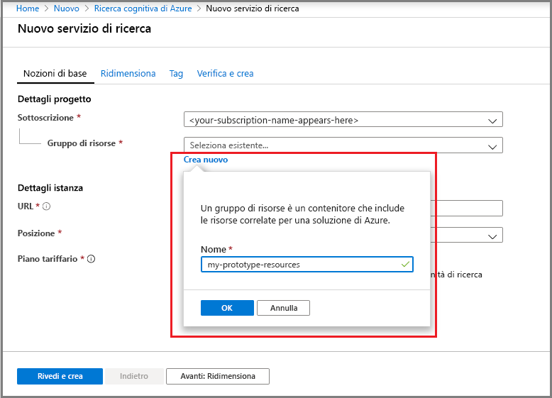
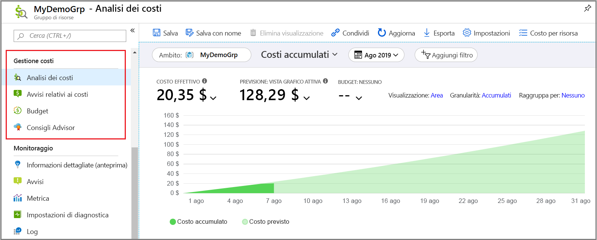
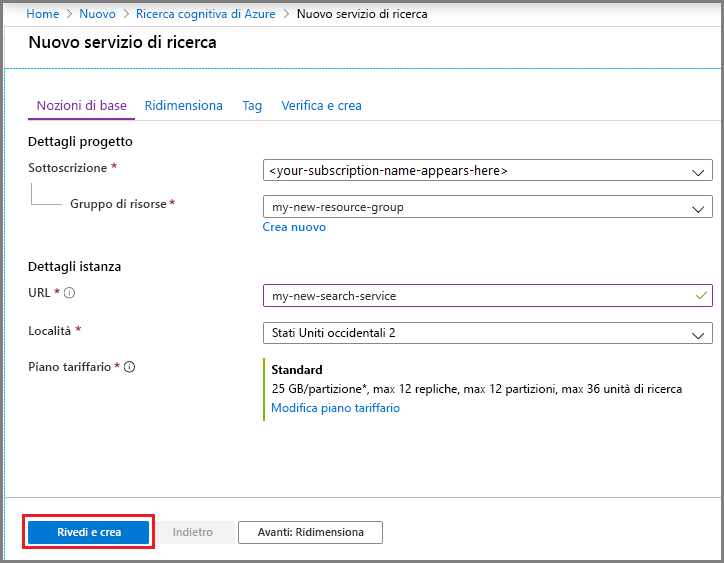
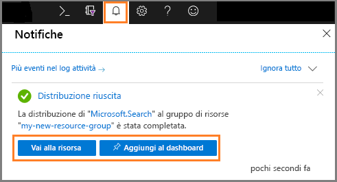
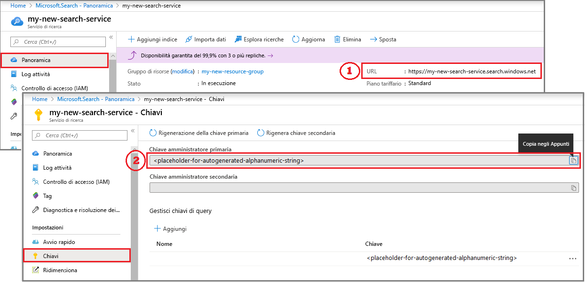
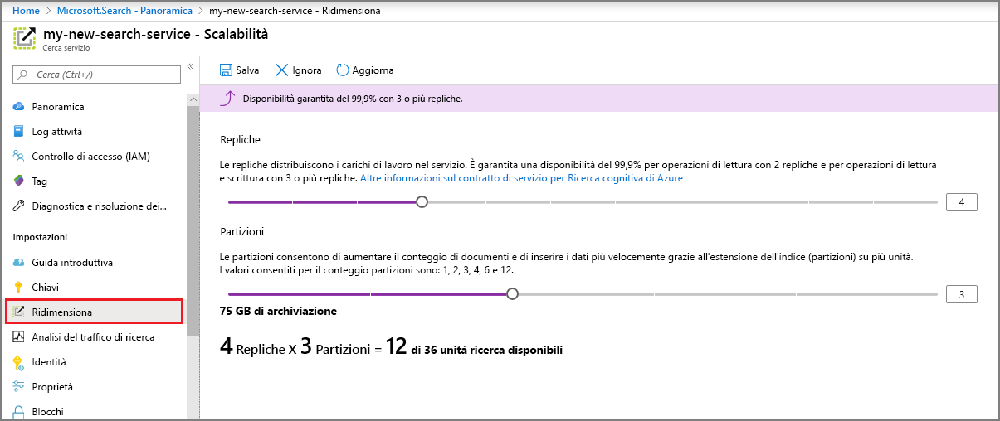

# Guida introduttiva: Creare un servizio Ricerca cognitiva di Azure nel portale

Ricerca cognitiva di Azure è una risorsa autonoma usata per aggiungere un'esperienza di ricerca alle app personalizzate. Ricerca cognitiva di Azure si integra facilmente con altri servizi di Azure, ma è possibile usarlo anche come componente autonomo oppure integrarlo con le app nei server di rete o con il software in esecuzione in altre piattaforme cloud.

In questo articolo verrà illustrato come creare una risorsa nel [portale di Azure](https://portal.azure.com/).

Se si preferisce PowerShell, usare il [modello di servizio](https://azure.microsoft.com/resources/templates/101-azure-search-create/) di Azure Resource Manager. Per informazioni su come iniziare, vedere [Gestire il servizio Ricerca cognitiva di Azure con PowerShell](search-manage-powershell.md).

## Sottoscrizione gratuita o a pagamento

[Aprire un account Azure gratuito](https://azure.microsoft.com/pricing/free-trial/?WT.mc_id=A261C142F) e usare i crediti per provare i servizi di Azure a pagamento. Dopo avere consumato i crediti, mantenere l'account e continuare a usare i servizi di Azure gratuiti, ad esempio Siti Web. Verranno applicati addebiti alla carta di credito solo se l'utente modifica le impostazioni e richiede esplicitamente l'addebito.

In alternativa, [attivare i benefici della sottoscrizione MSDN](https://azure.microsoft.com/pricing/member-offers/msdn-benefits-details/?WT.mc_id=A261C142F). Con la sottoscrizione MSDN ogni mese si accumulano crediti che è possibile usare per i servizi di Azure a pagamento. 

## Trovare Ricerca cognitiva di Azure

1. Accedere al [portale di Azure](https://portal.azure.com/).
2. Fare clic sul segno più ("+ Crea risorsa") nell'angolo superiore sinistro.
3. Usare la barra di ricerca per trovare "Ricerca cognitiva di Azure" o passare alla risorsa selezionando **Web** > **Ricerca cognitiva di Azure**.

## Scegliere una sottoscrizione.

Se sono disponibili più sottoscrizioni, sceglierne una per il servizio di ricerca.

## Impostare un gruppo di risorse

Un gruppo di risorse è necessario e utile per la gestione a livello globale delle risorse, inclusi i costi. Un gruppo di risorse può essere costituito da un servizio o da più servizi usati in combinazione. Se, ad esempio, si usa Ricerca cognitiva di Azure per l'indicizzazione di un database di Azure Cosmos DB, è possibile inserire i due servizi nello stesso gruppo di risorse per agevolarne la gestione. 

Se non si combinano le risorse in un singolo gruppo o se i gruppi di risorse esistenti sono riempiti con risorse usate in soluzioni non correlate, creare un nuovo gruppo di risorse solo per la risorsa Ricerca cognitiva di Azure. 

Nel tempo, è possibile tenere traccia dei costi correnti e previsti a livello globale, come illustrato nello screenshot, oppure scorrere verso il basso per visualizzare i costi per le singole risorse. Lo screenshot seguente mostra il tipo di informazioni sui costi che è possibile prevedere quando si combinano più risorse in un unico gruppo.

> [!TIP]
> I gruppi di risorse semplificano la pulizia, in quanto l'eliminazione di un gruppo elimina anche i servizi al suo interno. Per i progetti prototipo che usano più servizi, l'inserimento di tutti gli elementi nello stesso gruppo di risorse ne semplifica l'eliminazione al termine del progetto.

## Assegnare un nome al servizio

In Dettagli istanza fornire un nome per il servizio nel campo **URL**. Questo nome fa parte dell'endpoint dell'URL in cui vengono eseguite le chiamate API: `https://your-service-name.search.windows.net`. Se ad esempio si vuole che l'endpoint sia `https://myservice.search.windows.net`, immettere `myservice`.

Requisiti per i nomi di servizio:

* Deve essere univoco all'interno dello spazio dei nomi search.windows.net
* lunghezza compresa tra 2 e 60 caratteri
* È possibile usare lettere minuscole, cifre o trattini ("-")
* Non può contenere un trattino ("-") nei primi 2 caratteri o nell'ultimo carattere
* Non deve contenere trattini consecutivi ("--")

> [!TIP]
> Se si prevede di usare più servizi, è consigliabile includere l'area o la località nel nome del servizio come convenzione di denominazione. I servizi all'interno della stessa area possono scambiare dati gratuitamente, quindi se Ricerca cognitiva di Azure si trova nell'area Stati Uniti occidentali e in quest'area sono presenti altri servizi, un nome come `mysearchservice-westus` può consentire di evitare di dover visualizzare la pagina delle proprietà per decidere come combinare o collegare le risorse.

## Scegliere una posizione

Ricerca cognitiva di Azure, in qualità di servizio di Azure, può essere ospitato nei data center di tutto il mondo. L'elenco delle aree supportate è disponibile nella [pagina dei prezzi](https://azure.microsoft.com/pricing/details/search/). 

È possibile ridurre al minimo o evitare i costi per la larghezza di banda scegliendo la stessa posizione per più servizi. Se, ad esempio, si esegue l'indicizzazione dei dati forniti da un altro servizio di Azure (Archiviazione di Azure, Azure Cosmos DB, database SQL di Azure), creando il servizio Ricerca cognitiva di Azure nella stessa area è possibile evitare i costi relativi alla larghezza di banda, in quanto non vengono addebitati costi per i dati in uscita quando i servizi si trovano nella stessa area.

Se inoltre si usano arricchimenti tramite intelligenza artificiale, creare il servizio nella stessa area di Servizi cognitivi. *Per l'arricchimento tramite intelligenza artificiale, Ricerca cognitiva di Azure e Servizi cognitivi devono trovarsi nella stessa area*.

> [!Note]
> L'area India centrale no n è attualmente disponibile per i nuovi servizi. Per i servizi già in India centrale, è possibile aumentare le prestazioni senza alcuna restrizione e il servizio è completamente supportato in tale area. La restrizione in quest'area è temporanea ed è limitata solo ai nuovi servizi. Quando la restrizione non sarà più valida, questa nota verrà rimossa.

## Scegliere un piano tariffario (SKU)

[Ricerca cognitiva di Azure attualmente è disponibile con vari piani tariffari](https://azure.microsoft.com/pricing/details/search/): Gratuito, Basic o Standard. Ogni piano tariffario prevede una specifica [capacità e limiti](search-limits-quotas-capacity.md). Per indicazioni, vedere [Scegliere uno SKU o un piano tariffario per Ricerca di Azure](search-sku-tier.md) .

Per carichi di lavoro di produzione viene in genere scelto il piano Basic o Standard, ma la maggior parte dei clienti inizia con il servizio gratuito. Le differenze principali tra i livelli sono la velocità e la dimensione della partizione, nonché i limiti per il numero di oggetti che è possibile creare.

Non è possibile modificare il piano tariffario dopo aver creato il servizio. Se in un secondo momento si vuole passare a un piano tariffario superiore o inferiore, è necessario creare nuovamente il servizio.

## Creare il servizio

Dopo aver fornito gli input necessari, procedere con la creazione del servizio. 

Il servizio, che può essere monitorato tramite le notifiche di Azure, viene distribuito in pochi minuti. Aggiungere il servizio al dashboard per accedervi facilmente in futuro.

## Ottenere una chiave e un endpoint dell'URL

A meno che non si usi il portale, per accedere al nuovo servizio a livello di codice è necessario specificare l'endpoint dell'URL e una chiave API di autenticazione.

1. Nella pagina **Panoramica** individuare e copiare l'endpoint dell'URL visualizzato a destra.

2. Nella pagina **Chiavi** copiare una delle chiavi di amministrazione (equivalenti). Le chiavi API di amministrazione sono necessarie per creare, aggiornare ed eliminare oggetti nel servizio. Al contrario, le chiavi di query forniscono l'accesso in lettura al contenuto dell'indice.

   

Per le attività basate sul portale, l'endpoint e la chiave non sono necessari. Il portale è già collegato alla risorsa di Ricerca cognitiva di Azure con diritti amministrativi. Per una procedura dettagliata per il portale, iniziare con [Avvio rapido: Creare un indice di Ricerca cognitiva di Azure nel portale](search-get-started-portal.md).

## Ridimensionare il servizio

Al termine del provisioning del servizio, è possibile ridimensionare il servizio per adattarlo alle proprie esigenze. Se è stato scelto il piano tariffario Standard per il servizio Ricerca cognitiva di Azure, è possibile ridimensionare il servizio in due dimensioni, ovvero partizioni e repliche. Se fosse stato scelto il piano Basic, sarebbe stato possibile aggiungere solo le repliche. Se è stato effettuato il provisioning del servizio Gratuito, la scalabilità non è disponibile.

Le ***partizioni*** consentono di archiviare e di eseguire ricerche in un numero maggiore di documenti nel servizio.

***Repliche*** consentire al servizio gestire un carico superiore di query di ricerca.

L'aggiunta di risorse fa aumentare la fattura mensile. Il [calcolatore prezzi](https://azure.microsoft.com/pricing/calculator/) consente di capire le ramificazioni della fattura dovute all'aggiunta di risorse. Tenere presente che è possibile modificare le risorse in base al carico. Ad esempio, è possibile aumentare le risorse per creare un indice iniziale completo e ridurle successivamente a un livello più appropriato per l'indicizzazione incrementale.

> [!Important]
> Un servizio deve disporre di [2 repliche per ogni contratto di servizio di sola lettura e 3 repliche per ogni contratto di servizio di lettura/scrittura](https://azure.microsoft.com/support/legal/sla/search/v1_0/).

1. Passare alla pagina del servizio di ricerca nel portale di Azure.
2. Nel riquadro di navigazione a sinistra selezionare **Impostazioni** > **Scalabilità**.
3. Usare la barra di scorrimento per aggiungere risorse di entrambi i tipi.

> [!Note]
> A livelli superiori la velocità e lo spazio di archiviazione per partizione aumentano. Per altre informazioni, vedere l'articolo su [capacità e limiti](search-limits-quotas-capacity.md).

## Aggiunta di un secondo servizio

La maggior parte dei clienti usa un solo servizio su cui esegue il provisioning a un livello che offre il [giusto equilibrio di risorse](search-sku-tier.md). Un servizio può ospitare più indici, soggetto ai [limiti massimi del livello selezionato](search-capacity-planning.md), con ciascun indice isolato dall'altro. In Ricerca cognitiva di Azure le richieste possono essere indirizzate solo a un indice, riducendo al minimo le probabilità di recupero di dati accidentale o intenzionale da altri indici nello stesso servizio.

Sebbene la maggior parte dei clienti usi un solo servizio, la ridondanza del servizio potrebbe essere necessaria se i requisiti operativi includono i seguenti elementi:

* Ripristino di emergenza (interruzione del data center). Ricerca cognitiva di Azure non offre il failover immediato in caso di interruzione. Per consigli e informazioni aggiuntive, vedere [Amministrazione del servizio](search-manage.md).
* L'analisi della modellazione multi-tenancy ha determinato che i servizi aggiuntivi siano la progettazione ottimale. Per altre informazioni, vedere [Progettazione per multi-tenancy](search-modeling-multitenant-saas-applications.md).
* Per le applicazioni distribuite globalmente è possibile richiedere un'istanza di Ricerca cognitiva di Azure in più aree per ridurre al minimo la latenza del traffico internazionale dell'applicazione.

> [!NOTE]
> In Ricerca cognitiva di Azure non è possibile isolare le operazioni di indicizzazione e query, quindi non devono essere creati più servizi per i carichi di lavoro isolati. Per un indice viene sempre eseguita una query sul servizio in cui è stato creato (non è possibile creare un indice in un servizio e copiarlo in un altro).

Non è necessario un secondo servizio per la disponibilità elevata. La disponibilità elevata per le query si raggiunge quando si usano 2 o più repliche nello stesso servizio. Gli aggiornamenti di replica sono sequenziali, il che significa che almeno uno è operativo quando viene implementato un aggiornamento del servizio. Per altre informazioni sul tempo di attività, vedere i [Contratti di servizio](https://azure.microsoft.com/support/legal/sla/search/v1_0/).

## Passaggi successivi

Dopo il provisioning di un servizio, è possibile continuare nel portale con la creazione del primo indice.

> [!div class="nextstepaction"]
> [Guida introduttiva: Creare un indice di Ricerca cognitiva di Azure nel portale](search-get-started-portal.md)
