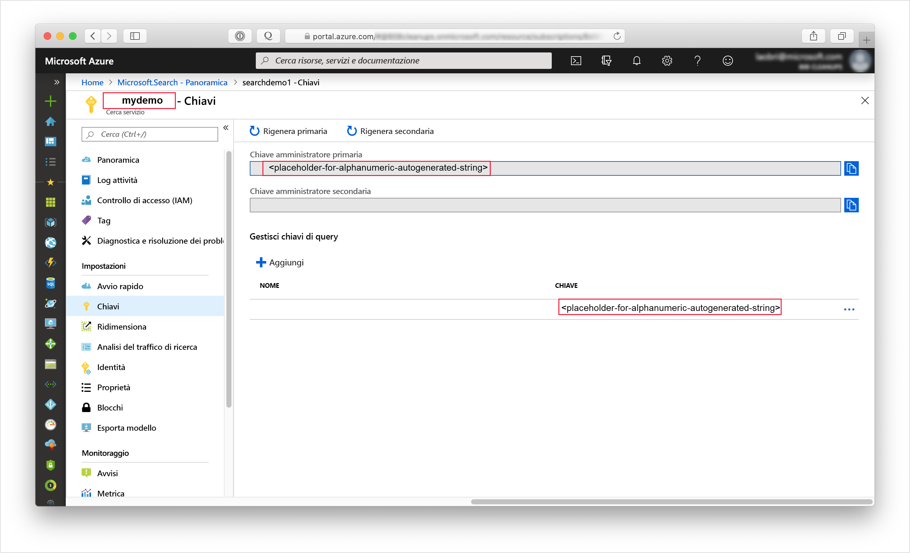
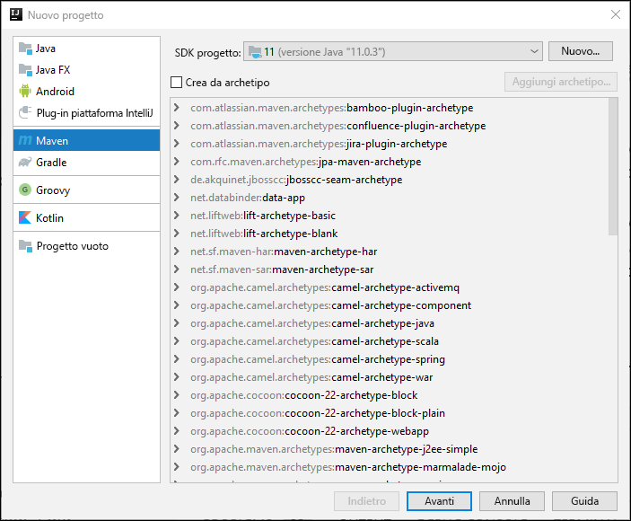
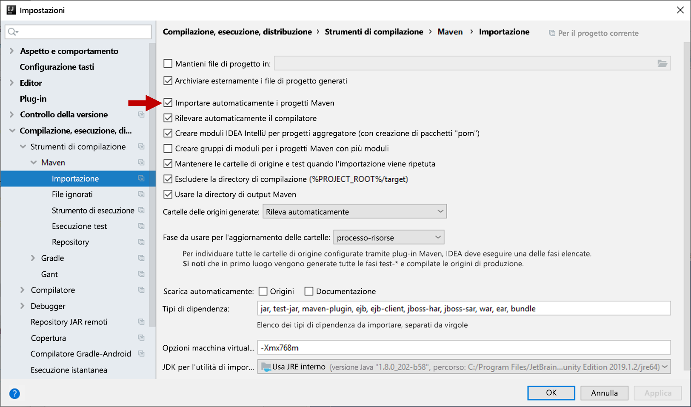
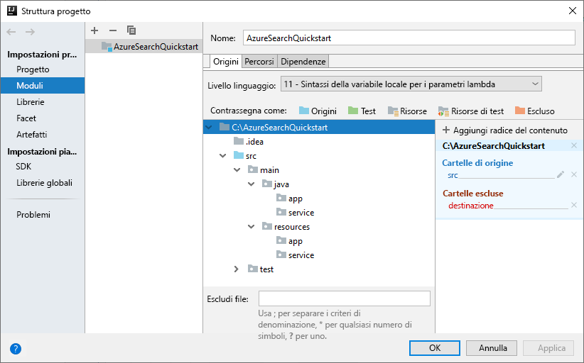
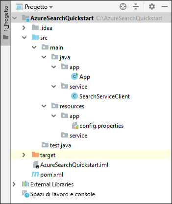
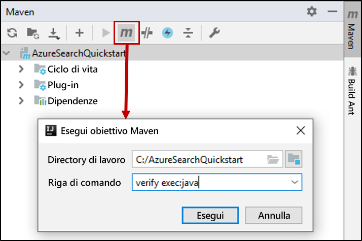

# <a name="quickstart-create-an-azure-search-index-in-java-using-rest-apis"></a>Guida introduttiva: Creare un indice di Ricerca di Azure in Java con le API REST
> [!div class="op_single_selector"]
> * [JavaScript](search-get-started-nodejs.md)
> * [C#](search-get-started-dotnet.md)
> * [Java](search-get-started-java.md)
> * [Portale](search-get-started-portal.md)
> * [PowerShell](search-create-index-rest-api.md)
> * [Python](search-get-started-python.md)
> * [Postman](search-get-started-postman.md)

Per creare un'applicazione console Java che crea, carica ed esegue query su un indice di Ricerca di Azure, è possibile usare [IntelliJ](https://www.jetbrains.com/idea/), [Java 11 SDK](/java/azure/jdk/?view=azure-java-stable) e l'[API REST del servizio Ricerca di Azure](/rest/api/searchservice/). Questo articolo fornisce le istruzioni dettagliate per creare l'applicazione. In alternativa, è possibile [scaricare ed eseguire l'applicazione completa](/samples/azure-samples/azure-search-java-samples/java-sample-quickstart/).

Se non si ha una sottoscrizione di Azure, creare un [account gratuito](https://azure.microsoft.com/free/?WT.mc_id=A261C142F) prima di iniziare.

## <a name="prerequisites"></a>Prerequisiti

Per compilare e testare questo esempio sono stati usati il software e i servizi seguenti:

+ [IntelliJ IDEA](https://www.jetbrains.com/idea/)

+ [Java 11 SDK](/java/azure/jdk/?view=azure-java-stable)

+ [Creare un servizio Ricerca di Azure](search-create-service-portal.md) o [trovare un servizio esistente](https://ms.portal.azure.com/#blade/HubsExtension/BrowseResourceBlade/resourceType/Microsoft.Search%2FsearchServices) nella sottoscrizione corrente. È possibile usare un servizio gratuito per questo avvio rapido.

<a name="get-service-info"></a>

## <a name="get-a-key-and-url"></a>Ottenere una chiave e un URL

Le chiamate al servizio richiedono un URL endpoint e una chiave di accesso per ogni richiesta. Con entrambi gli elementi viene creato un servizio di ricerca, quindi se si è aggiunto Ricerca di Azure alla sottoscrizione, seguire questi passaggi per ottenere le informazioni necessarie:

1. [Accedere al portale di Azure](https://portal.azure.com/) e ottenere l'URL nella pagina **Panoramica** del servizio di ricerca. Un endpoint di esempio potrebbe essere simile a `https://mydemo.search.windows.net`.

2. In **Impostazioni** > **Chiavi** ottenere una chiave amministratore per diritti completi sul servizio. Sono disponibili due chiavi amministratore interscambiabili, fornite per continuità aziendale nel caso in cui sia necessario eseguire il rollover di una di esse. È possibile usare la chiave primaria o secondaria nelle richieste per l'aggiunta, la modifica e l'eliminazione di oggetti.

   Creare anche una chiave di query. È consigliabile inviare richieste di query con accesso di sola lettura.



Per ogni richiesta inviata al servizio è richiesta una chiave API. La presenza di una chiave valida stabilisce una relazione di trust, in base alle singole richieste, tra l'applicazione che invia la richiesta e il servizio che la gestisce.

## <a name="set-up-your-environment"></a>Configurazione dell'ambiente

Per iniziare, aprire IntelliJ IDEA e configurare un nuovo progetto.

### <a name="create-the-project"></a>Creare il progetto

1. Aprire IntelliJ IDEA e selezionare **Create New Project** (Crea nuovo progetto).
1. Selezionare **Maven**.
1. Nell'elenco **Project SDK** (SDK progetto) selezionare Java 11 SDK.

     

1. In **GroupId** e **ArtifactId** immettere `AzureSearchQuickstart`.
1. Accettare le impostazioni predefinite rimanenti per aprire il progetto.

### <a name="specify-maven-dependencies"></a>Specificare le dipendenze di Maven

1. Selezionare **File** > **Settings** (Impostazioni).
1. Nella finestra **Settings** (Impostazioni) selezionare **Build, Execution, Deployment** (Compilazione, esecuzione, distribuzione)  > **Build Tools** (Strumenti di compilazione)  > **Maven** > **Importing** (Importazione).
1. Selezionare la casella di controllo **Import Maven projects automatically** (Importa automaticamente progetti Maven) e fare clic su **OK** per chiudere la finestra. I plug-in Maven e altre dipendenze verranno ora sincronizzati automaticamente quando si aggiorna il file pom.xml nel passaggio successivo.

    

1. Aprire il file pom.xml e sostituire il contenuto con i dettagli di configurazione di Maven seguenti. Sono inclusi i riferimenti al [plug-in Exec Maven](https://www.mojohaus.org/exec-maven-plugin/) e un'[API dell'interfaccia JSON](https://javadoc.io/doc/org.glassfish/javax.json/1.0.2).

    ```xml
    <?xml version="1.0" encoding="UTF-8"?>
    <project xmlns="http://maven.apache.org/POM/4.0.0"
             xmlns:xsi="http://www.w3.org/2001/XMLSchema-instance"
             xsi:schemaLocation="http://maven.apache.org/POM/4.0.0 http://maven.apache.org/xsd/maven-4.0.0.xsd">
        <modelVersion>4.0.0</modelVersion>
    
        <groupId>AzureSearchQuickstart</groupId>
        <artifactId>AzureSearchQuickstart</artifactId>
        <version>1.0-SNAPSHOT</version>
        <build>
            <sourceDirectory>src</sourceDirectory>
            <plugins>
                <plugin>
                    <artifactId>maven-compiler-plugin</artifactId>
                    <version>3.1</version>
                    <configuration>
                        <source>11</source>
                        <target>11</target>
                    </configuration>
                </plugin>
                <plugin>
                    <groupId>org.codehaus.mojo</groupId>
                    <artifactId>exec-maven-plugin</artifactId>
                    <version>1.6.0</version>
                    <executions>
                        <execution>
                            <goals>
                                <goal>exec</goal>
                            </goals>
                        </execution>
                    </executions>
                    <configuration>
                        <mainClass>main.java.app.App</mainClass>
                        <cleanupDaemonThreads>false</cleanupDaemonThreads>
                    </configuration>
                </plugin>
            </plugins>
        </build>
        <dependencies>
            <dependency>
                <groupId>org.glassfish</groupId>
                <artifactId>javax.json</artifactId>
                <version>1.0.2</version>
            </dependency>
        </dependencies>   
    </project>
    ```

### <a name="set-up-the-project-structure"></a>Configurare la struttura del progetto

1. Selezionare **File** > **Project Structure** (Struttura del progetto).
1. Selezionare **Modules** (Moduli) ed espandere l'albero di origine per accedere al contenuto della cartella `src` >  `main`.
1. Nella cartella `src` >  `main` > `java` aggiungere le cartelle `app` e `service`. A questo scopo, selezionare la cartella `java`, premere ALT+INS e quindi immettere il nome della cartella.
1. Nella cartella `src` >  `main` >`resources` aggiungere le cartelle `app` e `service`.

    Al termine, l'albero del progetto dovrebbe avere un aspetto simile all'immagine seguente.

    

1. Fare clic su **OK** per chiudere la finestra.

### <a name="add-azure-search-service-information"></a>Aggiungere informazioni sul servizio Ricerca di Azure

1. Nella finestra **Project** (Progetto) espandere l'albero di origine per accedere alla cartella `src` >  `main` >`resources` > `app` e aggiungere un file `config.properties`. A questo scopo, selezionare la cartella `app`, premere ALT+INS, selezionare **File** e quindi immettere il nome file.

1. Copiare le impostazioni seguenti nel nuovo file e sostituire `<YOUR-SEARCH-SERVICE-NAME>`, `<YOUR-ADMIN-KEY>`e `<YOUR-QUERY-KEY>` con il nome del servizio e le chiavi personali. Se l'endpoint servizio è `https://mydemo.search.windows.net`, il nome del servizio sarà "mydemo".

    ```java
        SearchServiceName=<YOUR-SEARCH-SERVICE-NAME>
        SearchServiceAdminKey=<YOUR-ADMIN-KEY>
        SearchServiceQueryKey=<YOUR-QUERY-KEY>
        IndexName=hotels-quickstart
        ApiVersion=2019-05-06
    ```

### <a name="add-the-main-method"></a>Aggiungere il metodo main

1. Nella cartella `src` >  `main` > `java` > `app` aggiungere una classe `App`. A questo scopo, selezionare la cartella `app`, premere ALT+INS, selezionare **Java Class** (Classe Java) e quindi immettere il nome della classe.
1. Aprire la classe `App` e sostituirne il contenuto con il codice seguente. Questo codice contiene il metodo `main`. 

    Il codice non commentato legge i parametri del servizio di ricerca e li usa per creare un'istanza del client del servizio di ricerca. Il codice del client del servizio di ricerca verrà aggiunto nella sezione successiva.

    I commenti al codice commentato in questa classe verranno rimossi in una sezione successiva di questa guida di avvio rapido.

    ```java
    package main.java.app;
    
    import main.java.service.SearchServiceClient;
    import java.io.IOException;
    import java.util.Properties;
    
    public class App {
    
        private static Properties loadPropertiesFromResource(String resourcePath) throws IOException {
            var inputStream = App.class.getResourceAsStream(resourcePath);
            var configProperties = new Properties();
            configProperties.load(inputStream);
            return configProperties;
        }
    
        public static void main(String[] args) {
            try {
                var config = loadPropertiesFromResource("/app/config.properties");
                var client = new SearchServiceClient(
                        config.getProperty("SearchServiceName"),
                        config.getProperty("SearchServiceAdminKey"),
                        config.getProperty("SearchServiceQueryKey"),
                        config.getProperty("ApiVersion"),
                        config.getProperty("IndexName")
                );
    
    
    //Uncomment the next 3 lines in the 1 - Create Index section of the quickstart
    //            if(client.indexExists()){ client.deleteIndex();}
    //            client.createIndex("/service/index.json");
    //            Thread.sleep(1000L); // wait a second to create the index
    
    //Uncomment the next 2 lines in the 2 - Load Documents section of the quickstart
    //            client.uploadDocuments("/service/hotels.json");
    //            Thread.sleep(2000L); // wait 2 seconds for data to upload
    
    //Uncomment the following 5 search queries in the 3 - Search an index section of the quickstart
    //            // Query 1
    //            client.logMessage("\n*QUERY 1****************************************************************");
    //            client.logMessage("Search for: Atlanta'");
    //            client.logMessage("Return: All fields'");
    //            client.searchPlus("Atlanta");
    //
    //            // Query 2
    //            client.logMessage("\n*QUERY 2****************************************************************");
    //            client.logMessage("Search for: Atlanta");
    //            client.logMessage("Return: HotelName, Tags, Address");
    //            SearchServiceClient.SearchOptions options2 = client.createSearchOptions();
    //            options2.select = "HotelName,Tags,Address";
    //            client.searchPlus("Atlanta", options2);
    //
    //            //Query 3
    //            client.logMessage("\n*QUERY 3****************************************************************");
    //            client.logMessage("Search for: wifi & restaurant");
    //            client.logMessage("Return: HotelName, Description, Tags");
    //            SearchServiceClient.SearchOptions options3 = client.createSearchOptions();
    //            options3.select = "HotelName,Description,Tags";
    //            client.searchPlus("wifi,restaurant", options3);
    //
    //            // Query 4 -filtered query
    //            client.logMessage("\n*QUERY 4****************************************************************");
    //            client.logMessage("Search for: all");
    //            client.logMessage("Filter: Ratings greater than 4");
    //            client.logMessage("Return: HotelName, Rating");
    //            SearchServiceClient.SearchOptions options4 = client.createSearchOptions();
    //            options4.filter="Rating%20gt%204";
    //            options4.select = "HotelName,Rating";
    //            client.searchPlus("*",options4);
    //
    //            // Query 5 - top 2 results, ordered by
    //            client.logMessage("\n*QUERY 5****************************************************************");
    //            client.logMessage("Search for: boutique");
    //            client.logMessage("Get: Top 2 results");
    //            client.logMessage("Order by: Rating in descending order");
    //            client.logMessage("Return: HotelId, HotelName, Category, Rating");
    //            SearchServiceClient.SearchOptions options5 = client.createSearchOptions();
    //            options5.top=2;
    //            options5.orderby = "Rating%20desc";
    //            options5.select = "HotelId,HotelName,Category,Rating";
    //            client.searchPlus("boutique", options5);
    
            } catch (Exception e) {
                System.err.println("Exception:" + e.getMessage());
                e.printStackTrace();
            }
        }
    }
    ```

### <a name="add-the-http-operations"></a>Aggiungere le operazioni HTTP

1. Nella cartella `src` >  `main` > `java` > `service` aggiungere una classe `SearchServiceClient`. A questo scopo, selezionare la cartella `service`, premere ALT+INS, selezionare **Java Class** (Classe Java) e quindi immettere il nome della classe.
1. Aprire la classe `SearchServiceClient` e sostituirne il contenuto con il codice seguente. Questo codice fornisce le operazioni HTTP necessarie per usare l'API REST di Ricerca di Azure. Altri metodi per la creazione di un indice, il caricamento di documenti e l'esecuzione di query sull'indice verranno aggiunti in una sezione successiva.

    ```java
    package main.java.service;

    import javax.json.Json;
    import javax.net.ssl.HttpsURLConnection;
    import java.io.IOException;
    import java.io.StringReader;
    import java.net.HttpURLConnection;
    import java.net.URI;
    import java.net.http.HttpClient;
    import java.net.http.HttpRequest;
    import java.net.http.HttpResponse;
    import java.nio.charset.StandardCharsets;
    import java.util.Formatter;
    import java.util.function.Consumer;
    
        /* This class is responsible for implementing HTTP operations for creating the index, uploading documents and searching the data*/
        public class SearchServiceClient {
            private final String _adminKey;
            private final String _queryKey;
            private final String _apiVersion;
            private final String _serviceName;
            private final String _indexName;
            private final static HttpClient client = HttpClient.newHttpClient();
    
        public SearchServiceClient(String serviceName, String adminKey, String queryKey, String apiVersion, String indexName) {
            this._serviceName = serviceName;
            this._adminKey = adminKey;
            this._queryKey = queryKey;
            this._apiVersion = apiVersion;
            this._indexName = indexName;
        }

        private static HttpResponse<String> sendRequest(HttpRequest request) throws IOException, InterruptedException {
            logMessage(String.format("%s: %s", request.method(), request.uri()));
            return client.send(request, HttpResponse.BodyHandlers.ofString());
        }

        private static URI buildURI(Consumer<Formatter> fmtFn)
                {
                    Formatter strFormatter = new Formatter();
                    fmtFn.accept(strFormatter);
                    String url = strFormatter.out().toString();
                    strFormatter.close();
                    return URI.create(url);
        }
    
        public static void logMessage(String message) {
            System.out.println(message);
        }
    
        public static boolean isSuccessResponse(HttpResponse<String> response) {
            try {
                int responseCode = response.statusCode();
    
                logMessage("\n Response code = " + responseCode);
    
                if (responseCode == HttpURLConnection.HTTP_OK || responseCode == HttpURLConnection.HTTP_ACCEPTED
                        || responseCode == HttpURLConnection.HTTP_NO_CONTENT || responseCode == HttpsURLConnection.HTTP_CREATED) {
                    return true;
                }
    
                // We got an error
                var msg = response.body();
                if (msg != null) {
                    logMessage(String.format("\n MESSAGE: %s", msg));
                }
    
            } catch (Exception e) {
                e.printStackTrace();
            }
    
            return false;
        }
    
        public static HttpRequest httpRequest(URI uri, String key, String method, String contents) {
            contents = contents == null ? "" : contents;
            var builder = HttpRequest.newBuilder();
            builder.uri(uri);
            builder.setHeader("content-type", "application/json");
            builder.setHeader("api-key", key);
    
            switch (method) {
                case "GET":
                    builder = builder.GET();
                    break;
                case "HEAD":
                    builder = builder.GET();
                    break;
                case "DELETE":
                    builder = builder.DELETE();
                    break;
                case "PUT":
                    builder = builder.PUT(HttpRequest.BodyPublishers.ofString(contents));
                    break;
                case "POST":
                    builder = builder.POST(HttpRequest.BodyPublishers.ofString(contents));
                    break;
                default:
                    throw new IllegalArgumentException(String.format("Can't create request for method '%s'", method));
            }
            return builder.build();
        }
    }
    
    ```

### <a name="build-the-project"></a>Compilare il progetto

1. Verificare che il progetto presenti la struttura seguente.

    

1. Aprire la finestra degli strumenti **Maven** ed eseguire questo obiettivo Maven: `verify exec:java`


Al termine dell'elaborazione cercare un messaggio BUILD SUCCESS seguito da un codice di uscita zero (0).

## <a name="1---create-index"></a>1 - Creare l'indice

La definizione dell'indice hotels contiene campi semplici e un campo complesso. Esempi di campo semplice sono "HotelName" o "Description". Il campo "Address" è un campo complesso perché contiene sottocampi, ad esempio "Street Address" e "City". In questa guida di avvio rapido per la definizione dell'indice si usa JSON.

1. Nella finestra **Project** (Progetto) espandere l'albero di origine per accedere alla cartella `src` >  `main` >`resources` > `service` e aggiungere un file `index.json`. A questo scopo, selezionare la cartella `app`, premere ALT+INS, selezionare **File** e quindi immettere il nome file.

1. Aprire il file `index.json` e inserire la definizione dell'indice seguente.

    ```json
    {
      "name": "hotels-quickstart",
      "fields": [
        {
          "name": "HotelId",
          "type": "Edm.String",
          "key": true,
          "filterable": true
        },
        {
          "name": "HotelName",
          "type": "Edm.String",
          "searchable": true,
          "filterable": false,
          "sortable": true,
          "facetable": false
        },
        {
          "name": "Description",
          "type": "Edm.String",
          "searchable": true,
          "filterable": false,
          "sortable": false,
          "facetable": false,
          "analyzer": "en.lucene"
        },
        {
          "name": "Description_fr",
          "type": "Edm.String",
          "searchable": true,
          "filterable": false,
          "sortable": false,
          "facetable": false,
          "analyzer": "fr.lucene"
        },
        {
          "name": "Category",
          "type": "Edm.String",
          "searchable": true,
          "filterable": true,
          "sortable": true,
          "facetable": true
        },
        {
          "name": "Tags",
          "type": "Collection(Edm.String)",
          "searchable": true,
          "filterable": true,
          "sortable": false,
          "facetable": true
        },
        {
          "name": "ParkingIncluded",
          "type": "Edm.Boolean",
          "filterable": true,
          "sortable": true,
          "facetable": true
        },
        {
          "name": "LastRenovationDate",
          "type": "Edm.DateTimeOffset",
          "filterable": true,
          "sortable": true,
          "facetable": true
        },
        {
          "name": "Rating",
          "type": "Edm.Double",
          "filterable": true,
          "sortable": true,
          "facetable": true
        },
        {
          "name": "Address",
          "type": "Edm.ComplexType",
          "fields": [
            {
              "name": "StreetAddress",
              "type": "Edm.String",
              "filterable": false,
              "sortable": false,
              "facetable": false,
              "searchable": true
            },
            {
              "name": "City",
              "type": "Edm.String",
              "searchable": true,
              "filterable": true,
              "sortable": true,
              "facetable": true
            },
            {
              "name": "StateProvince",
              "type": "Edm.String",
              "searchable": true,
              "filterable": true,
              "sortable": true,
              "facetable": true
            },
            {
              "name": "PostalCode",
              "type": "Edm.String",
              "searchable": true,
              "filterable": true,
              "sortable": true,
              "facetable": true
            },
            {
              "name": "Country",
              "type": "Edm.String",
              "searchable": true,
              "filterable": true,
              "sortable": true,
              "facetable": true
            }
          ]
        }
      ]
    }
    ```

    Il nome dell'indice sarà "hotels-quickstart". Gli attributi nei campi dell'indice determinano la modalità di ricerca dei dati indicizzati in un'applicazione. Ad esempio, l'attributo `IsSearchable` deve essere assegnato a ogni campo che deve essere incluso in una ricerca full-text. Per altre informazioni sugli attributi, vedere [Raccolta di campi e attributi di campi](search-what-is-an-index.md#fields-collection).
    
    Il campo `Description` di questo indice usa la proprietà facoltativa `analyzer` per eseguire l'override dell'analizzatore di lingua Lucene predefinito. Il campo `Description_fr` usa l'analizzatore Lucene per il francese (`fr.lucene`) perché archivia testo in francese. Il campo `Description` usa l'analizzatore di lingua Microsoft facoltativo (en.lucene). Per altre informazioni sugli analizzatori, vedere [Analizzatori per elaborazione del testo in Ricerca di Azure](search-analyzers.md).

1. Aggiungere il codice seguente alla classe `SearchServiceClient` . Questi metodi compilano gli URL del servizio REST di Ricerca di Azure che creano ed eliminano un indice e che determinano l'esistenza di un indice. I metodi consentono inoltre di effettuare la richiesta HTTP.

    ```java
    public boolean indexExists() throws IOException, InterruptedException {
        logMessage("\n Checking if index exists...");
        var uri = buildURI(strFormatter -> strFormatter.format(
                "https://%s.search.windows.net/indexes/%s/docs?api-version=%s&search=*",
                _serviceName,_indexName,_apiVersion));
        var request = httpRequest(uri, _adminKey, "HEAD", "");
        var response = sendRequest(request);
        return isSuccessResponse(response);
    }
    
    public boolean deleteIndex() throws IOException, InterruptedException {
        logMessage("\n Deleting index...");
        var uri = buildURI(strFormatter -> strFormatter.format(
                "https://%s.search.windows.net/indexes/%s?api-version=%s",
                _serviceName,_indexName,_apiVersion));
        var request = httpRequest(uri, _adminKey, "DELETE", "*");
        var response = sendRequest(request);
        return isSuccessResponse(response);
    }
    
    
    public boolean createIndex(String indexDefinitionFile) throws IOException, InterruptedException {
        logMessage("\n Creating index...");
        //Build the search service URL
        var uri = buildURI(strFormatter -> strFormatter.format(
                "https://%s.search.windows.net/indexes/%s?api-version=%s",
                _serviceName,_indexName,_apiVersion));
        //Read in index definition file
        var inputStream = SearchServiceClient.class.getResourceAsStream(indexDefinitionFile);
        var indexDef = new String(inputStream.readAllBytes(), StandardCharsets.UTF_8);
        //Send HTTP PUT request to create the index in the search service
        var request = httpRequest(uri, _adminKey, "PUT", indexDef);
        var response = sendRequest(request);
        return isSuccessResponse(response);
    }
    ```

1. Rimuovere il commento dal codice seguente nella classe `App`. Questo codice elimina l'indice "hotels-quickstart", se esistente, e crea un nuovo indice basato sulla definizione dell'indice del file "index.json". 

    Dopo la richiesta di creazione dell'indice viene inserita una pausa di un secondo. Questa pausa garantisce che l'indice venga creato prima del caricamento dei documenti.

    ```java
        if (client.indexExists()) { client.deleteIndex();}
          client.createIndex("/service/index.json");
          Thread.sleep(1000L); // wait a second to create the index
    ```

1. Aprire la finestra degli strumenti **Maven** ed eseguire questo obiettivo Maven: `verify exec:java`

    Durante l'esecuzione del codice, cercare un messaggio "Creating index" (Creazione dell'indice) seguito da un codice di risposta 201. Questo codice di risposta conferma che l'indice è stato creato. L'esecuzione dovrebbe terminare con un messaggio BUILD SUCCESS e un codice di uscita zero (0).
    
## <a name="2---load-documents"></a>2 - Caricare i documenti

1. Nella finestra **Project** (Progetto) espandere l'albero di origine per accedere alla cartella `src` >  `main` >`resources` > `service` e aggiungere un file `hotels.json`. A questo scopo, selezionare la cartella `app`, premere ALT+INS, selezionare **File** e quindi immettere il nome file.
1. Inserire nel file i documenti seguenti per gli alberghi.

    ```json
    {
      "value": [
        {
          "@search.action": "upload",
          "HotelId": "1",
          "HotelName": "Secret Point Motel",
          "Description": "The hotel is ideally located on the main commercial artery of the city in the heart of New York. A few minutes away is Time's Square and the historic centre of the city, as well as other places of interest that make New York one of America's most attractive and cosmopolitan cities.",
          "Description_fr": "L'hôtel est idéalement situé sur la principale artère commerciale de la ville en plein cœur de New York. A quelques minutes se trouve la place du temps et le centre historique de la ville, ainsi que d'autres lieux d'intérêt qui font de New York l'une des villes les plus attractives et cosmopolites de l'Amérique.",
          "Category": "Boutique",
          "Tags": [ "pool", "air conditioning", "concierge" ],
          "ParkingIncluded": "false",
          "LastRenovationDate": "1970-01-18T00:00:00Z",
          "Rating": 3.60,
          "Address": {
            "StreetAddress": "677 5th Ave",
            "City": "New York",
            "StateProvince": "NY",
            "PostalCode": "10022",
            "Country": "USA"
          }
        },
        {
          "@search.action": "upload",
          "HotelId": "2",
          "HotelName": "Twin Dome Motel",
          "Description": "The hotel is situated in a  nineteenth century plaza, which has been expanded and renovated to the highest architectural standards to create a modern, functional and first-class hotel in which art and unique historical elements coexist with the most modern comforts.",
          "Description_fr": "L'hôtel est situé dans une place du XIXe siècle, qui a été agrandie et rénovée aux plus hautes normes architecturales pour créer un hôtel moderne, fonctionnel et de première classe dans lequel l'art et les éléments historiques uniques coexistent avec le confort le plus moderne.",
          "Category": "Boutique",
          "Tags": [ "pool", "free wifi", "concierge" ],
          "ParkingIncluded": "false",
          "LastRenovationDate": "1979-02-18T00:00:00Z",
          "Rating": 3.60,
          "Address": {
            "StreetAddress": "140 University Town Center Dr",
            "City": "Sarasota",
            "StateProvince": "FL",
            "PostalCode": "34243",
            "Country": "USA"
          }
        },
        {
          "@search.action": "upload",
          "HotelId": "3",
          "HotelName": "Triple Landscape Hotel",
          "Description": "The Hotel stands out for its gastronomic excellence under the management of William Dough, who advises on and oversees all of the Hotel’s restaurant services.",
          "Description_fr": "L'hôtel est situé dans une place du XIXe siècle, qui a été agrandie et rénovée aux plus hautes normes architecturales pour créer un hôtel moderne, fonctionnel et de première classe dans lequel l'art et les éléments historiques uniques coexistent avec le confort le plus moderne.",
          "Category": "Resort and Spa",
          "Tags": [ "air conditioning", "bar", "continental breakfast" ],
          "ParkingIncluded": "true",
          "LastRenovationDate": "2015-09-20T00:00:00Z",
          "Rating": 4.80,
          "Address": {
            "StreetAddress": "3393 Peachtree Rd",
            "City": "Atlanta",
            "StateProvince": "GA",
            "PostalCode": "30326",
            "Country": "USA"
          }
        },
        {
          "@search.action": "upload",
          "HotelId": "4",
          "HotelName": "Sublime Cliff Hotel",
          "Description": "Sublime Cliff Hotel is located in the heart of the historic center of Sublime in an extremely vibrant and lively area within short walking distance to the sites and landmarks of the city and is surrounded by the extraordinary beauty of churches, buildings, shops and monuments. Sublime Cliff is part of a lovingly restored 1800 palace.",
          "Description_fr": "Le sublime Cliff Hotel est situé au coeur du centre historique de sublime dans un quartier extrêmement animé et vivant, à courte distance de marche des sites et monuments de la ville et est entouré par l'extraordinaire beauté des églises, des bâtiments, des commerces et Monuments. Sublime Cliff fait partie d'un Palace 1800 restauré avec amour.",
          "Category": "Boutique",
          "Tags": [ "concierge", "view", "24-hour front desk service" ],
          "ParkingIncluded": "true",
          "LastRenovationDate": "1960-02-06T00:00:00Z",
          "Rating": 4.60,
          "Address": {
            "StreetAddress": "7400 San Pedro Ave",
            "City": "San Antonio",
            "StateProvince": "TX",
            "PostalCode": "78216",
            "Country": "USA"
          }
        }
      ]
    }
    ```

1. Inserire il codice seguente nella classe `SearchServiceClient`. Questo codice compila l'URL del servizio REST per il caricamento dei documenti per gli alberghi nell'indice e quindi effettua la richiesta HTTP POST.

    ```java
    public boolean uploadDocuments(String documentsFile) throws IOException, InterruptedException {
        logMessage("\n Uploading documents...");
        //Build the search service URL
        var endpoint = buildURI(strFormatter -> strFormatter.format(
                "https://%s.search.windows.net/indexes/%s/docs/index?api-version=%s",
                _serviceName,_indexName,_apiVersion));
        //Read in the data to index
        var inputStream = SearchServiceClient.class.getResourceAsStream(documentsFile);
        var documents = new String(inputStream.readAllBytes(), StandardCharsets.UTF_8);
        //Send HTTP POST request to upload and index the data
        var request = httpRequest(endpoint, _adminKey, "POST", documents);
        var response = sendRequest(request);
        return isSuccessResponse(response);
    }
    ```

1. Rimuovere il commento dal codice seguente nella classe `App`. Questo codice carica nell'indice i documenti presenti in "hotels.json".

    ```java
    client.uploadDocuments("/service/hotels.json");
    Thread.sleep(2000L); // wait 2 seconds for data to upload
    ```

    Dopo la richiesta di caricamento viene inserita una pausa di due secondi per garantire che il processo di caricamento del documento venga completato prima dell'esecuzione di query sull'indice.

1. Aprire la finestra degli strumenti **Maven** ed eseguire questo obiettivo Maven: `verify exec:java`

    Dal momento che nel passaggio precedente è stato creato un indice "hotels-quickstart", il codice lo eliminerà e lo ricreerà prima di caricare i documenti per gli alberghi.

    Durante l'esecuzione del codice, cercare un messaggio "Uploading documents" (Caricamento dei documenti) seguito da un codice di risposta 200. Questo codice di risposta conferma che i documenti sono stati caricati nell'indice. L'esecuzione dovrebbe terminare con un messaggio BUILD SUCCESS e un codice di uscita zero (0).

## <a name="3---search-an-index"></a>3 - Eseguire la ricerca in un indice

A questo punto, dopo aver caricato i documenti, è possibile creare query di ricerca per accedere ai dati degli alberghi.

1. Aggiungere il codice seguente alla classe `SearchServiceClient` . Questo codice compila gli URL del servizio REST di Ricerca di Azure per eseguire ricerche nei dati indicizzati e stampare i risultati della ricerca.

    La classe `SearchOptions` e il metodo `createSearchOptions` consentono di specificare un subset delle opzioni di query disponibili dell'API REST di Ricerca di Azure. Per altre informazioni sulle opzioni di query dell'API REST, vedere [Eseguire ricerche nei documenti (API REST del servizio Ricerca di Azure)](/rest/api/searchservice/search-documents).

    Il metodo `SearchPlus` crea l'URL della query di ricerca, effettua la richiesta di ricerca e quindi stampa i risultati nella console. 

    ```java
    public SearchOptions createSearchOptions() { return new SearchOptions();}

    //Defines available search parameters that can be set
    public static class SearchOptions {

        public String select = "";
        public String filter = "";
        public int top = 0;
        public String orderby= "";
    }

    //Concatenates search parameters to append to the search request
    private String createOptionsString(SearchOptions options)
    {
        String optionsString = "";
        if (options != null) {
            if (options.select != "")
                optionsString = optionsString + "&$select=" + options.select;
            if (options.filter != "")
                optionsString = optionsString + "&$filter=" + options.filter;
            if (options.top != 0)
                optionsString = optionsString + "&$top=" + options.top;
            if (options.orderby != "")
                optionsString = optionsString + "&$orderby=" +options.orderby;
        }
        return optionsString;
    }
    
    public void searchPlus(String queryString)
    {
        searchPlus( queryString, null);
    }
    
    public void searchPlus(String queryString, SearchOptions options) {
    
        try {
            String optionsString = createOptionsString(options);
            var uri = buildURI(strFormatter -> strFormatter.format(
                    "https://%s.search.windows.net/indexes/%s/docs?api-version=%s&search=%s%s",
                    _serviceName, _indexName, _apiVersion, queryString, optionsString));
            var request = httpRequest(uri, _queryKey, "GET", null);
            var response = sendRequest(request);
            var jsonReader = Json.createReader(new StringReader(response.body()));
            var jsonArray = jsonReader.readObject().getJsonArray("value");
            var resultsCount = jsonArray.size();
            logMessage("Results:\nCount: " + resultsCount);
            for (int i = 0; i <= resultsCount - 1; i++) {
                logMessage(jsonArray.get(i).toString());
            }
    
            jsonReader.close();
    
        }
        catch (Exception e) {
            e.printStackTrace();
        }
    
    }
    ```

1. Rimuovere il commento dal codice seguente nella classe `App`. Questo codice consente di impostare cinque diverse query, tra cui il testo da cercare, i parametri di query e i campi dati da restituire. 

    ```java
    // Query 1
    client.logMessage("\n*QUERY 1****************************************************************");
    client.logMessage("Search for: Atlanta");
    client.logMessage("Return: All fields'");
    client.searchPlus("Atlanta");

    // Query 2
    client.logMessage("\n*QUERY 2****************************************************************");
    client.logMessage("Search for: Atlanta");
    client.logMessage("Return: HotelName, Tags, Address");
    SearchServiceClient.SearchOptions options2 = client.createSearchOptions();
    options2.select = "HotelName,Tags,Address";
    client.searchPlus("Atlanta", options2);

    //Query 3
    client.logMessage("\n*QUERY 3****************************************************************");
    client.logMessage("Search for: wifi & restaurant");
    client.logMessage("Return: HotelName, Description, Tags");
    SearchServiceClient.SearchOptions options3 = client.createSearchOptions();
    options3.select = "HotelName,Description,Tags";
    client.searchPlus("wifi,restaurant", options3);

    // Query 4 -filtered query
    client.logMessage("\n*QUERY 4****************************************************************");
    client.logMessage("Search for: all");
    client.logMessage("Filter: Ratings greater than 4");
    client.logMessage("Return: HotelName, Rating");
    SearchServiceClient.SearchOptions options4 = client.createSearchOptions();
    options4.filter="Rating%20gt%204";
    options4.select = "HotelName,Rating";
    client.searchPlus("*",options4);

    // Query 5 - top 2 results, ordered by
    client.logMessage("\n*QUERY 5****************************************************************");
    client.logMessage("Search for: boutique");
    client.logMessage("Get: Top 2 results");
    client.logMessage("Order by: Rating in descending order");
    client.logMessage("Return: HotelId, HotelName, Category, Rating");
    SearchServiceClient.SearchOptions options5 = client.createSearchOptions();
    options5.top=2;
    options5.orderby = "Rating%20desc";
    options5.select = "HotelId,HotelName,Category,Rating";
    client.searchPlus("boutique", options5);
    ```


    Sono disponibili due [modi per cercare termini in una query](search-query-overview.md#types-of-queries): la ricerca full-text e i filtri. Una query di ricerca full-text esegue la ricerca di uno o più termini nei campi `IsSearchable` dell'indice. Un filtro è un'espressione booleana che viene valutata in base ai campi `IsFilterable` in un indice. È possibile usare le ricerche full-text e i filtri insieme o separatamente.

1. Aprire la finestra degli strumenti **Maven** ed eseguire questo obiettivo Maven: `verify exec:java`

    Cercare un riepilogo di ogni query e dei relativi risultati. L'esecuzione dovrebbe terminare con il messaggio BUILD SUCCESS e un codice di uscita zero (0).

## <a name="clean-up"></a>Eseguire la pulizia

Quando si lavora nella propria sottoscrizione, alla fine di un progetto è opportuno rimuovere le risorse che non sono più necessarie. L'esecuzione continua delle risorse può avere un costo. È possibile eliminare le singole risorse oppure il gruppo di risorse per eliminare l'intero set di risorse.

Per trovare e gestire le risorse nel portale, usare il collegamento **Tutte le risorse** o **Gruppi di risorse** nel riquadro di spostamento a sinistra.

Se si usa un servizio gratuito, tenere presente che il numero di indicizzatori e origini dati è limitato a tre. Per non superare il limite, è possibile eliminare i singoli elementi nel portale. 

## <a name="next-steps"></a>Passaggi successivi

In questa guida di avvio rapido per Java sono state eseguite le attività per creare un indice, caricarvi documenti ed eseguire query. Se si conoscono già i concetti di base, è consigliabile leggere gli articoli seguenti per ulteriori approfondimenti.

+ [Operazioni sugli indici](/rest/api/searchservice/index-operations)

+ [Operazioni sui documenti](/rest/api/searchservice/document-operations)

+ [Operazioni sull'indicizzatore](/rest/api/searchservice/indexer-operations)
