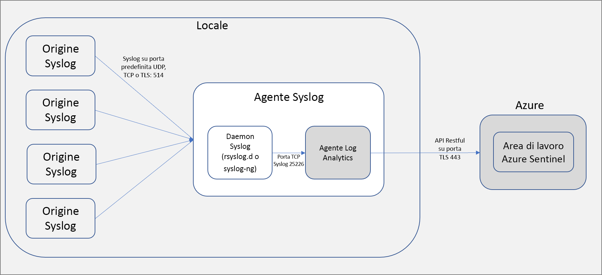

# Connettere la soluzione esterna usando il formato di evento comune

Quando si connette una soluzione esterna che invia messaggi CEF, sono disponibili tre passaggi per la connessione a Sentinel di Azure:

PASSAGGIO 1: [connettere CEF distribuendo l'agente](connect-cef-agent.md) passaggio 2: [eseguire passaggi specifici della soluzione](connect-cef-solution-config.md) passaggio 3: [verificare la connettività](connect-cef-verify.md)

Questo articolo descrive il funzionamento della connessione, fornisce prerequisiti e fornisce i passaggi per la distribuzione dell'agente nelle soluzioni di sicurezza che inviano messaggi CEF (Common Event Format) su syslog. 

> [!NOTE] 
> I dati vengono archiviati nella posizione geografica dell'area di lavoro in cui viene eseguito Azure Sentinel.

Per effettuare questa connessione, è necessario distribuire un agente in un computer Linux dedicato (VM o locale) per supportare la comunicazione tra il dispositivo e Azure Sentinel. Il diagramma seguente illustra la configurazione in caso di una macchina virtuale Linux in Azure.

 

In alternativa, questa configurazione sarà disponibile se si usa una VM in un altro cloud o un computer locale. 

 

## Considerazioni sulla sicurezza

Assicurarsi di configurare la sicurezza del computer in base ai criteri di sicurezza dell'organizzazione. Ad esempio, è possibile configurare la rete in modo che venga allineata ai criteri di sicurezza della rete aziendale e modificare le porte e i protocolli nel daemon per allinearli ai propri requisiti. È possibile usare le istruzioni seguenti per migliorare la configurazione della sicurezza del computer:  [Secure VM in Azure](../virtual-machines/linux/security-policy.md), procedure consigliate [per la sicurezza di rete](../security/fundamentals/network-best-practices.md).

Per usare la comunicazione TLS tra la soluzione di sicurezza e il computer syslog, è necessario configurare il daemon syslog (rsyslog o syslog-ng) per la comunicazione in TLS: [crittografia del traffico syslog con TLS-rsyslog](https://www.rsyslog.com/doc/v8-stable/tutorials/tls_cert_summary.html), [crittografia dei messaggi di log con TLS-syslog-ng](https://support.oneidentity.com/technical-documents/syslog-ng-open-source-edition/3.22/administration-guide/60#TOPIC-1209298).

 
## Prerequisiti
Verificare che il computer Linux usato come proxy esegua uno dei sistemi operativi seguenti:

- 64 bit
  - CentOS 6 e 7
  - Amazon Linux 2017.09
  - Oracle Linux 6 e 7
  - Red Hat Enterprise Linux Server 6 e 7
  - Debian GNU/Linux 8 e 9
  - Ubuntu Linux 14.04 LTS, 16.04 LTS e 18.04 LTS
  - SUSE Linux Enterprise Server 12
- 32 bit
   - CentOS 6
   - Oracle Linux 6
   - Red Hat Enterprise Linux Server 6
   - Debian GNU/Linux 8 e 9
   - Ubuntu Linux 14.04 LTS e 16.04 LTS
 
 - Versioni del daemon
   - Syslog-ng: 2,1-3.22.1
   - Rsyslog: V8
  
 - RFC di syslog supportate
   - Syslog RFC 3164
   - Syslog RFC 5424
 
Verificare che il computer soddisfi anche i requisiti seguenti: 
- Autorizzazioni
    - È necessario disporre di autorizzazioni elevate (sudo) nel computer. 
- Requisiti software
    - Assicurarsi che Python sia in esecuzione nel computer

## Passaggi successivi
In questo documento si è appreso come connettere Appliance CEF ad Azure Sentinel. Per altre informazioni su Azure Sentinel, vedere gli articoli seguenti:
- Informazioni su come [ottenere visibilità sui dati e sulle potenziali minacce](quickstart-get-visibility.md).
- Iniziare a [rilevare minacce con Azure Sentinel](tutorial-detect-threats.md).

