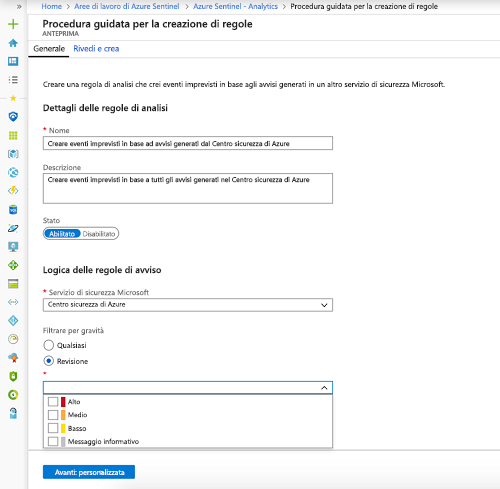
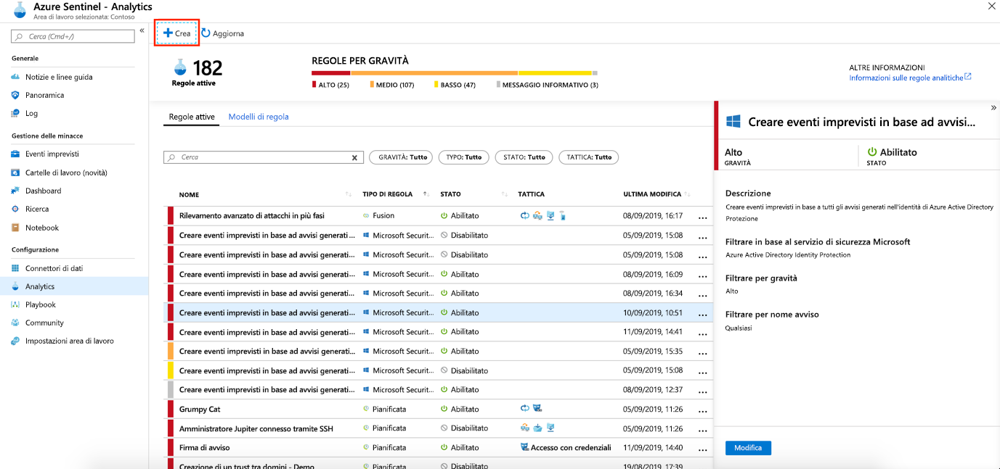
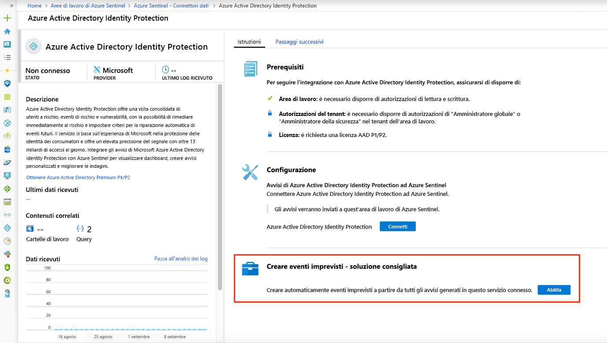

# Creare automaticamente eventi imprevisti dagli avvisi di sicurezza Microsoft

Gli avvisi generati nelle soluzioni di sicurezza Microsoft connesse ad Azure Sentinel, ad esempio Microsoft Cloud App Security e Azure Advanced Threat Protection, non creano automaticamente eventi imprevisti in Azure Sentinel. Per impostazione predefinita, quando si connette una soluzione Microsoft ad Azure Sentinel, tutti gli avvisi generati in tale servizio verranno archiviati come dati non elaborati in Azure Sentinel e più precisamente nella tabella Avviso di sicurezza dell'area di lavoro di Azure Sentinel. È quindi possibile usare tali dati come tutti gli altri dati non elaborati connessi in Sentinel.

È possibile configurare facilmente Azure Sentinel in modo da creare automaticamente eventi imprevisti ogni volta che viene attivato un avviso in una soluzione di sicurezza Microsoft connessa, seguendo le istruzioni riportate in questo articolo.

## Prerequisites
Per abilitare la creazione degli eventi imprevisti da avvisi del servizio di sicurezza, è necessario [connettere le soluzioni di sicurezza Microsoft](connect-data-sources.md#data-connection-methods).

## Uso delle regole di analisi per la creazione di eventi imprevisti per la sicurezza Microsoft

Usare le regole predefinite disponibili in Azure Sentinel per scegliere le soluzioni di sicurezza Microsoft connesse che dovrebbero creare automaticamente gli eventi imprevisti di Azure Sentinel in tempo reale. È anche possibile modificare le regole per definire opzioni più specifiche per filtrare quali avvisi generati dalla soluzione di sicurezza Microsoft devono creare eventi imprevisti in Azure Sentinel. Ad esempio, è possibile scegliere di creare automaticamente eventi imprevisti di Azure Sentinel solo da avvisi con gravità alta del Centro sicurezza di Azure.

1. Nella portale di Azure in Azure Sentinel selezionare**Analisi**.

1. Selezionare la scheda **Rule templates** (Modelli di regole) per visualizzare tutte le regole di analisi predefinite.

    

1. Scegliere il modello di regola di analisi **Microsoft security** (Sicurezza Microsoft) da usare e fare clic su **Crea regola**.

    

1. È possibile modificare i dettagli della regola e scegliere di filtrare gli avvisi che creeranno gli eventi imprevisti in base alla gravità dell'avviso o al testo contenuto nel nome dell'avviso.  
      
    Ad esempio, se si sceglie **Centro sicurezza di Azure** nel campo **Microsoft security service** (Servizio di sicurezza Microsoft) e si sceglie **High** (Alta) nel campo **Filter by severity** (Filtra per gravità), solo gli avvisi del Centro sicurezza di Azure con gravità alta creeranno automaticamente eventi imprevisti in Azure Sentinel.  

    

1. È anche possibile creare una nuova regola di **Microsoft security** (Sicurezza Microsoft) per filtrare gli avvisi di servizi di sicurezza Microsoft diversi facendo clic su **+Crea** e selezionando **Microsoft incident creation rule** (Regola di creazione eventi imprevisti Microsoft).

    

  È possibile creare più di una regola di analisi **Microsoft security** (Sicurezza Microsoft) per tipo di **servizio di sicurezza Microsoft**. Non vengono creati eventi imprevisti duplicati perché ogni regola viene usata come filtro. Anche se un avviso corrisponde a più di una regola di analisi **Microsoft security** (Sicurezza Microsoft), viene creato solo un evento imprevisto di Azure Sentinel.

## Abilitare automaticamente la generazione di eventi imprevisti durante la connessione
 Quando si connette una soluzione di sicurezza Microsoft, è possibile scegliere se gli avvisi della soluzione di sicurezza devono generare automaticamente eventi imprevisti in Azure Sentinel.

1. Connettere un'origine dati della soluzione di sicurezza Microsoft. 

   

1. In **Create incidents** (Crea eventi imprevisti) selezionare **Enable** (Abilita) per abilitare la regola di analisi predefinita che crea automaticamente gli eventi imprevisti dagli avvisi generati nel servizio di sicurezza connesso. È quindi possibile modificare questa regola in **Analisi** e quindi **Active rules** (Regole attive).

## Passaggi successivi

- Per iniziare a usare Azure Sentinel, è necessario avere una sottoscrizione di Microsoft Azure. Se non si ha una sottoscrizione, è possibile iscriversi per una [versione di valutazione gratuita](https://azure.microsoft.com/free/).
- Informazioni su come [caricare i dati in Azure Sentinel](quickstart-onboard.md) e [ottenere visibilità sui dati e sulle potenziali minacce](quickstart-get-visibility.md).
