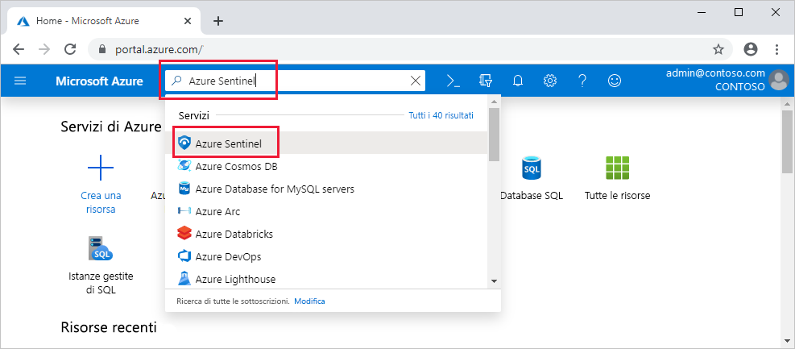

# Avvio rapido: Caricare dati in Azure Sentinel

Questa Guida introduttiva illustra come caricare dati in Azure Sentinel. 

Per caricare dati in Azure Sentinel, è necessario prima abilitare Azure Sentinel e quindi connettere le origini dati. Azure Sentinel include numerosi connettori predefiniti per l'integrazione in tempo reale con le soluzioni Microsoft, comprese le soluzioni Microsoft Threat Protection e origini Microsoft 365, tra cui Office 365, Azure AD, Azure ATP, Microsoft Cloud App Security e altre ancora. Inoltre, sono presenti connettori predefiniti a soluzioni non Microsoft, per l'ecosistema di sicurezza allargato. Per connettere le origini dati con Azure Sentinel è anche possibile usare Common Event Format, Syslog o API REST.  

Dopo aver connesso le origini dati, è possibile effettuare una scelta in una raccolta di cartelle di lavoro create in maniera specialistica per far emergere informazioni dettagliate in base ai dati. Tali cartelle di lavoro possono essere facilmente personalizzate in base alle esigenze.

>[!IMPORTANT] 
> Per informazioni sugli addebiti relativi all'uso di Azure Sentinel, vedere [i prezzi di Azure Sentinel](https://azure.microsoft.com/pricing/details/azure-sentinel/).
  

## Prerequisiti globali

- Sottoscrizione attiva di di Azure. Se non se ne possiede una, creare un [account gratuito](https://azure.microsoft.com/free/?WT.mc_id=A261C142F) prima di iniziare.

- Area d lavoro Log Analytics. Informazioni su [come creare un'area di lavoro Log Analytics](../log-analytics/log-analytics-quick-create-workspace.md). Per altre informazioni sulle aree di lavoro Log Analytics, vedere [Progettazione della distribuzione dei log di Monitoraggio di Azure](../azure-monitor/platform/design-logs-deployment.md).

- Per abilitare Azure Sentinel, è necessario disporre delle autorizzazioni per la sottoscrizione in cui si trova l'area di lavoro di Azure. 
- Per usare Azure Sentinel, è necessario disporre delle autorizzazioni di collaboratore o lettore per il gruppo di risorse a cui appartiene l'area di lavoro.
- Possono essere necessarie autorizzazioni aggiuntive per connettere origini dati specifiche.
- Azure Sentinel è un servizio a pagamento. Per informazioni sui prezzi, vedere [Informazioni su Azure Sentinel](https://go.microsoft.com/fwlink/?linkid=2104058).
 
## Abilitare Azure Sentinel 

1. Accedere al portale di Azure. Assicurarsi che la sottoscrizione in cui è stato creato Azure Sentinel sia selezionata.

1. Cercare e selezionare **Azure Sentinel**.

   

1. Selezionare **Aggiungi**.

1. Selezionare l'area di lavoro da usare o crearne una nuova. È possibile eseguire Azure Sentinel in più di un'area di lavoro, ma i dati sono isolati in una singola area di lavoro.

   

   >[!NOTE] 
   > - Le aree di lavoro predefinite create in Centro sicurezza di Azure non vengono visualizzate nell'elenco e non è possibile installare Azure Sentinel in tali aree.
   > - Azure Sentinel può essere eseguito in aree di lavoro in qualsiasi [area di disponibilità generale di Log Analytics](https://azure.microsoft.com/global-infrastructure/services/?products=monitor), ad eccezione delle aree Cina, Germania e Azure per enti pubblici. I dati generati da Azure Sentinel (ad esempio eventi imprevisti, segnalibri e regole di avviso, che possono contenere dati del cliente originati da tali aree di lavoro), vengono salvati in Europa occidentale (per aree di lavoro situate in Europa) o negli Stati Uniti orientali (per tutte le aree di lavoro con base negli Stati Uniti e per qualsiasi altra area ad eccezione dell'Europa).

1. Selezionare **Aggiungi Azure Sentinel**.
  

## Connettere le origini dati

Azure Sentinel crea la connessione ai servizi e alle app collegandosi al servizio e inviando gli eventi e i log ad Azure Sentinel. Per i computer e le macchine virtuali, è possibile installare l'agente di Azure Sentinel che raccoglie i log e li trasmette ad Azure Sentinel. Per i firewall e i proxy, Azure Sentinel usa un server Linux Syslog in cui è installato l'agente e da cui l'agente raccoglie i file di log e li trasmette ad Azure Sentinel. 
 
1. Fare clic su **Raccolta dati**.
2. È disponibile un riquadro per ogni origine dati che è possibile connettere. 
Fare clic ad esempio su **Azure Active Directory**. Se si connette questa origine dati, è possibile trasmettere tutti i log da Azure AD ad Azure Sentinel. È possibile selezionare il tipo di log da ottenere, ovvero log di accesso o di controllo.  
In via definitiva, Azure Sentinel offre consigli per le cartelle di lavoro da installare per ogni connettore, in modo da ottenere immediatamente analisi approfondite sui dati.   Per altre informazioni, seguire le istruzioni di installazione o [fare riferimento alla guida di connessione pertinente](connect-data-sources.md). Per informazioni sui connettori dei dati, vedere [Connettere i servizi Microsoft](connect-data-sources.md).

Dopo che le origini dati sono connesse, viene avviato il trasferimento dei dati in Azure Sentinel ed è possibile iniziare a usarli. È possibile visualizzare i log nei [dashboard predefiniti](quickstart-get-visibility.md) e iniziare a compilare le query in Log Analytics per [esaminare i dati](tutorial-investigate-cases.md).

## Passaggi successivi
In questo documento si è appreso come connettere le origini dati ad Azure Sentinel. Per altre informazioni su Azure Sentinel, vedere gli articoli seguenti:
- Informazioni su come [ottenere visibilità sui dati e sulle potenziali minacce](quickstart-get-visibility.md).
- Iniziare a [rilevare minacce con Azure Sentinel](tutorial-detect-threats-built-in.md).
- Trasmettere i dati da [appliance di Common Event Format](connect-common-event-format.md) in Azure Sentinel.
