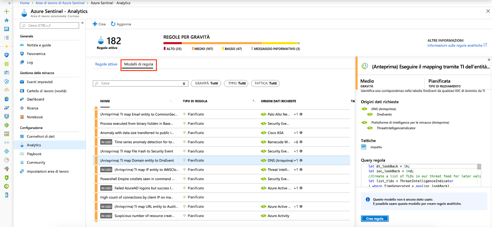

# Esercitazione: Rileva le minacce predefinite

> [!IMPORTANT]
> Il rilevamento delle minacce predefinito è attualmente disponibile in anteprima pubblica.
> Questa funzionalità viene fornita senza un contratto di servizio e non è consigliata per i carichi di lavoro di produzione.
> Per altre informazioni, vedere [Condizioni supplementari per l'utilizzo delle anteprime di Microsoft Azure](https://azure.microsoft.com/support/legal/preview-supplemental-terms/).

Dopo aver [connesso le origini dati](quickstart-onboard.md)@no__t 1per di Azure Sentinel, è necessario ricevere una notifica quando si verifica qualcosa di sospetto. Per consentire l'esecuzione di questa operazione, è possibile usare i modelli predefiniti disponibili in Azure Sentinel. Questi modelli sono stati progettati dal team di esperti di sicurezza e analisti di Microsoft in base a minacce note, vettori di attacco comuni e catene di escalation delle attività sospette. Dopo aver abilitato questi modelli, verranno automaticamente cercati eventuali attività sospette nell'ambiente in uso. Molti modelli possono essere personalizzati per cercare, o filtrare, le attività in base alle esigenze. Gli avvisi generati da questi modelli creeranno eventi imprevisti che è possibile assegnare ed esaminare nell'ambiente in uso.

Questa esercitazione consente di rilevare le minacce con Azure Sentinel:

> [!div class="checklist"]
> * Usare i rilevamenti predefiniti
> * Automatizzare le risposte alle minacce

## Informazioni sui rilevamenti predefiniti

Per visualizzare tutti i rilevamenti predefiniti, passare a **Analytics** e quindi a **modelli di regole**. Questa scheda contiene tutte le regole predefinite di Azure Sentinel.

   

Sono disponibili i tipi di modello seguenti:

- **Sicurezza Microsoft** : i modelli di sicurezza Microsoft creano automaticamente gli eventi imprevisti di Sentinel di Azure dagli avvisi generati in altre soluzioni di sicurezza Microsoft, in tempo reale. È possibile utilizzare le regole di sicurezza Microsoft come modello per creare nuove regole con logica simile. Per ulteriori informazioni sulle regole di sicurezza, vedere [creazione automatica degli eventi imprevisti da avvisi di sicurezza Microsoft](create-incidents-from-alerts.md).
- **Fusion** -based sulla tecnologia Fusion, il rilevamento avanzato degli attacchi multifase in Azure Sentinel usa algoritmi di Machine Learning scalabili che possono correlare molti avvisi ed eventi a bassa fedeltà tra più prodotti in modo estremamente fedele e interoperabile incidenti. Fusion è abilitato per impostazione predefinita. Poiché la logica è nascosta, non è possibile usarla come modello per creare più di una regola.
- **Analisi del comportamento di Machine Learning** : questi modelli sono basati su algoritmi di Microsoft Machine Learning proprietari, pertanto non è possibile vedere la logica interna del modo in cui funzionano e quando vengono eseguiti. Poiché la logica è nascosta, non è possibile usarla come modello per creare più di una regola.
-   **Pianificate** : le regole analitiche pianificate sono query pianificate scritte da esperti di sicurezza Microsoft. È possibile visualizzare la logica di query e apportare modifiche. È possibile utilizzare le regole pianificate come modello per creare nuove regole con logica simile.

## Usare i rilevamenti predefiniti

1. Per usare un modello predefinito, fare clic su **Crea regola** per creare una nuova regola attiva in base a tale modello. Ogni voce include un elenco di origini dati obbligatorie che vengono controllate automaticamente e ciò può comportare la disabilitazione della **regola di creazione** .
  
   
 
1. Verrà visualizzata la creazione guidata regola, in base al modello selezionato. Tutti i dettagli sono riempiti automaticamente e, per le **regole pianificate** o **le regole di sicurezza Microsoft**, è possibile personalizzare la logica per adattarla meglio alla propria organizzazione o creare regole aggiuntive basate sul modello predefinito. Dopo aver seguito i passaggi della creazione guidata regola e aver completato la creazione di una regola basata sul modello, la nuova regola verrà visualizzata nella scheda **regole attive** .

Per ulteriori informazioni sui campi della procedura guidata, vedere [Tutorial: Creare regole analitiche personalizzate per rilevare le minacce sospette @ no__t-0.

## Passaggi successivi
In questa esercitazione si è appreso come iniziare a rilevare le minacce usando Azure Sentinel. 

Per informazioni su come automatizzare le risposte alle minacce, [configurare le risposte automatiche alle minacce in Sentinel di Azure](tutorial-respond-threats-playbook.md).

