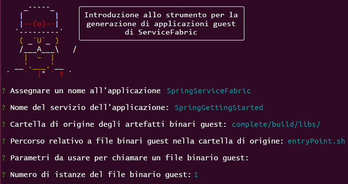
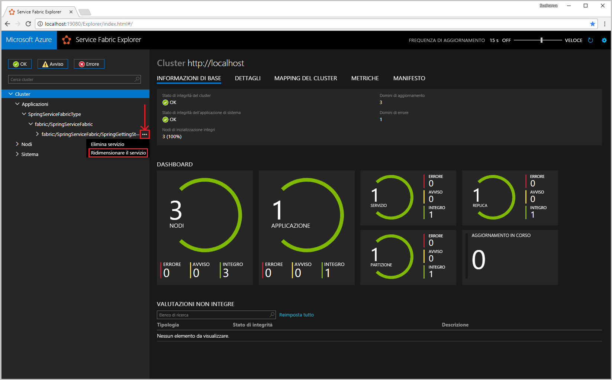
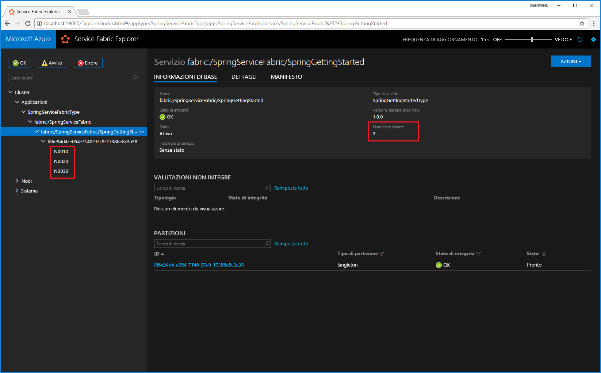
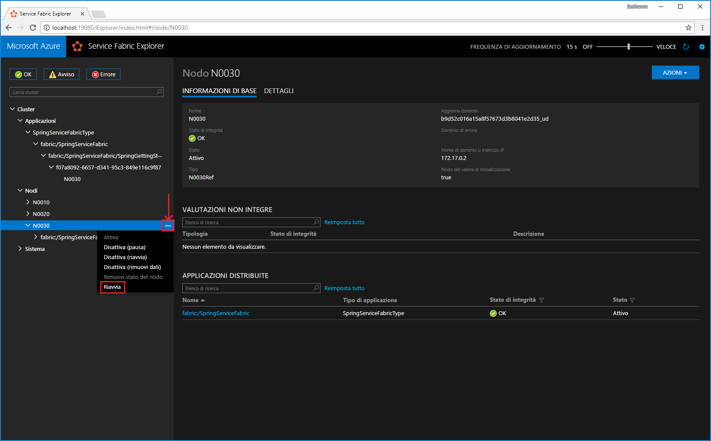
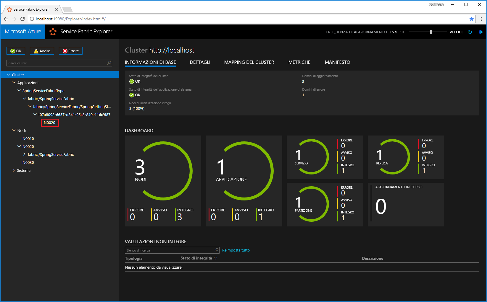

# <a name="quickstart-deploy-a-java-spring-boot-app-on-azure-service-fabric"></a>Avvio rapido: Distribuire un'app Spring Boot Java in Azure Service Fabric

In questo argomento di avvio rapido si distribuisce un'applicazione Spring Boot Java in Azure Service Fabric usando strumenti della riga di comando familiari in Linux o MacOS. Azure Service Fabric è una piattaforma di sistemi distribuiti per la distribuzione e la gestione di microservizi e contenitori. 

## <a name="prerequisites"></a>Prerequisites

#### <a name="linuxtablinux"></a>[Linux](#tab/linux)

- [Ambiente Java](https://docs.microsoft.com/azure/service-fabric/service-fabric-get-started-linux#set-up-java-development) e [Yeoman](https://docs.microsoft.com/azure/service-fabric/service-fabric-get-started-linux#set-up-yeoman-generators-for-containers-and-guest-executables)
- [Service Fabric SDK e l'interfaccia della riga di comando di Service Fabric](https://docs.microsoft.com/azure/service-fabric/service-fabric-get-started-linux#installation-methods)
- [Git](https://git-scm.com/downloads)

#### <a name="macostabmacos"></a>[MacOS](#tab/macos)

- [Ambiente Java e Yeoman](https://docs.microsoft.com/azure/service-fabric/service-fabric-get-started-mac#create-your-application-on-your-mac-by-using-yeoman)
- [Service Fabric SDK e l'interfaccia della riga di comando di Service Fabric](https://docs.microsoft.com/azure/service-fabric/service-fabric-cli#cli-mac)
- [Git](https://git-scm.com/downloads)

--- 

## <a name="download-the-sample"></a>Scaricare l'esempio

In una finestra del terminale eseguire il comando seguente per clonare l'app di esempio [Introduzione](https://github.com/spring-guides/gs-spring-boot) a Spring Boot nel computer locale.

```bash
git clone https://github.com/spring-guides/gs-spring-boot.git
```

## <a name="build-the-spring-boot-application"></a>Compilare l'applicazione Spring Boot 
All'interno della directory *gs-spring-boot/complete* eseguire il comando seguente per compilare l'applicazione 

```bash
./gradlew build
``` 

## <a name="package-the-spring-boot-application"></a>Creare il pacchetto dell'applicazione Spring Boot 
1. All'interno della directory *gs-spring-boot* nel clone, eseguire il comando `yo azuresfguest`. 

1. Rispondere alle richieste specificando le informazioni seguenti.

    

1. Nella cartella *SpringServiceFabric/SpringServiceFabric/SpringGettingStartedPkg/code* creare un file denominato *entryPoint.sh*. Aggiungere il codice seguente alla fine del file *entryPoint.sh*. 

    ```bash
    #!/bin/bash
    BASEDIR=$(dirname $0)
    cd $BASEDIR
    java -jar gs-spring-boot-0.1.0.jar
    ```

1. Aggiungere la risorsa **Endpoints** nel file *gs-spring-boot/SpringServiceFabric/SpringServiceFabric/SpringGettingStartedPkg/ServiceManifest.xml*

    ```xml 
        <Resources>
          <Endpoints>
            <Endpoint Name="WebEndpoint" Protocol="http" Port="8080" />
          </Endpoints>
       </Resources>
    ```

    Il file *ServiceManifest.xml* sarà ora simile al seguente: 

    ```xml
    <?xml version="1.0" encoding="utf-8"?>
    <ServiceManifest Name="SpringGettingStartedPkg" Version="1.0.0"
                     xmlns="http://schemas.microsoft.com/2011/01/fabric" xmlns:xsd="https://www.w3.org/2001/XMLSchema" xmlns:xsi="https://www.w3.org/2001/XMLSchema-instance" >

       <ServiceTypes>
          <StatelessServiceType ServiceTypeName="SpringGettingStartedType" UseImplicitHost="true">
       </StatelessServiceType>
       </ServiceTypes>

       <CodePackage Name="code" Version="1.0.0">
          <EntryPoint>
             <ExeHost>
                <Program>entryPoint.sh</Program>
                <Arguments></Arguments>
                <WorkingFolder>CodePackage</WorkingFolder>
             </ExeHost>
          </EntryPoint>
       </CodePackage>
        <Resources>
          <Endpoints>
            <Endpoint Name="WebEndpoint" Protocol="http" Port="8080" />
          </Endpoints>
       </Resources>
     </ServiceManifest>
    ```

In questa fase è stata creata un'applicazione di Service Fabric per il progetto di esempio Introduzione a Spring Boot che è possibile distribuire in Service Fabric.

## <a name="run-the-application-locally"></a>Eseguire l'applicazione in locale

1. Per avviare il cluster locale nei computer Ubuntu, eseguire il comando seguente:

    ```bash
    sudo /opt/microsoft/sdk/servicefabric/common/clustersetup/devclustersetup.sh
    ```

    Se si usa un Mac, avviare il cluster locale dall'immagine Docker (si presuppone che siano stati seguiti i [prerequisiti](https://docs.microsoft.com/azure/service-fabric/service-fabric-get-started-mac#create-a-local-container-and-set-up-service-fabric) per configurare il cluster locale per Mac). 

    ```bash
    docker run --name sftestcluster -d -p 19080:19080 -p 19000:19000 -p 25100-25200:25100-25200 -p 8080:8080 mysfcluster
    ```

    L'avvio del cluster locale può richiedere tempo. Per verificare se il cluster è in esecuzione, accedere a Service Fabric Explorer in `http://localhost:19080`. I cinque nodi integri indicano che il cluster locale è in esecuzione. 
    
    

1. Aprire la cartella *gs-spring-boot/SpringServiceFabric*.
1. Eseguire il comando seguente per connettersi al cluster locale.

    ```bash
    sfctl cluster select --endpoint http://localhost:19080
    ```
1. Eseguire lo script *install.sh*.

    ```bash
    ./install.sh
    ```

1. Aprire il Web browser preferito e accedere all'applicazione tramite `http://localhost:8080`.

    

È ora possibile accedere all'applicazione Spring Boot distribuita in un cluster di Service Fabric.

Per altre informazioni, vedere l'esempio [Introduzione](https://spring.io/guides/gs/spring-boot/) di Spring Boot nel sito Web Spring.

## <a name="scale-applications-and-services-in-a-cluster"></a>Ridimensionare applicazioni e servizi in un cluster

I servizi possono essere facilmente ridimensionati in un cluster per supportare le modifiche del carico sui servizi. È possibile ridimensionare un servizio modificando il numero di istanze in esecuzione nel cluster. Sono disponibili diversi sistemi per garantire il ridimensionamento dei servizi. È ad esempio possibile usare gli script o i comandi dell'interfaccia della riga di comando di Service Fabric (sfctl). I passaggi seguenti usano Service Fabric Explorer.

Service Fabric Explorer è in esecuzione in tutti i cluster di Service Fabric ed è accessibile da un browser passando alla porta di gestione HTTP (19080) del cluster, ad esempio `http://localhost:19080`.

Per ridimensionare il servizio front-end Web, seguire questa procedura:

1. Aprire Service Fabric Explorer nel cluster, ad esempio `http://localhost:19080`.
1. Selezionare i puntini di sospensione ( **...** ) accanto al nodo **fabric:/SpringServiceFabric/SpringGettingStarted** nella visualizzazione ad albero e selezionare **Scale Service** (Ridimensiona servizio).

    

    È ora possibile scegliere di modificare il numero di istanze del servizio.

1. Impostare il numero su **3** e selezionare **Scale Service** (Ridimensiona servizio).

    Di seguito è illustrato un modo alternativo per modificare il numero di istanze del servizio tramite la riga di comando.

    ```bash
    # Connect to your local cluster
    sfctl cluster select --endpoint https://<ConnectionIPOrURL>:19080 --pem <path_to_certificate> --no-verify

    # Run Bash command to scale instance count for your service
    sfctl service update --service-id 'SpringServiceFabric~SpringGettingStarted' --instance-count 3 --stateless 
    ``` 

1. Selezionare il nodo **fabric:/SpringServiceFabric/SpringGettingStarted** nella visualizzazione struttura ad albero ed espandere il nodo della partizione (rappresentato da un GUID).

    

    Il servizio ha tre istanze. Nella visualizzazione ad albero viene indicato in quali nodi vengono eseguite.

Con questa semplice attività di gestione, sono state raddoppiate le risorse disponibili per il servizio front-end per l'elaborazione del carico utente. È importante comprendere che non sono necessarie più istanze di un servizio perché questo venga eseguito in modo affidabile. In caso di problemi di un servizio, Service Fabric assicura l'esecuzione di una nuova istanza del servizio nel cluster.

## <a name="fail-over-services-in-a-cluster"></a>Servizi di failover in un cluster

Per dimostrare il failover del servizio, viene simulato il riavvio di un nodo tramite Service Fabric Explorer. Verificare che sia in esecuzione una sola istanza del servizio.

1. Aprire Service Fabric Explorer nel cluster, ad esempio `http://localhost:19080`.
1. Selezionare i puntini di sospensione ( **...** ) accanto al nodo che esegue l'istanza del servizio e riavviare il nodo.

    
1. L'istanza del servizio verrà spostata in un altro nodo e nell'applicazione non si verificheranno tempi di inattività.

    

## <a name="next-steps"></a>Passaggi successivi

In questa guida introduttiva si è appreso come:

* Distribuire un'applicazione Spring Boot in Service Fabric
* Distribuire l'applicazione nel cluster locale
* Scalare orizzontalmente l'applicazione in più nodi
* Eseguire il failover del servizio senza compromettere la disponibilità

Per altre informazioni sull'uso di app Java in Service Fabric, continuare con l'esercitazione sulle app Java.

> [!div class="nextstepaction"]
> [Distribuire un'app Java](./service-fabric-tutorial-create-java-app.md)
