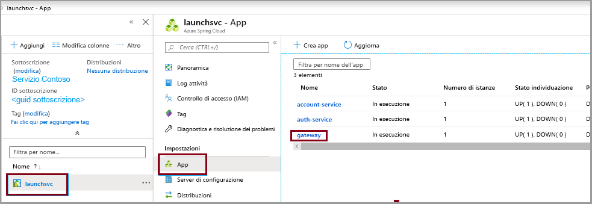

# <a name="quickstart-launch-a-java-spring-application-using-the-azure-cli"></a>Avvio rapido: Avviare un'applicazione Java Spring tramite l'interfaccia della riga di comando di Azure

Azure Spring Cloud consente di eseguire facilmente un'applicazione di microservizi basata su Spring Boot in Azure.

Questo argomento di avvio rapido illustra come distribuire un'applicazione Java Spring Cloud in Azure. Al termine, è possibile continuare a gestire l'applicazione tramite l'interfaccia della riga di comando di Azure oppure passare all'uso del portale di Azure.

Seguendo questo argomento di avvio rapido, si apprenderà come:

> [!div class="checklist"]
> * Effettuare il provisioning di un'istanza del servizio
> * Impostare un server di configurazione per un'istanza
> * Creare un'applicazione di microservizi in locale
> * Distribuire ogni microservizio
> * Assegnare un endpoint pubblico per l'applicazione

## <a name="prerequisites"></a>Prerequisites

>[!Note]
> Azure Spring Cloud è attualmente disponibile come anteprima pubblica. Le offerte di anteprima pubblica consentono ai clienti di sperimentare le nuove funzionalità prima del rilascio della versione ufficiale.  I servizi e le funzionalità di anteprima pubblica non sono destinati all'uso in produzione.  Per altre informazioni sul supporto durante le anteprime, vedere le [domande frequenti](https://azure.microsoft.com/support/faq/) o inviare una [richiesta di supporto](https://docs.microsoft.com/azure/azure-supportability/how-to-create-azure-support-request).

>[!TIP]
> Azure Cloud Shell è una shell interattiva gratuita che può essere usata per eseguire la procedura di questo articolo.  Include i comuni strumenti di Azure preinstallati, tra cui le ultime versioni di Git, JDK, Maven e dell'interfaccia della riga di comando di Azure. Se è stato eseguito l'accesso alla sottoscrizione di Azure, avviare [Azure Cloud Shell](https://shell.azure.com) da shell.azure.com.  Per altre informazioni su Azure Cloud Shell, [leggere la documentazione](../cloud-shell/overview.md)

Per completare questa guida introduttiva:

1. [Installare Git](https://git-scm.com/)
2. [Installare JDK 8](https://docs.microsoft.com/java/azure/jdk/?view=azure-java-stable)
3. [Installare Maven 3.0 o versione successiva](https://maven.apache.org/download.cgi)
4. [Installare l'interfaccia della riga di comando di Azure versione 2.0.67 o successiva](https://docs.microsoft.com/cli/azure/install-azure-cli?view=azure-cli-latest)
5. [Iscriversi per ottenere una sottoscrizione di Azure](https://azure.microsoft.com/free/)

## <a name="install-the-azure-cli-extension"></a>Installare l'estensione dell'interfaccia della riga di comando di Azure

Installare l'estensione Azure Spring Cloud per l'interfaccia della riga di comando di Azure usando il comando seguente

```azurecli
az extension add --name spring-cloud
```

## <a name="provision-a-service-instance-on-the-azure-cli"></a>Effettuare il provisioning di un'istanza del servizio nell'interfaccia della riga di comando di Azure

1. Accedere all'interfaccia della riga di comando di Azure e scegliere una sottoscrizione attiva. Assicurarsi di scegliere una sottoscrizione attiva autorizzata per Azure Spring Cloud

    ```azurecli
        az login
        az account list -o table
        az account set --subscription
    ```

2. Preparare un nome per il servizio Azure Spring Cloud.  Il nome deve essere composto da 4-32 caratteri e può contenere solo lettere in minuscolo, numeri e trattini.  Il primo carattere del nome del servizio deve essere una lettera e l'ultimo deve essere una lettera o un numero.

3. Creare un gruppo di risorse in cui includere il servizio Azure Spring Cloud.

    ```azurecli
        az group create --location eastus --name <resource group name>
    ```
    Altre informazioni sui [gruppi di risorse di Azure](../azure-resource-manager/management/overview.md).

4. Aprire una finestra dell'interfaccia della riga di comando di Azure ed eseguire i comandi seguenti per effettuare il provisioning di un'istanza di Azure Spring Cloud.

    ```azurecli
        az spring-cloud create -n <service name> -g <resource group name>
    ```

    La distribuzione dell'istanza del servizio richiede circa cinque minuti.

5. Impostare i nomi predefiniti del gruppo di risorse e del cluster usando i comandi seguenti:

    ```azurecli
        az configure --defaults group=<service group name>
        az configure --defaults spring-cloud=<service instance name>
    ```

## <a name="setup-your-configuration-server"></a>Configurare il server di configurazione

Aggiornare il server di configurazione con la posizione del repository Git per il progetto:

```git
az spring-cloud config-server git set -n <your-service-name> --uri https://github.com/Azure-Samples/piggymetrics --label config
```

## <a name="build-the-microservices-applications-locally"></a>Creare l'applicazione di microservizi in locale

1. Creare una nuova cartella e clonare il repositori di app di esempio nell'account di Azure Cloud.  

    ```azurecli
        mkdir source-code
        git clone https://github.com/Azure-Samples/piggymetrics
    ```

2. Cambiare directory e creare il progetto.

    ```azurecli
        cd piggymetrics
        mvn clean package -D skipTests
    ```

La compilazione del progetto richiede circa 5 minuti.  Al termine, si dovrebbero avere singoli file JAR per ogni servizio nelle rispettive cartelle.

## <a name="create-the-microservices"></a>Creare i microservizi

Creare i microservizi Spring Cloud usando i file JAR creati nel passaggio precedente. Verranno creati tre microservizi: **gateway**, **auth-service** e **account-service**.

```azurecli
az spring-cloud app create --name gateway
az spring-cloud app create --name auth-service
az spring-cloud app create --name account-service
```

## <a name="deploy-applications-and-set-environment-variables"></a>Distribuire le applicazioni e impostare le variabili di ambiente

È necessario distribuire effettivamente le applicazioni in Azure. Usare i comandi seguenti per distribuire le tre applicazioni:

```azurecli
az spring-cloud app deploy -n gateway --jar-path ./gateway/target/gateway.jar
az spring-cloud app deploy -n account-service --jar-path ./account-service/target/account-service.jar
az spring-cloud app deploy -n auth-service --jar-path ./auth-service/target/auth-service.jar
```

## <a name="assign-public-endpoint-to-gateway"></a>Assegnare un endpoint pubblico al gateway

È necessario un modo per accedere all'applicazione tramite Web browser. L'applicazione gateway richiede un endpoint pubblico, che è possibile assegnare con il comando seguente:

```azurecli
az spring-cloud app update -n gateway --is-public true
```

Infine, eseguire una query sull'applicazione **gateway** per trovare il relativo indirizzo IP pubblico in modo da verificare se è in esecuzione:

```azurecli
az spring-cloud app show --name gateway | grep url
```

Passare all'URL specificato dal comando precedente per eseguire l'applicazione PiggyMetrics.
    

È anche possibile passare al portale di Azure per trovare l'URL. 
1. Passare al servizio
1. Selezionare **App**
1. Selezionare **gateway**

    
1. Trovare l'URL nella pagina della **panoramica del gateway**

## <a name="next-steps"></a>Passaggi successivi

In questo argomento di avvio rapido è stata distribuita un'applicazione Spring Cloud dall'interfaccia della riga di comando di Azure.  Per altre informazioni su Azure Spring Cloud, procedere con l'esercitazione sulla preparazione dell'app per la distribuzione.

> [!div class="nextstepaction"]
> [Preparare l'applicazione Azure Spring Cloud per la distribuzione](spring-cloud-tutorial-prepare-app-deployment.md)

Altri esempi sono disponibili in GitHub: [Esempi di Azure Spring Cloud](https://github.com/Azure-Samples/Azure-Spring-Cloud-Samples/tree/master/service-binding-cosmosdb-sql).
