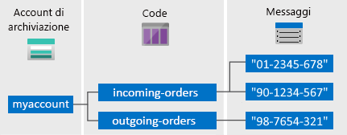

# Che cosa sono le code di Azure?

Archiviazione code di Azure è un servizio per l'archiviazione di un numero elevato di messaggi. È possibile accedere ai messaggi ovunque ci si trovi con chiamate autenticate tramite HTTP o HTTPS. Un messaggio in coda avere dimensioni fino a 64 KB. Una coda può contenere milioni di messaggi, fino al limite di capacità totale dell'account di archiviazione. Le code vengono in genere usate per creare un backlog di lavoro da elaborare in modo asincrono.

## Concetti del servizio di accodamento

Il servizio di accodamento contiene i componenti seguenti:

* **Formato URL:** è possibile fare riferimento alle code usando il formato URL seguente:

    `https://<storage account>.queue.core.windows.net/<queue>`
  
    L'URL seguente fa riferimento a una delle code nel diagramma:  
  
    `https://myaccount.queue.core.windows.net/images-to-download`

* **Account di archiviazione:** l'accesso ad Archiviazione di Azure viene eseguito esclusivamente tramite un account di archiviazione. Per informazioni sulla capacità dell'account di archiviazione, vedere [Obiettivi di scalabilità e prestazioni per Archiviazione di Azure](../common/storage-scalability-targets.md?toc=%2fazure%2fstorage%2fqueues%2ftoc.json) .

* **Coda:** una coda contiene un set di messaggi. Il nome della coda **deve** essere tutto in minuscolo. Per altre informazioni, vedere [Denominazione di code e metadati](https://msdn.microsoft.com/library/azure/dd179349.aspx).

* **Messaggio:** un messaggio, in qualsiasi formato, con dimensioni massime di 64 kB. Prima della versione 2017-07-29, la durata (TTL) massima consentita è di sette giorni. Per la versione 2017-07-29 o successive, la durata massima consentita può essere un numero positivo qualsiasi o -1, a indicare che il messaggio non scade. Se questo parametro viene omesso, la durata predefinita è di sette giorni.

## Passaggi successivi

* [Creare un account di archiviazione](../storage-create-storage-account.md?toc=%2fazure%2fstorage%2fqueues%2ftoc.json)
* [Introduzione alle code con .NET](storage-dotnet-how-to-use-queues.md)
