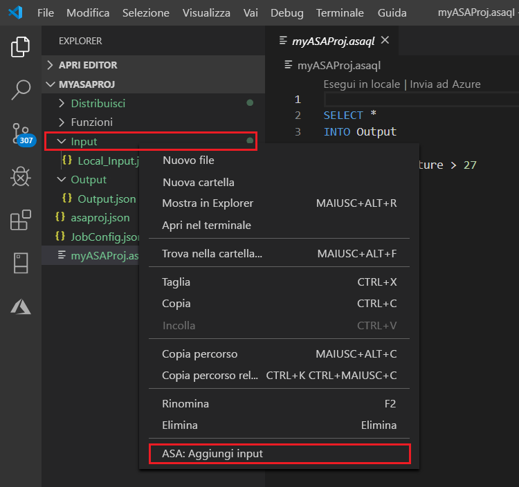
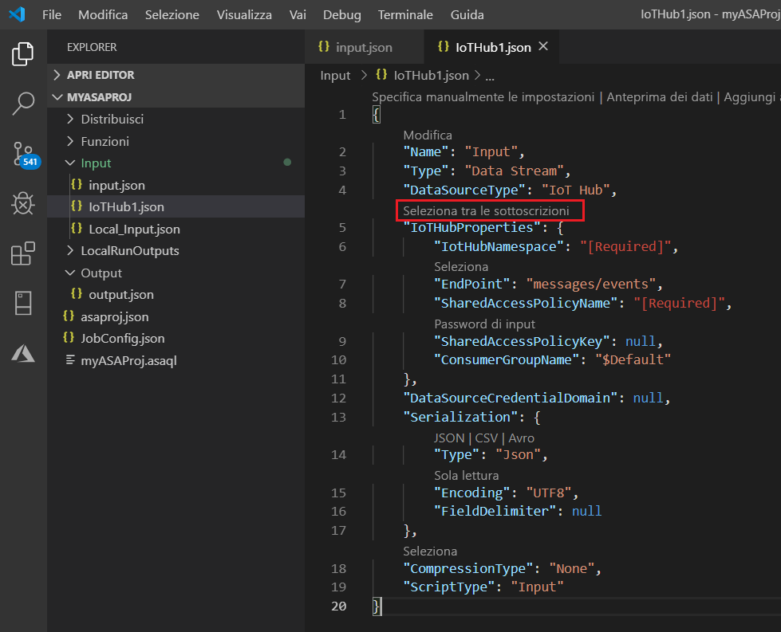

# Testare le query di analisi di flusso in locale rispetto all'input del flusso Live usando Visual Studio Code

È possibile usare gli strumenti di analisi di flusso di Azure per Visual Studio Code per testare i processi di analisi di flusso in locale rispetto all'input del flusso live. L'input può provenire da un'origine, ad esempio hub eventi di Azure o hub Azure. I risultati dell'output vengono inviati come file JSON a una cartella nel progetto denominato **LocalRunOutputs**.

## Prerequisiti

* Installare il [.NET Core SDK](https://dotnet.microsoft.com/download) e riavviare Visual Studio Code.

* Usare [questa Guida introduttiva](quick-create-vs-code.md) per informazioni su come creare un processo di analisi di flusso usando Visual Studio Code.

## Definire un input di flusso Live

1. Fare clic con il pulsante destro del mouse sulla cartella **inputs** nel progetto di analisi di flusso. Quindi selezionare **ASA: Aggiungi input** dal menu di scelta rapida.

   

   È anche possibile premere **CTRL + MAIUSC + P** per aprire il riquadro comandi e immettere **ASA: Aggiungi input**.

   

2. Scegliere un tipo di origine di input dall'elenco a discesa.

   

3. Se l'input è stato aggiunto dal riquadro comandi, scegliere lo script di query di analisi di flusso che userà l'input. Deve essere popolato automaticamente con il percorso del file **myASAproj. asaql**.

   

4. Scegliere **Seleziona dalle sottoscrizioni di Azure** dal menu a discesa.

    

5. Configurare il file JSON appena generato. È possibile usare la funzionalità CodeLens per immettere una stringa, selezionare da un elenco a discesa o modificare il testo direttamente nel file. La schermata seguente mostra come esempio la **selezione delle sottoscrizioni** .

   

## Anteprima input

Per assicurarsi che i dati di input vengano ricevuti, selezionare **Anteprima dati** nel file di configurazione dell'input Live dalla riga superiore. Alcuni dati di input provengono da un hub Internet e vengono visualizzati nella finestra di anteprima. La visualizzazione dell'anteprima potrebbe richiedere alcuni secondi.

 

## Eseguire query localmente

Tornare all'editor di query e selezionare **Esegui localmente**. Selezionare quindi **Usa input Live** dall'elenco a discesa.

Il risultato viene visualizzato nella finestra a destra e aggiornato ogni 3 secondi. È possibile selezionare **Esegui per eseguire** nuovamente il test. È anche possibile selezionare **Apri in cartella** per visualizzare i file dei risultati in Esplora file e aprirli con Visual Studio Code o uno strumento come Excel. Si noti che i file dei risultati sono disponibili solo in formato JSON.

L'ora predefinita per l'avvio del processo di creazione dell'output è impostata su **Now**. È possibile personalizzare l'ora selezionando il pulsante **ora di inizio output** nella finestra risultati.

## Passaggi successivi

* [Esplorare i processi di analisi di flusso di Azure con Visual Studio Code (anteprima)](visual-studio-code-explore-jobs.md)

* [Configurare pipeline CI/CD usando il pacchetto NPM](setup-cicd-vs-code.md)
