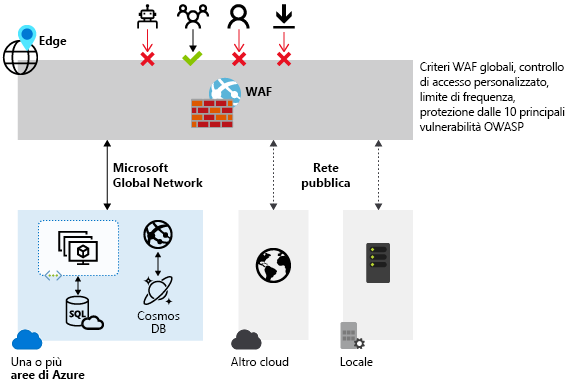
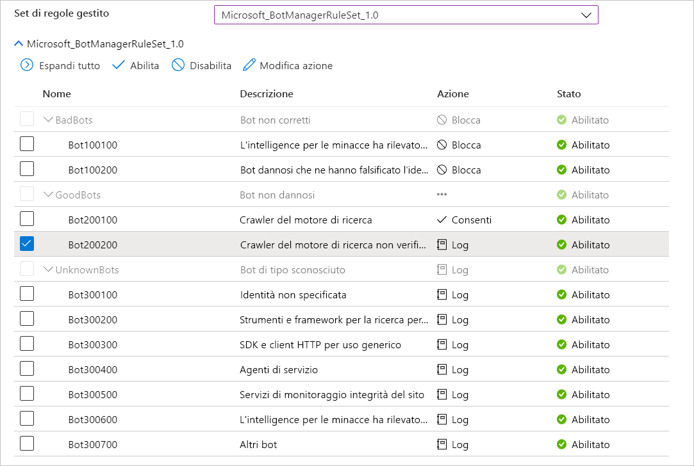

# Web Application Firewall di Azure in Frontdoor di Azure

Web Application Firewall (WAF) di Azure in Frontdoor di Azure offre una soluzione di protezione centralizzata per le applicazioni Web che vengono distribuite a livello globale tramite Frontdoor di Azure. È progettato e gestito per difendere i servizi Web da vulnerabilità comuni e per mantenere una disponibilità elevata del servizio per gli utenti, oltre che per aiutare a soddisfare i requisiti di conformità.

WAF in Frontdoor è una soluzione globale centralizzata, distribuita nei percorsi di rete perimetrale di Azure in tutto il mondo. Con questa soluzione, ogni richiesta in ingresso per un'applicazione Web abilitata per WAF e distribuita da Frontdoor viene ispezionata in corrispondenza del perimetro della rete. Ciò consente a WAF di respingere eventuali attacchi dannosi in prossimità delle origini di attacco, impedendone l'accesso alla rete virtuale, e offre protezione globale su larga scala senza compromettere le prestazioni. I criteri di WAF possono essere facilmente collegati a qualsiasi profilo di Frontdoor nella sottoscrizione ed è possibile implementare rapidamente nuove regole, in modo da rispondere con tempestività ai mutevoli modelli di minacce.

## Regole e criteri di WAF

È possibile configurare criteri di WAF e associarli a uno o più front-end di Frontdoor per la protezione. I criteri di WAF sono costituiti da due tipi di regole di sicurezza:

- Regole personalizzate create dal cliente.

- Set di regole gestiti, ovvero raccolte di regole preconfigurate e gestite da Azure.

Quando sono presenti entrambi i tipi, le regole personalizzate vengono elaborate prima di quelle incluse in un set di regole gestito. Una regola è costituita da una condizione di corrispondenza, una priorità e un'azione. I tipi di azione supportati sono: ALLOW, BLOCK, LOG e REDIRECT. È possibile creare criteri completamente personalizzati che soddisfino specifici requisiti di protezione delle applicazioni combinando regole gestite e personalizzate.

Le regole all'interno dei criteri vengono elaborate in ordine di priorità, dove la priorità è un numero intero univoco che definisce l'ordine di elaborazione delle regole. Un valore intero più basso indica una priorità più alta e quindi le regole con valori di priorità più bassi vengono elaborate prima di quelle con valori più alti. Una volta trovata una corrispondenza per una regola, alla richiesta viene applicata l'azione definita in tale regola. Dopo l'elaborazione di una corrispondenza di questo tipo, le regole con priorità più bassa non vengono elaborate ulteriormente.

Un'applicazione Web distribuita da Frontdoor può avere un solo criterio di WAF associato alla volta. È tuttavia possibile anche una configurazione di Frontdoor senza criteri di WAF associati. Se presenti, i criteri di WAF vengono replicati in tutti i percorsi perimetrali per assicurare la coerenza nei criteri di sicurezza in tutto il mondo.

## Modalità di WAF

I criteri di WAF possono essere configurati per l'esecuzione nelle due modalità seguenti:

- **Modalità di rilevamento**: quando è attiva la modalità di rilevamento, WAF esegue solo le azioni di monitoraggio e registrazione nei log della richiesta e della regola di WAF corrispondente. È possibile attivare la diagnostica della registrazione per Frontdoor. Nel portale di Azure questa operazione può essere eseguita tramite la sezione **Diagnostica**.

- **Modalità di prevenzione**: quando è configurato per l'esecuzione in modalità di prevenzione, WAF esegue l'azione specificata se una richiesta corrisponde a una regola. In caso di corrispondenza, le eventuali altre regole con priorità più bassa non vengono valutate. Tutte le richieste corrispondenti vengono anche registrate nei log di WAF.

## Azioni di WAF

I clienti di WAF possono scegliere di eseguire una delle azioni seguenti quando una richiesta soddisfa le condizioni di una regola:

- **ALLOW**:  la richiesta passa attraverso WAF e viene inoltrata al back-end. Nessuna regola con priorità più bassa può bloccare questa richiesta.
- **BLOCK**: la richiesta viene bloccata e WAF invia una risposta al client senza inoltrare la richiesta al back-end.
- **LOG**:  la richiesta viene registrata nei log di WAF e WAF continua la valutazione delle regole con priorità più bassa.
- **REDIRECT**: WAF reindirizza la richiesta all'URI specificato. Quest'ultimo è impostato a livello di criterio. Una volta configurate, tutte le richieste corrispondenti all'azione **REDIRECT** verranno inviate a tale URI.

## Regole di WAF

Un criterio di WAF può essere costituito da due tipi di regole di sicurezza: regole personalizzate, create dal cliente, e set di regole gestiti, ovvero preconfigurati e gestiti da Azure.

### Regole personalizzate

È possibile configurare regole personalizzate di WAF nel modo seguente:

- **Elenco di indirizzi IP consentiti e bloccati**: è possibile configurare regole personalizzate per controllare l'accesso alle applicazioni Web in base a un elenco di indirizzi o intervallo di indirizzi IP client. Entrambi i tipi di indirizzi IPv4 e IPv6 sono supportati. Questo elenco può essere configurato in modo da bloccare o consentire le richieste in cui l'indirizzo IP di origine corrisponde a un indirizzo IP nell'elenco.

- **Controllo di accesso geografico**: è possibile configurare regole personalizzate per controllare l'accesso alle applicazioni Web in base al codice paese associato all'indirizzo IP di un client.

- **Controllo di accesso in base ai parametri HTTP**: è possibile configurare regole personalizzate in base alla corrispondenza di stringhe per i parametri della richiesta HTTP/HTTPS, ad esempio stringhe di query, argomenti POST, URI della richiesta, Intestazione della richiesta e Corpo della richiesta.

- **Controllo di accesso in base al metodo della richiesta**: è possibile configurare regole personalizzate in base al metodo HTTP della richiesta, ad esempio GET, PUT o HEAD.

- **Vincolo di dimensione**: è possibile configurare regole personalizzate in base alla lunghezza di parti specifiche di una richiesta, ad esempio la stringa di query, l'URI o il corpo della richiesta.

- **Regole di limitazione della frequenza**: Una regola di controllo della frequenza prevede la limitazione di traffico elevato anomalo da qualsiasi indirizzo IP client. È possibile configurare una soglia per il numero di richieste Web consentite da un indirizzo IP client per la durata di un minuto. Si tratta di un valore diverso da una regola personalizzata di tipo Consenti/Blocca basata su un elenco di indirizzi IP, che consente o blocca tutte le richieste provenienti da un indirizzo IP client. La limitazione della frequenza può essere combinata con condizioni di corrispondenza aggiuntive, ad esempio parametri HTTP(S) corrispondenti per il controllo della frequenza a livello granulare.

### Set di regole gestiti da Azure

I set di regole gestiti da Azure consentono di distribuire in modo semplice la protezione da un set comune di minacce alla sicurezza. Poiché questi set sono gestiti da Azure, le regole vengono opportunamente aggiornate per assicurare la protezione dalle nuove firme di attacco. In versione di anteprima pubblica, il set di regole predefinito gestito da Azure include regole per le categorie di minacce seguenti:

- Scripting intersito
- Attacchi Java
- Attacchi di tipo Local File Inclusion
- Attacchi PHP injection
- Attacchi di tipo Remote Command Execution
- Attacchi di tipo Remote File Inclusion
- Attacchi di tipo Session Fixation
- Protezione dagli attacchi SQL injection
- Attacchi a protocollo

Il numero di versione del set di regole predefinito viene incrementato man mano vengono aggiunte nuove firme di attacco.
Il set di regole predefinito è abilitato per impostazione predefinita nei criteri di WAF quando è attiva la modalità di rilevamento. È possibile disabilitare o abilitare singole regole nel set predefinito in base ai requisiti dell'applicazione. È anche possibile impostare azioni specifiche (ALLOW/BLOCK/REDIRECT/LOG) per ogni regola. L'azione predefinita è BLOCK. È inoltre possibile configurare regole personalizzate nello stesso criterio di WAF se si vuole ignorare una qualsiasi regola preconfigurata nel set predefinito.
Le regole personalizzate vengono sempre applicate prima della valutazione delle regole del set predefinito. Se una richiesta corrisponde a una regola personalizzata, viene applicata l'azione corrispondente e la richiesta viene bloccata o passata attraverso il back-end, senza che vengano richiamate altre regole personalizzate o le regole include nel set predefinito. È inoltre possibile scegliere di rimuovere il set di regole predefinito dai criteri di WAF.

### Set di regole di protezione dai bot (anteprima)

Per WAF è possibile abilitare un set di regole gestito di protezione dai bot per eseguire azioni personalizzate sulle richieste provenienti da categorie note di bot. Sono supportate tre categorie di bot: bot dannosi, bot legittimi e bot sconosciuti. Le firme dei bot vengono gestite e aggiornate dinamicamente dalla piattaforma WAF. Gli indirizzi IP dannosi dei bot dannosi provengono dal feed di Microsoft Threat Intelligence. La soluzione Microsoft Threat Intelligence, basata su [Intelligent Security Graph](https://www.microsoft.com/security/operations/intelligence), viene usata da più servizi, tra cui Centro sicurezza di Azure. I bot legittimi includono i motori di ricerca convalidati. Le categorie sconosciute includono ulteriori gruppi di bot. È possibile impostare azioni personalizzate per bloccare, consentire, registrare o reindirizzare diversi tipi di bot.

> [!IMPORTANT]
> Il set di regole di protezione dai bot è attualmente disponibile in anteprima pubblica e con un contratto di servizio di anteprima. Alcune funzionalità potrebbero non essere supportate o potrebbero presentare funzionalità limitate.  Vedere [Condizioni supplementari per l'uso delle anteprime di Microsoft Azure](https://azure.microsoft.com/support/legal/preview-supplemental-terms/).

Se la protezione dai bot è abilitata, le richieste in ingresso che corrispondono a regole di bot vengono registrate nel log FrontdoorWebApplicationFirewallLog. È possibile accedere ai log di WAF da un account di archiviazione, da un hub eventi o da Log Analytics.

## Configurazione

La configurazione e la distribuzione di tutti i tipi di regole di WAF sono completamente supportate tramite il portale di Azure, le API REST, i modelli di Azure Resource Manager e Azure PowerShell.

## Monitoraggio

Il monitoraggio per WAF in Frontdoor è integrato con Monitoraggio di Azure per tenere traccia degli avvisi e monitorare con facilità le tendenze del traffico.

## Passaggi successivi

- Informazioni su [Web Application Firewall di Azure nel gateway applicazione di Azure](../ag/ag-overview.md)
