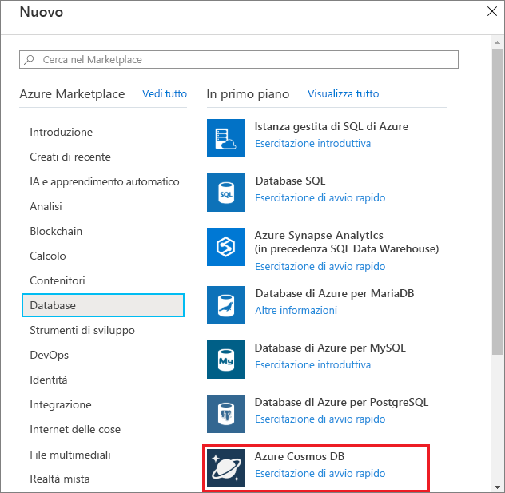

1. In una nuova finestra accedere al [portale di Azure](https://portal.azure.com/).
2. Nel menu a sinistra selezionare **Crea una risorsa**, **Database** e infine in **Azure Cosmos DB** selezionare **Crea**.
   
   

3. Nella pagina **Crea account Cosmos DB** immettere le impostazioni per il nuovo account Azure Cosmos DB. 
 
    Impostazione|valore|Descrizione
    ---|---|---
    Subscription|Sottoscrizione in uso|Selezionare la sottoscrizione di Azure da usare per l'account Azure Cosmos DB. 
    Gruppo di risorse|Creare un nuovo gruppo di risorse  Immettere quindi lo stesso nome univoco specificato in ID|Selezionare **Crea nuovo**. Immettere quindi il nome di un nuovo gruppo di risorse per l'account. Per semplicità, usare lo stesso nome usato come ID. 
    Nome account|Immettere un nome univoco|Immettere un nome univoco per identificare l'account Azure Cosmos DB. Poiché all'ID specificato viene aggiunto *mongo.cosmos.azure.com* per creare l'URI, usare un ID univoco.  L'ID può contenere solo lettere minuscole, numeri e il carattere trattino (-). Deve avere una lunghezza compresa tra 3 e 31 caratteri.
    API|API Azure Cosmos DB per MongoDB|L'API determina il tipo di account da creare. Azure Cosmos DB offre cinque API: Core (SQL) per i database di documenti, Gremlin per i database a grafo, API Azure Cosmos DB per MongoDB per i database di documenti, Tabella di Azure e Cassandra. Attualmente, è necessario creare un account separato per ogni API.   Selezionare **MongoDB** poiché in questo argomento di avvio rapido si creerà una tabella che funziona con MongoDB.|
    Location|Selezionare l'area più vicina agli utenti|Selezionare una posizione geografica in cui ospitare l'account Azure Cosmos DB. Usare la località più vicina agli utenti per offrire loro la massima velocità di accesso ai dati.
    Versione|3.6|Selezionare il protocollo di trasmissione MongoDB versione 3.6 oppure, per la compatibilità con le versioni precedenti, selezionare la versione 3.2.

    Selezionare **Rivedi+Crea**. È possibile ignorare le sezioni **Rete** e **Tag**. 

    

4. La creazione dell'account richiede alcuni minuti, Attendere che nel portale venga visualizzata la pagina **Complimenti, L'account Cosmos con compatibilità del protocollo di collegamento per MongoDB è pronto**.

    
