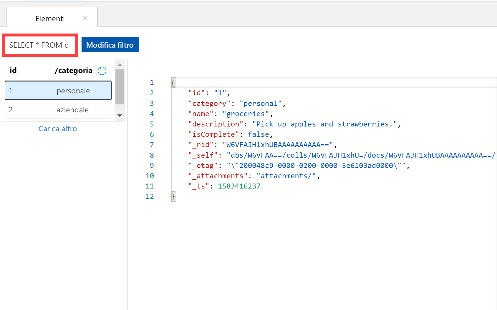
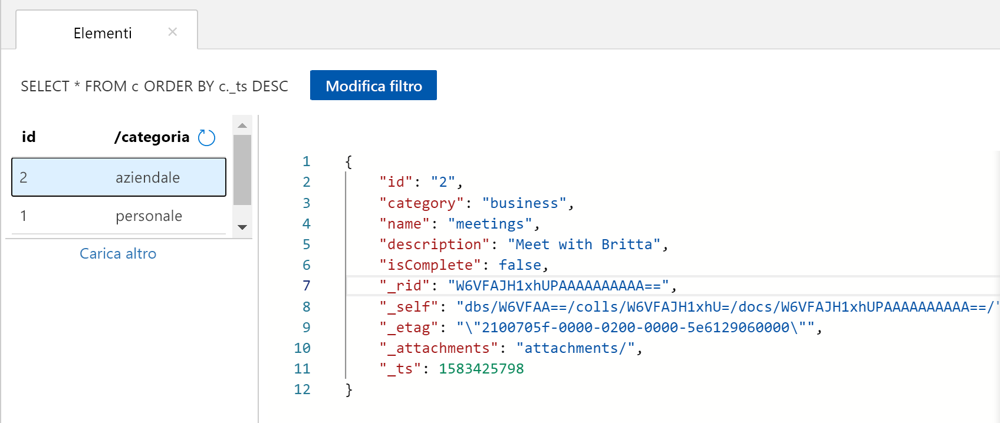

È possibile usare le query in Esplora dati per recuperare e filtrare i dati.

1. Nella parte superiore della scheda **Elementi** di Esplora dati esaminare la query predefinita `SELECT * FROM c`. Questa query recupera e visualizza tutti i documenti presenti nella raccolta in ordine di ID. 
   
   
   
1. Per modificare la query, selezionare **Modifica filtro**, sostituire la query predefinita con `ORDER BY c._ts DESC`, quindi selezionare **Applica filtro**.
   
   

   La query modificata elenca i documenti in ordine decrescente in base al timestamp, quindi il secondo documento creato appare ora in cima all'elenco. 
   
   

Se si ha familiarità con la sintassi SQL, è possibile immettere qualsiasi [query SQL](../articles/cosmos-db/sql-api-sql-query.md) supportata nella casella del predicato della query. È anche possibile usare Esplora dati per creare stored procedure, funzioni definite dall'utente e trigger per eseguire la logica di business sul lato server. 

Esplora dati consente di accedere facilmente dal portale di Azure a tutte le funzionalità di accesso ai dati a livello di codice disponibili nelle API. Si usa il portale anche per ridimensionare la velocità effettiva, ottenere le chiavi e le stringhe di connessione ed esaminare le metriche e i contratti di servizio per l'account Azure Cosmos DB. 

