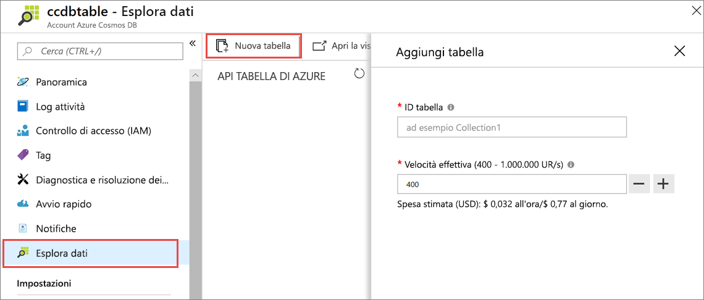
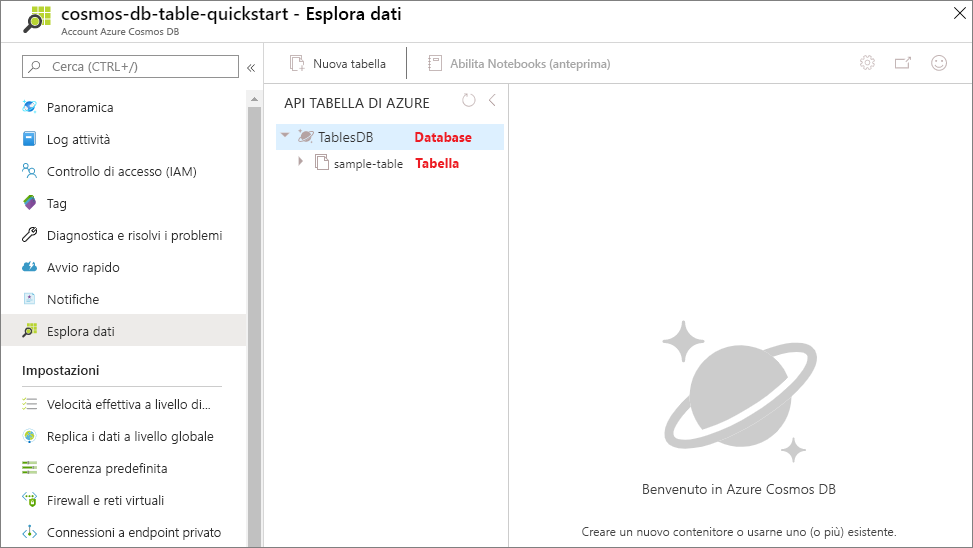

È ora possibile usare lo strumento Esplora dati nel portale di Azure per creare un database e una tabella. 

1. Selezionare su **Esplora dati** > **Nuova tabella**. 
    
    Viene visualizzata l'area **Add Table** (Aggiungi tabella) all'estrema destra. Per vederla potrebbe essere necessario scorrere la schermata.

    

2. Nella pagina **Add Table** (Aggiungi tabella) immettere le impostazioni per la nuova tabella.

    Impostazione|Valore consigliato|DESCRIZIONE
    ---|---|---
    ID tabella|sample-table|ID della nuova tabella. I nomi delle tabelle presentano gli stessi requisiti relativi ai caratteri degli ID di database. I nomi dei database devono avere una lunghezza compresa tra 1 e 255 caratteri e non possono contenere `/ \ # ?` o spazi finali.
    Velocità effettiva|400 UR/s|Modificare la velocità effettiva in 400 unità richiesta al secondo (UR/sec). Se si vuole ridurre la latenza, è possibile aumentare la velocità effettiva in un secondo momento.

3. Selezionare **OK**.

4. In Esplora dati verranno visualizzati il nuovo database e la nuova tabella.

   