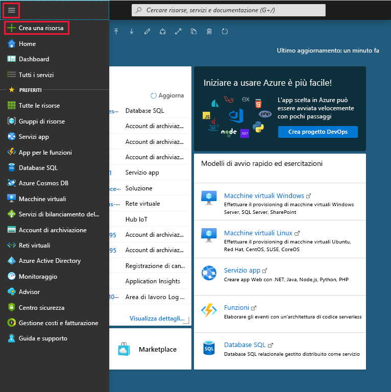
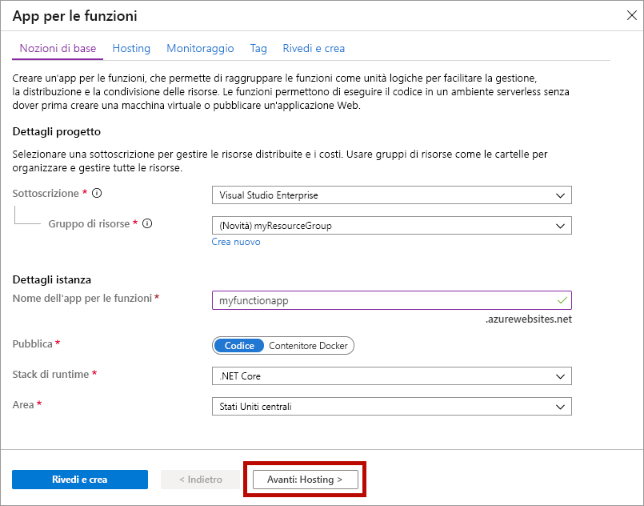
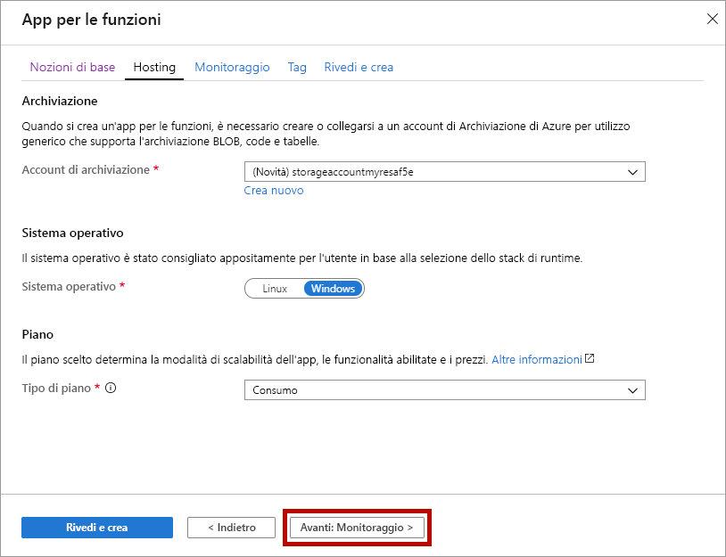
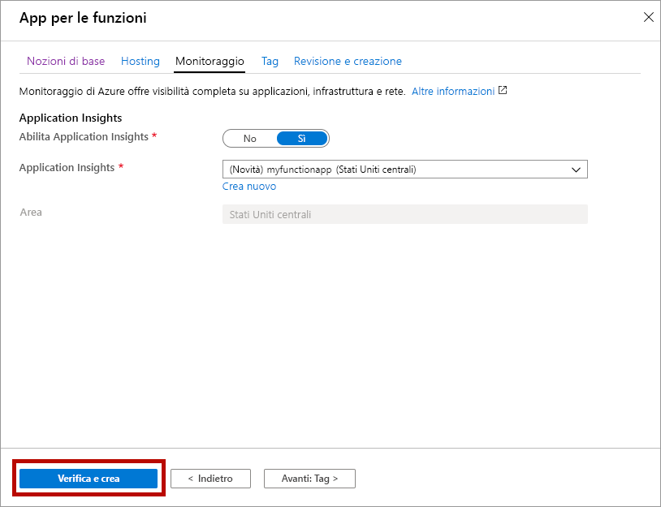
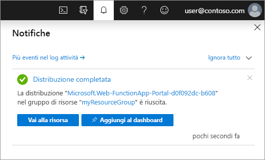

1. Nel menu del portale di Azure selezionare **Crea una risorsa**.

    

1. Nella pagina **Nuovo**, selezionare **Calcolo** > **App per le funzioni**.

1. Usare le impostazioni dell'app per le funzioni come indicato nella tabella sottostante l'immagine.

    

    | Impostazione      | Valore consigliato  | Descrizione |
    | ------------ | ---------------- | ----------- |
    | **Sottoscrizione** | Sottoscrizione in uso | Sottoscrizione in cui viene creata questa nuova app per le funzioni. |
    | **[Gruppo di risorse](../articles/azure-resource-manager/management/overview.md)** |  *myResourceGroup* | Nome del nuovo gruppo di risorse in cui creare l'app per le funzioni. |
    | **Nome dell'app per le funzioni** | Nome globalmente univoco | Nome che identifica la nuova app per le funzioni. I caratteri validi sono `a-z` (senza distinzione tra maiuscole e minuscole), `0-9` e `-`.  |
    |**Pubblica**| Codice | Opzione per la pubblicazione di file di codice o di un contenitore Docker. |
    | **Stack di runtime** | Lingua preferita | Scegliere un runtime che supporti il linguaggio di programmazione della funzione preferito. Scegliere **.NET** per le funzioni C# e F #. |
    |**Area**| Area preferita | Scegliere un'[area](https://azure.microsoft.com/regions/) nelle vicinanze o vicino ad altri servizi a cui accedono le funzioni. |

    Selezionare il pulsante **Avanti: Hosting >** .

1. Immettere le impostazioni seguenti per l'hosting.

    

    | Impostazione      | Valore consigliato  | Descrizione |
    | ------------ | ---------------- | ----------- |
    | **[Account di archiviazione](../articles/storage/common/storage-account-create.md)** |  Nome globalmente univoco |  Creare un account di archiviazione usato dall'app per le funzioni. I nomi degli account di archiviazione devono avere una lunghezza compresa tra 3 e 24 caratteri e possono contenere solo numeri e lettere minuscole. È anche possibile usare un account esistente, che deve soddisfare i [requisiti dell'account di archiviazione](../articles/azure-functions/functions-scale.md#storage-account-requirements). |
    |**Sistema operativo**| Sistema operativo preferito | Viene preselezionato automaticamente un sistema operativo in base alla selezione dello stack di runtime, ma, se necessario, è possibile modificare l'impostazione. |
    | **[Piano](../articles/azure-functions/functions-scale.md)** | Piano a consumo | Piano di hosting che definisce come vengono allocate le risorse all'app per le funzioni. Nel **piano a consumo** predefinito le risorse vengono aggiunte dinamicamente in base alle esigenze delle funzioni. In questo hosting [senza server](https://azure.microsoft.com/overview/serverless-computing/) si paga solo per il periodo in cui le funzioni sono in esecuzione. In caso di esecuzione in un piano di servizio app, è necessario gestire il [ridimensionamento dell'app per le funzioni](../articles/azure-functions/functions-scale.md).  |

    Selezionare il pulsante **Avanti: Monitoraggio >** .

1. Immettere le impostazioni seguenti per il monitoraggio.

    

    | Impostazione      | Valore consigliato  | Descrizione |
    | ------------ | ---------------- | ----------- |
    | **[Application Insights](../articles/azure-functions/functions-monitoring.md)** | Predefinito | Crea una risorsa di Application Insights con lo stesso *nome di app* nell'area più vicina supportata. Espandendo questa impostazione, è possibile cambiare il **Nome nuova risorsa** oppure scegliere una **Località** in un'[area geografica di Azure](https://azure.microsoft.com/global-infrastructure/geographies/) in cui si vogliono archiviare i dati. |

    Selezionare **Rivedi e crea** per rivedere le selezioni effettuate per la configurazione dell'app.

1. Selezionare **Crea** per effettuare il provisioning dell'app per le funzioni e distribuirla.

1. Selezionare l'icona di notifica nell'angolo superiore destro del portale e attendere la visualizzazione del messaggio **La distribuzione è riuscita**.

    

1. Selezionare **Vai alla risorsa** per visualizzare la nuova app per le funzioni. È anche possibile selezionare **Aggiungi al dashboard**. In questo modo è più facile tornare in questa risorsa di app per le funzioni dal dashboard.
