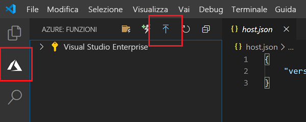

## Pubblicare il progetto in Azure

In questa sezione verrà creata un'app per le funzioni con le risorse correlate nella sottoscrizione di Azure e quindi verrà distribuito il codice. 

1. Selezionare l'icona di Azure nella barra attività, quindi nell'area **Azure: Funzioni** scegliere il pulsante **Deploy to function app...** (Distribuisci nell'app per le funzioni...).

    

1. Quando richiesto, immettere le informazioni seguenti:

    ::: zone pivot="programming-language-csharp,programming-language-powershell"

    | Prompt | valore | Descrizione |
    | ------ | ----- | ----- |
    | Seleziona sottoscrizione | Sottoscrizione in uso | Opzione visualizzata quando sono presenti più sottoscrizioni. |
    | Selezionare l'app per le funzioni in Azure | + Crea nuova app per le funzioni | La pubblicazione in un'app per le funzioni esistente sovrascrive il contenuto di tale app in Azure. |
    | Immettere un nome univoco a livello globale per l'app per le funzioni | Nome univoco | I caratteri validi per un nome di app per le funzioni sono `a-z`, `0-9` e `-`. |
    | Selezionare una località per le nuove risorse | Region | Scegliere [un'area](https://azure.microsoft.com/regions/) nelle vicinanze. | 

    ::: zone-end

    ::: zone pivot="programming-language-javascript,programming-language-typescript,programming-language-python"

    | Prompt | valore | Descrizione |
    | ------ | ----- | ----- |
    | Seleziona sottoscrizione | Sottoscrizione in uso | Opzione visualizzata quando sono presenti più sottoscrizioni. |
    | Selezionare l'app per le funzioni in Azure | + Crea nuova app per le funzioni | La pubblicazione in un'app per le funzioni esistente sovrascrive il contenuto di tale app in Azure. |
    | Immettere un nome univoco a livello globale per l'app per le funzioni | Nome univoco | I caratteri validi per un nome di app per le funzioni sono `a-z`, `0-9` e `-`. |
    | Selezionare un runtime | Versione in uso | Scegliere la versione del linguaggio in esecuzione in locale. |
    | Selezionare una località per le nuove risorse | Region | Scegliere [un'area](https://azure.microsoft.com/regions/) nelle vicinanze. | 

    ::: zone-end

    
1.  Al termine, nella sottoscrizione vengono create le risorse di Azure seguenti:

    + **[Gruppo di risorse](../articles/azure-resource-manager/management/overview.md)** : contiene tutte le risorse di Azure create. Il nome si basa sul nome dell'app per le funzioni.
    + **[Account di archiviazione](../articles//storage/common/storage-introduction.md#types-of-storage-accounts)** : viene creato un account di archiviazione standard con un nome univoco basato sul nome dell'app per le funzioni.
    + **[Piano di hosting](../articles/azure-functions/functions-scale.md)** : nell'area Stati Uniti occidentali viene creato un piano a consumo per l'hosting dell'app per le funzioni.
    + **App per le funzioni**: il progetto viene distribuito ed eseguito nella nuova app per le funzioni.
    + **[Application Insights]()** : viene creata un'istanza connessa all'app per le funzioni in base al nome della funzione.

    Dopo la creazione dell'app per le funzioni e dopo l'applicazione del pacchetto di distribuzione viene visualizzata una notifica. 
    
1. Selezionare **Visualizza output** nelle notifiche per visualizzare i risultati della creazione e della distribuzione, incluse le risorse di Azure create.

    

1. Nell'area **Azure: Funzioni** nella barra laterale espandere la nuova app per le funzioni nella sottoscrizione. Espandere **Funzioni**, fare clic con il pulsante destro del mouse su (Windows) o premere CTRL + clic (MacOS) in **HttpExample**, quindi scegliere **Copy function URL** (Copia URL funzione).

    
