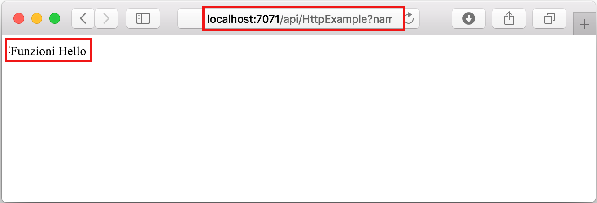

## Eseguire la funzione in locale

Azure Functions Core Tools consente di eseguire un progetto Funzioni di Azure nel computer di sviluppo locale.

1. Per testare la funzione, impostare un punto di interruzione nel codice della funzione e premere F5 per avviare il progetto di app per le funzioni. L'output dagli strumenti di base viene visualizzato nel pannello **Terminale**.

1. Nel pannello **Terminale** copiare l'endpoint dell'URL della funzione attivata da HTTP. 

    

1. Incollare l'URL per la richiesta HTTP nella barra degli indirizzi del browser. Aggiungere la stringa di query `?name=<yourname>` all'URL ed eseguire la richiesta. L'esecuzione viene sospesa quando viene raggiunto il punto di interruzione.

1. Quando si continua l'esecuzione, viene mostrata la risposta seguente nel browser per la richiesta GET:

    

1. Per interrompere il debug, premere MAIUSC+F5.