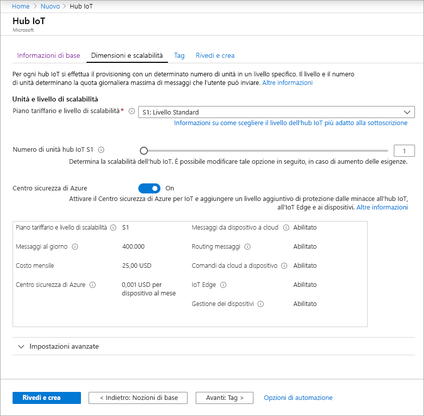

Questa sezione illustra come creare un hub IoT usando il [portale di Azure](https://portal.azure.com).

1. Accedere al [portale di Azure](https://portal.azure.com).

1. Nella home page di Azure selezionare il pulsante **+ Crea una risorsa** e quindi immettere *Hub IoT* nel campo **Cerca nel Marketplace**.

1. Nei risultati della ricerca selezionare **Hub IoT** e quindi fare clic su **Crea**.

1. Nella scheda **Informazioni di base** completare i campi come indicato di seguito:

   - **Sottoscrizione** Selezionare la sottoscrizione da usare per l'hub.

   - **Gruppo di risorse**: selezionare un gruppo di risorse o crearne uno nuovo. Per crearne uno nuovo, fare clic su **Crea nuovo** e specificare il nome da usare. Per usare un gruppo di risorse esistente, selezionarlo. Per altre informazioni, vedere l'articolo su come [gestire gruppi di risorse di Azure Resource Manager](../articles/azure-resource-manager/management/manage-resource-groups-portal.md).

   - **Area**: selezionare l'area in cui si vuole collocare l'hub. Selezionare la località più vicina.

   - **Nome hub IoT**: immettere un nome per l'hub. Il nome deve essere univoco a livello globale. Se il nome immesso è disponibile, viene visualizzato un segno di spunta verde.

   [!INCLUDE [iot-hub-pii-note-naming-hub](iot-hub-pii-note-naming-hub.md)]

   

1. Selezionare **Avanti: Dimensioni e piano** per continuare a creare l'hub.

   

    Questa schermata consente di impostare i valori seguenti:

    - **Piano tariffario e livello di scalabilità**: il piano e il livello selezionati. È possibile scegliere tra livelli diversi a seconda del numero di funzionalità che si desidera e della quantità di messaggi che si inviano al giorno tramite la soluzione. Il livello gratuito è utilizzabile a scopo di test e valutazione. Consente la connessione di 500 dispositivi all'hub e un massimo di 8.000 messaggi al giorno. Per ogni sottoscrizione di Azure è possibile creare un solo hub IoT nel livello gratuito.

    - **Unità di hub IoT**: Il numero di messaggi consentiti per unità al giorno dipende dal piano tariffario dell'hub. Se ad esempio si vuole che l'hub supporti 700.000 messaggi in ingresso, selezionare due unità del piano S1.
    Per informazioni dettagliate sulle altre opzioni relative al livello, vedere [Scegliere il livello più adatto di hub IoT](../articles/iot-hub/iot-hub-scaling.md).

    - **Impostazioni avanzate** > **Partizioni da dispositivo a cloud**: questa proprietà associa i messaggi da dispositivo a cloud al numero di lettori simultanei di tali messaggi. La maggior parte degli hub richiede solo quattro partizioni.

1. Per questo articolo accettare le scelte predefinite e quindi selezionare **Rivedi e crea** per esaminare le scelte effettuate. Dovrebbe essere visualizzata una schermata simile alla seguente.

   

1. Fare clic su **Crea** per creare il nuovo hub. La creazione dell'hub richiede alcuni minuti.
