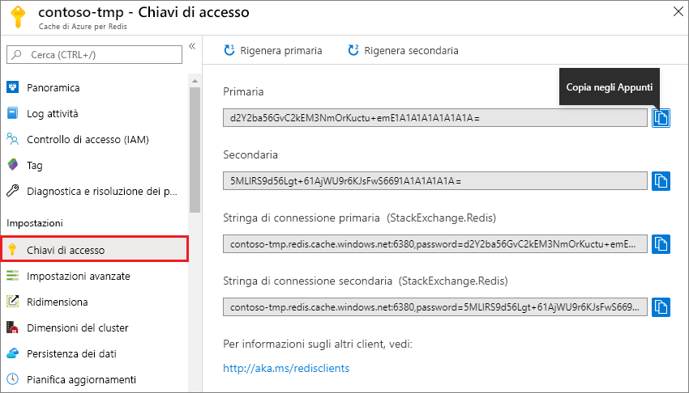
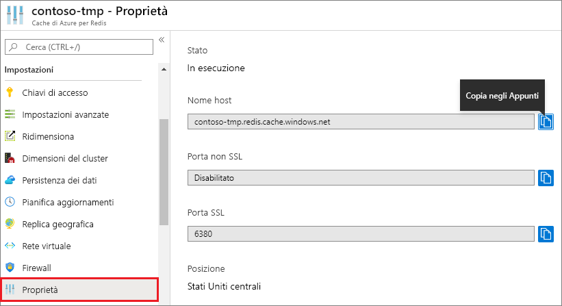

### Recuperare il nome host, le porte e le chiavi di accesso dal portale di Azure

Per connettersi a un'istanza della cache di Azure per Redis, i client della cache devono conoscere il nome host, le porte e una chiave per la cache. Alcuni client possono fare riferimento a questi elementi usando nomi leggermente diversi. È possibile ottenere il nome host, le porte e le chiavi dal [portale di Azure](https://portal.azure.com).

- Per ottenere le chiavi di accesso, selezionare **Chiavi di accesso** nel riquadro di spostamento di sinistra della cache. 
  
  

- Per ottenere il nome host e le porte, selezionare **Proprietà** nel riquadro di spostamento di sinistra della cache. Il formato del nome host è *\<Nome DNS>.redis.cache.windows.net*.

  

